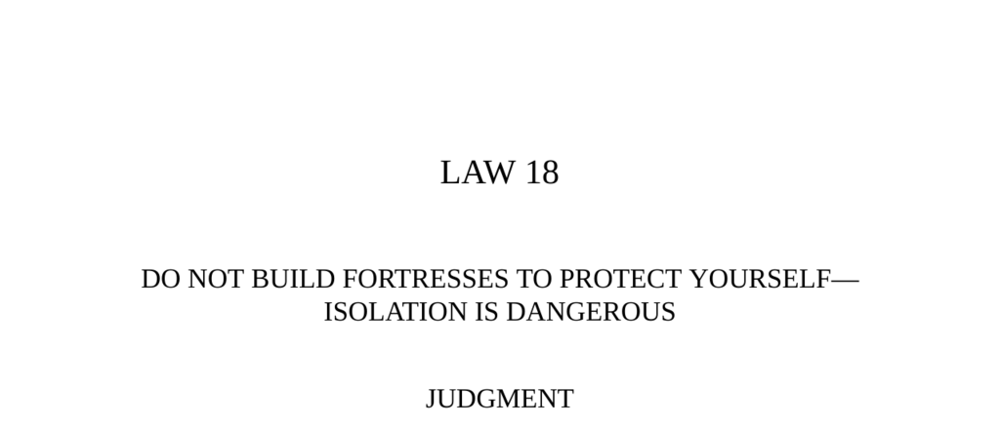

- **Judgment**
  - 
    - Fortresses appear safe but cut off valuable information and increase vulnerability.
    - Isolation makes a person conspicuous and an easy target for enemies.
    - Circulating among people and finding allies offers better protection.
    - [The 48 Laws of Power](https://en.wikipedia.org/wiki/The_48_Laws_of_Power)
- **Transgression of the Law**
  - **Ch'in Shih Huang Ti**
    - First emperor of China unified kingdoms into a massive realm.
    - Lived isolated in a vast palace with secret passages and punished anyone who saw him.
    - Feared human contact, traveled incognito, and died alone, hidden to conceal his death.
    - Isolation caused loss of control and possible poisoning by ministers.
    - [Shih Huang Ti - Britannica](https://www.britannica.com/biography/Qin-Shi-Huang)
  - **The Masque of the Red Death**
    - Prince Prospero withdrew to a walled abbey during a deadly plague.
    - Enforced total isolation with sealed gates to defy contagion.
    - A mysterious figure representing the plague appeared, killing all guests.
    - Isolation proved useless against inevitable death.
    - [The Masque of the Red Death - Edgar Allan Poe](https://americanliterature.com/author/edgar-allan-poe/short-story/the-masque-of-the-red-death)
- **Interpretation**
  - **Shih Huang Ti's Isolation**
    - Used violence and unification policies, outlawed Confucian teachings.
    - Grew paranoid, increased executions, withdrew into palace isolation.
    - Isolation caused loss of political control and contributed to his downfall.
    - Isolation prevents hearing of plots and weakens leadership.
    - [Qin Dynasty - History.com](https://www.history.com/topics/ancient-china/qin-dynasty)
  - **Louis XIV and Versailles**
    - Built Versailles to keep nobility under constant surveillance and control.
    - Social openness prevented conspiracies and rebellion.
    - Daily rituals centered around the king ensured he was always aware of court dynamics.
    - No privacy allowed monitoring of all activities.
    - [Versailles - The Met](https://www.metmuseum.org/toah/hd/vers/hd_vers.htm)
- **Observance of the Law**
  - **Louis XIV’s Court**
    - Nobility lived close to Louis XIV with strict ranking and constant attendance.
    - The king’s lever ritual centralized power and communication.
    - Versailles operated as a social and political network that prevented isolation.
    - Resulted in fifty years of peace and prevented rebellions.
    - [Louis XIV - Britannica](https://www.britannica.com/biography/Louis-XIV-king-of-France)
- **Keys to Power**
  - 
    - Fortresses symbolize power’s isolation and create vulnerability and immobility.
    - Power depends on social interaction, circulation, and being the center of activity.
    - Retreat increases paranoia, reduces information sources, and leads to defeat.
    - Historical examples: Cicero built broad social networks; Talleyrand mingled widely for intelligence.
    - Isolation weakens social and creative powers, as seen in artist Pontormo’s downfall.
    - [Machiavelli on Fortresses - Stanford Encyclopedia](https://plato.stanford.edu/entries/machiavelli/)
- **Authority**
  - 
    - Wise rulers avoid fortresses and rely on subjects’ goodwill rather than physical defenses.
    - Isolation limits a ruler’s ability to maintain authority.
    - [Machiavelli’s The Prince](https://www.gutenberg.org/ebooks/1232)
- **Reversal**
  - 
    - Isolation rarely benefits leaders; it obstructs hearing what happens externally.
    - Temporary isolation can aid thought but risks distorted perceptions and detachment.
    - Maintaining pathways back to society is essential to avoid permanent isolation.
    - Machiavelli wrote *The Prince* during exile, reflecting productive isolation’s limits.
    - [Machiavelli: Life and Legacy](https://www.britannica.com/biography/Niccolo-Machiavelli)
