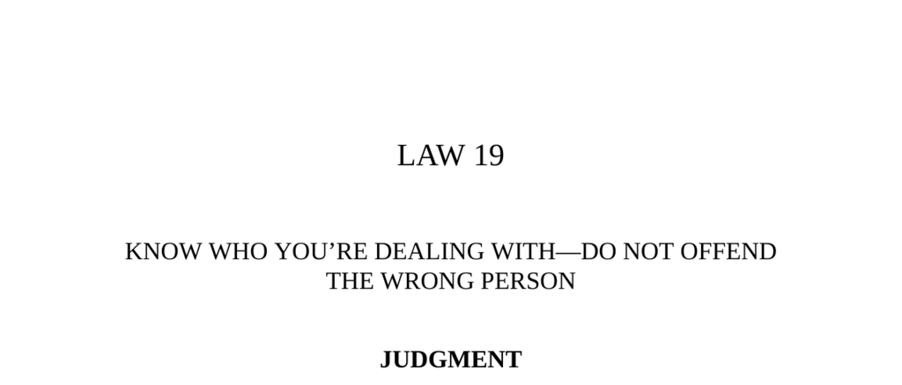

- **Judgment**
  - **Recognizing Different Types of People**
    - A key skill is to distinguish between wolves, foxes, hares, and vultures to minimize coercion and conflict.  
    - Different personalities react distinctly to deception or offense and require tailored strategies.  
    - Source: [Thunder in the Sky](https://www.goodreads.com/book/show/169693.Thunder_in_the_Sky) (Thomas Cleary, 1993)  
  - **The Arrogant and Proud Man**
    - This man resents slights intensely and seeks overwhelming violent revenge regardless of context.  
    - His pride is overactive and oversensitive, making negotiation dangerous if insulted.  
    - Example: Lope de Aguirre’s relentless revenge killing an official who ordered his punishment.  
  - **The Hopelessly Insecure Man**
    - Related to the proud type but less violent and more subtle in retaliation through prolonged small attacks.  
    - Injuring him requires withdrawal to avoid gradual damage over time.  
    - Testing their reaction to mild jokes can reveal this type.  
  - **Mr. Suspicion**
    - Highly distrustful, he suspects everyone of ill intent and is often unbalanced.  
    - He is the easiest to deceive but dangerous if suspicion turns on you.  
  - **The Serpent with a Long Memory**
    - Does not display overt anger but plans cold, calculating revenge when the opportunity arises.  
    - Recognized by his cold, unaffectionate demeanor and shrewdness.  
    - If injured, must be crushed or removed to avoid future retribution.  
  - **The Plain, Unassuming, and Often Unintelligent Man**
    - Difficult to deceive due to literal-mindedness and lack of imagination.  
    - Often wastes con artists’ time rather than exacting revenge.  
    - Testing with jokes or stories reveals this type.  

- **Transgressions of the Law**
  - **Transgression I: Muhammad of Khwarezm vs. Genghis Khan**
    - Muhammad insulted and rejected Genghis Khan’s offers and ambassadors, leading to a brutal war.  
    - Khan’s novel military tactics defeated a much larger army, destroying Muhammad’s empire.  
    - Lesson: Never underestimate or insult the potentially powerful, as offense can trigger overwhelming retaliation.  
    - See: [The Secret History of the Mongols](https://yalebooks.yale.edu/book/9780300138117/secret-history-mongols)  
  - **Transgression II: Joe Furey Con-Artist Ring and J. Frank Norfleet**
    - Norfleet was conned out of $45,000 but pursued the con artists relentlessly for five years.  
    - Unlike typical victims, Norfleet’s insecurity and refusal-to-accept defeat led to the ring’s destruction.  
    - Mark insecurity is a prime danger indicator, tested by gauging their reaction to minor insults.  
    - Suggested reading: [The Confidence Game](https://www.penguinrandomhouse.com/books/553487/the-confidence-game-by-maria-konnikova/)  
  - **Transgression III: Prince Ch’ung-erh and the Ruler of Cheng**
    - The ruler’s repeated insults to the exiled prince led to devastating destruction once the prince regained power.  
    - The prince exemplifies the “serpent with a long memory.”  
    - Always avoid insulting seemingly weak or insignificant people to prevent future calamities.  
    - Reference: [Records of the Grand Historian](https://en.wikipedia.org/wiki/Records_of_the_Grand_Historian)  
  - **Transgression IV: Joseph Duveen and Henry Ford**
    - Duveen misjudged Ford as a wealthy art buyer but Ford valued the reproductions over originals and declined to purchase.  
    - Ford’s plain, literal-minded personality made him an unprofitable mark.  
    - Duveen thereafter focused only on sophisticated buyers with imagination and craftiness.  
    - Further reading: [Duveen—His Life and Work](https://archive.org/details/duveenhislifewor00morgiala)  

- **Keys to Power**
  - **Importance of Measuring People**
    - Success requires concrete knowledge of one’s mark; instincts alone are inadequate.  
    - Understanding weaknesses, pride, and insecurities before taking action prevents costly mistakes.  
    - Never trust appearances or self-presentations, which are often deceptive.  
  - **Cautions in Judging Opponents**
    - Extensive study and spying are necessary before engaging an opponent.  
    - Appearances can mask true character: kindness can hide cruelty; bluster can hide cowardice.  
    - Disabled contempt as it breeds permanent enmity regardless of subsequent forgiveness.  
  - **Final Reminder**
    - Know your prey thoroughly and deploy tactics suited to their type, as a hunter does.  
    - Warning: No reversal exists for ignorance about others; failing this law invites ruin.  
    - Related quote: Lord Chesterfield on contempt and pride.  
    - Related resource: [The 48 Laws of Power](https://www.amazon.com/48-Laws-Power-Robert-Greene/dp/0140280197)
