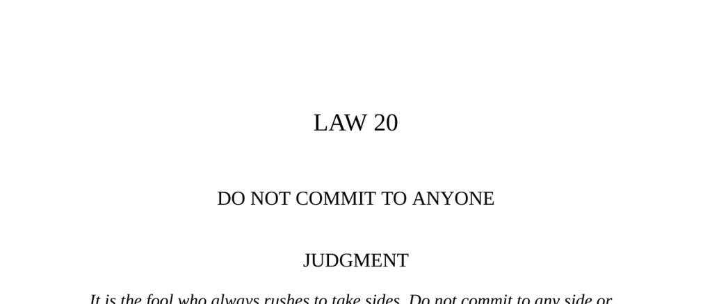

- **Judgment**  
  - It is foolish to rush into taking sides; maintain independence to master others.  
  - Commitment to oneself allows playing parties against each other and gaining pursuit.  
  - Avoiding allegiance preserves power and desirability.  
  - For further reading, see [The Art of War - Sun Tzu](https://en.wikipedia.org/wiki/The_Art_of_War).

- **Part I: Do Not Commit to Anyone, But Be Courted by All**  
  - Commitment to any party results in loss of power and control over how others pursue you.  
  - Queen Elizabeth I played suitors against one another, never marrying and thereby maintaining power.  
  - Elizabeth’s strategy created desire and worship around her by mixing hope with aloofness.  
  - Examples include Alcibiades and Henry Kissinger using non-commitment to maintain influence.  
  - Refusing to commit projects strength, making one more desirable to others.  
  - [Elizabeth I Biography](https://www.britannica.com/biography/Elizabeth-I).

- **Observance of the Law (Elizabeth I Example)**  
  - Elizabeth’s refusal to marry enabled her to avoid foreign entanglements and internal rivalries.  
  - By entertaining multiple suitors, she secured alliances without committing, preserving autonomy.  
  - Her courtship tactics enhanced her image as the "Virgin Queen," centralizing her power.  
  - Her reign resulted in peace and cultural flourishing without heirs.  
  - [The Virgin Queen Documentary](https://www.history.com/topics/british-history/elizabeth-i).

- **Interpretation (Elizabeth I Example)**  
  - Elizabeth avoided marriage to prevent loss of power due to her husband’s influence or war obligations.  
  - Following the example of Mary Queen of Scots, Elizabeth learned that commitment could mean ruin.  
  - Her goal was to avoid both war and subjugation by dangling the prospect of marriage without delivery.  
  - Through constant teasing and withdrawal, she dominated political and romantic rivals.  
  - [Women in Power: Elizabeth I](https://www.historyextra.com/period/tudor/).

- **Keys to Power (Non-Commitment Strategy)**  
  - Refusing commitment creates an aura of power and respect, making one irresistible.  
  - Commitment extinguishes magic, making a person ordinary and vulnerable.  
  - Emotional detachment and viewing others as pawns enable positioning between rivals.  
  - Historical figures like Alcibiades and Kissinger exemplify this strategy’s effectiveness.  
  - Accept gifts and favors cautiously to avoid obligations while maintaining aloofness.  
  - [Power Dynamics in History](https://plato.stanford.edu/entries/power/).

- **Part II: Do Not Commit to Anyone - Stay Above the Fray**  
  - Avoid being drawn into others’ conflicts; maintain neutrality and let others fight.  
  - Position yourself to mediate or exploit conflicts from a detached vantage point.  
  - The fox in fables profits by staying out of fights between others and manipulating outcomes.  
  - Isabella d’Este successfully managed Mantua by allying with all sides without allegiance.  
  - Playing both sides prevents depletion and preserves independence.  
  - [Diplomacy and Neutrality](https://www.c-span.org/video/?298098-1-diplomacy).

- **Observance of the Law (Isabella d’Este Example)**  
  - Isabella navigated Italy’s fragmented politics by charming and pleasing rival powers.  
  - She avoided outright loyalty, which would have jeopardized Mantua’s sovereignty.  
  - Her strategy protected Mantua from annexation despite surrounding wars and rivalries.  
  - She used gifts, diplomacy, and selective cooperation to neutralize threats.  
  - [Isabella d’Este Biography](https://www.britannica.com/biography/Isabella-dEste).

- **Interpretation (Isabella d’Este Example)**  
  - Taking sides in Italy’s conflicts led to ruin; independence ensured Mantua’s survival and prosperity.  
  - Committing draws one into others’ agendas, resulting in loss of initiative and resources.  
  - Remaining friendly but unattached allows one to grow stronger while others weaken.  
  - The ancient Chinese saying and fables stress benefiting from others’ quarrels by staying aloof.  
  - [Italian Renaissance Politics](https://www.metmuseum.org/toah/hd/vena/hd_vena.htm).

- **Keys to Power (Staying Above Conflicts)**  
  - Master emotions to avoid being sucked into endless squabbles.  
  - Show superficial interest without emotional or practical commitment.  
  - Gifts and charm help maintain appearances without losing independence.  
  - Waiting for conflicts to exhaust opponents before acting guarantees an advantageous position.  
  - Playing both sides or mediating raises status and options for personal gain.  
  - [Emotional Intelligence and Power](https://hbr.org/2015/12/emotional-intelligence-has-12-elements-which-do-you-need-to-improve).

- **The Price of Envy (Fables and Analogies)**  
  - The fox’s manipulation of the cat and dog illustrates dangers of conflict and envy.  
  - Fables teach that rushing into conflicts benefits clever outsiders at the expense of fighters.  
  - Historical anecdotes underscore the advantage of patience and strategic non-involvement.  
  - [Aesop’s Fables Collection](https://www.gutenberg.org/ebooks/19994).

- **Reversal**  
  - Excessive non-commitment leads to distrust and loss of interest by others.  
  - Committing occasionally for appearances preserves credibility but inner independence must persist.  
  - Maintaining the option to abandon alliances protects autonomy and creates fallback options.  
  - Balancing aloofness and engagement is necessary to sustain long-term power.  
  - [Balancing Commitment and Autonomy](https://www.psychologytoday.com/us/blog/stronger-the-broken-places/201707/balancing-autonomy-and-commitment).
