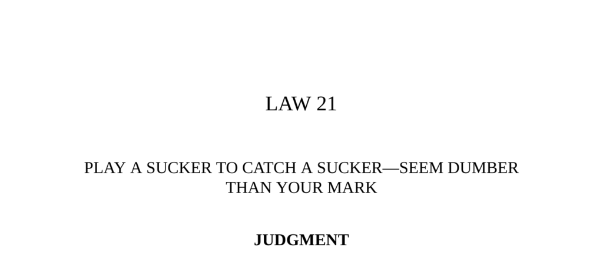

- **PLAY A SUCKER TO CATCH A SUCKER—SEEM DUMBER THAN YOUR MARK**
  - **Judgment**
    - The principle is to make victims feel smarter than you so they do not suspect ulterior motives.  
    - Harpending initially doubted the report of a diamond mine, but was persuaded to investigate by Rothschild.  
    - Intellectual superiority breeds resentment and suspicion, while apparent inferiority disarms people’s defensiveness.  
    - The story of Arnold and Slack, prospectors who fooled top financiers by playing naïve, exemplifies the law.  
    - Schopenhauer’s observation supports that foolish people avoid the company of the wise, making the tactic of seeming less intelligent effective.  
  - **Interpretation**
    - Arnold and Slack’s scam succeeded because they appeared naïve and unsophisticated, disarming suspicion.  
    - They used real experts and real gems to create a convincing illusion of the mine’s existence and value.  
    - Their outward clodhopper image and naive behavior caused financiers to underestimate them.  
    - The victim financiers suffered ruin while Arnold and Slack profited and vanished or prospered quietly.  
    - This case study illustrates the power of appearing less intelligent than the mark in deception.  
  - **Keys to Power**
    - People dislike feeling intellectually inferior and strive to convince themselves they are smarter.  
    - Never offend others’ intelligence, as it is crucial to their vanity and respect.  
    - Bismarck’s mimicry of recklessness fooled his Austrian counterpart into underestimating him.  
    - The Chinese proverb “Masquerading as a swine to kill the tiger” illustrates how playing stupid can deceive the overconfident.  
    - Downplaying intelligence and sophistication makes others lower their guard and increases your influence and opportunities.  
  - **Authority**
    - The wisest men know when to feign ignorance or stupidity to navigate social dynamics effectively.  
    - Posing as a fool is a strategic disguise that gains better acceptance than obvious intellectual superiority.  
    - Baltasar Gracián advises that the best reception comes from dressing oneself in the skin of the “dumbest of brutes.”  
  - **Reversal**
    - Revealing true intelligence rarely benefits one; discretion and modesty about one’s smarts are preferable.  
    - Early in a career, subtle hints of superior intelligence may be useful, but later playing down brilliance is recommended.  
    - When defending a deception, projecting confidence and authority can lend credibility, as shown by art dealer Joseph Duveen.  
    - Duveen’s success came from conveying expertise through authoritative demeanor, regardless of actual knowledge.  
    - Playing the “professor” is a useful tactic when needed but should not be imposed indiscriminately.
