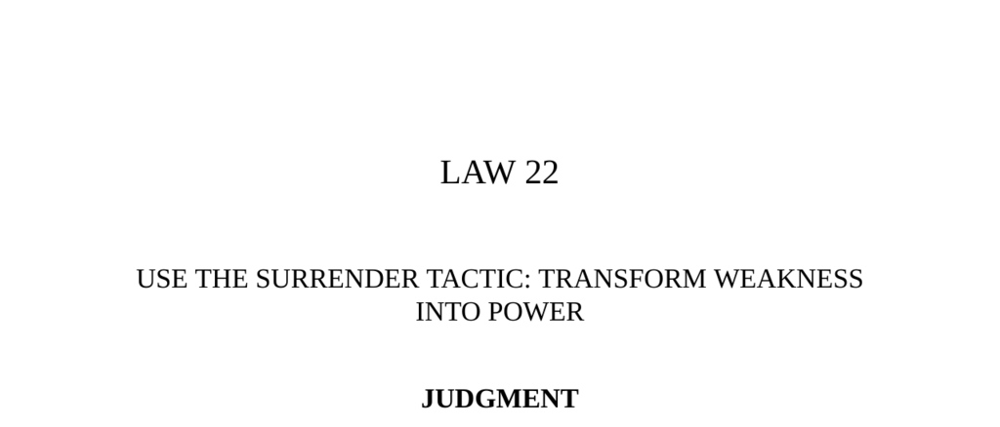

- **Judgment**
  - **Historical Background and the Melian Dialogue**
    - The city of Melos refused to ally with Athens during the Peloponnesian War, relying on Sparta’s support instead.  
    - Athens offered terms of surrender to Melos before invading, arguing that power defines justice and honor is subordinated to survival.  
    - The Melians rejected surrender, appealing to honor, the gods’ justice, and Spartan help, but were ultimately defeated and devastated by Athens.  
    - The historical episode illustrates the consequences of refusing to surrender when faced with overwhelming power.  
    - Further reading: [Melian Dialogue - Thucydides](https://sourcebooks.fordham.edu/ancient/thucydides-melian.asp)

- **Interpretation**
  - **Power Dynamics and Practicality of Surrender**
    - Athens pragmatically explained that fighting a stronger foe leads to needless martyrdom and defeat without aid.  
    - Weakness can be a strategic strength if it leads to patience and long-term power through calculated surrender.  
    - Surrender provides time to recover, sabotage, and wait for the enemy’s decline, as seen in historical examples.  
    - The surrender tactic unsettles opponents who expect resistance, thereby turning submission into a tool of power.  
    - Further reading: [The 48 Laws of Power](https://en.wikipedia.org/wiki/The_48_Laws_of_Power)

- **Observance of the Law**
  - **Bertolt Brecht and the Hollywood 19**
    - Bertolt Brecht used surrender tactically during the 1947 House Un-American Activities Committee hearing to avoid imprisonment.  
    - Brecht appeared compliant while delivering evasive and linguistically complex answers, undermining the committee subtly.  
    - Contrasting with the confrontational approach of his peers, Brecht maintained his freedom to produce work while mocking the authorities.  
    - The tactic of appearing to yield can disarm authorities and preserve one’s long-term influence in hostile environments.  
    - Further reading: [House Un-American Activities Committee](https://www.britannica.com/topic/House-Un-American-Activities-Committee)

- **Keys to Power**
  - **Strategic Principles of the Surrender Tactic**
    - Overreacting to aggression often escalates conflict; surrendering can neutralize aggression and confuse opponents.  
    - The tactic requires inward firmness despite outward flexibility, creating opportunities for future counterattack.  
    - Historical examples include King Goujian of Yue’s submission and revenge, and Japan’s adaptive policy toward Western influence.  
    - Overobedience can function as covert resistance and mockery, undermining oppressors without overt confrontation.  
    - Further reading: [Sun Tzu’s The Art of War](https://en.wikipedia.org/wiki/The_Art_of_War)

- **Reversal**
  - **Limits and Risks of Martyrdom as Surrender’s Opposite**
    - Martyrdom can inspire but often results in unpredictable outcomes and personal loss of influence or life.  
    - Choosing surrender over martyrdom preserves the possibility of regaining power when circumstances change.  
    - Martyrdom may represent selfish glorification rather than practical strategy in power dynamics.  
    - Staying alive to wait for the pendulum of power to swing back is generally the wiser course.  
    - Further reading: [The Martyr’s Dilemma](https://plato.stanford.edu/entries/martyrdom/)
