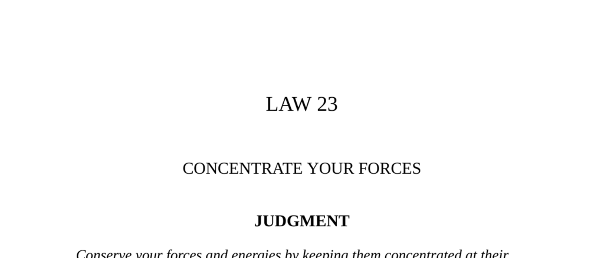

- **Judgment**
  - Conserve forces by focusing energy on the strongest point rather than spreading efforts thin.
  - Intensity surpasses extensity in achieving power and success.
  - Securing a key patron provides sustainable and long-term support.
  - For further insight, see [The Art of War by Sun Tzu](https://suntzusaid.com/book/).

- **Transgression of the Law**
  - The kingdom of Wu engaged in an overextended war against the Middle Kingdom in 6th century B.C.
  - Wu’s distracted focus led to vulnerability against the southern barbarians, Yueh.
  - The king ignored his chief minister Wu Tzu-hsiu's warnings and dismissed prudent advice.
  - Wu Tzu-hsiu’s prediction of Wu’s downfall proved accurate with Yueh’s eventual invasion.
  - The story illustrates how overambition and dispersed forces lead to catastrophic defeat.
  - For historical context, refer to [Strategy in Ancient China](https://www.britannica.com/topic/Sun-Tzu).

- **The Goose and the Horse**
  - The fable contrasts dispersion of abilities versus focused excellence.
  - The goose’s multi-element presence leads to mediocrity in each element.
  - The horse’s singular focus grants it strength, grace, and superior performance.
  - The fable exemplifies the superiority of intense specialization over diffused effort.
  - For more fables, see [Fables of John Aikin](https://www.gutenberg.org/ebooks/55390).

- **Observance of the Law**
  - Mayer Amschel Rothschild concentrated banking services on one powerful family to build initial wealth.
  - The Rothschild family maintained close internal control by employing relatives exclusively.
  - The five Rothschild brothers expanded influence across Europe while preserving family unity.
  - They established coded communication and exclusive informational advantages.
  - Marriages within the family minimized risk from outsiders and reinforced cohesion.
  - Their disciplined concentration preserved and expanded wealth amid 19th-century turmoil.
  - See [The Rothschilds: Banking Dynasty](https://www.britannica.com/topic/Rothschild-family).

- **Interpretation** (Observance of the Law)
  - The Rothschilds’ success stemmed from resisting dispersion and maintaining traditions.
  - Their unity provided power and stability in chaotic times and shifting political regimes.
  - Concentration on core strengths and history ensures sustainable power.
  - For strategic mindset, see [Clausewitz's Principles on Concentration](https://plato.stanford.edu/entries/clausewitz/).

- **Keys to Power**
  - Division and distraction plague modern society and weaken power.
  - Retreating inward and focusing on a single goal brings superior results.
  - Historical leaders (Napoleon, Casanova) demonstrate success through single-minded concentration.
  - Attaching loyalty to one patron secures reliable support and fosters mutual dependence.
  - Power structures naturally concentrate in small groups, not the titular leaders.
  - Identifying and aligning with true centers of power is essential to ascend.
  - See [The 48 Laws of Power Summary](https://fourminutebooks.com/the-48-laws-of-power-summary/).

- **Reversal**
  - Concentration risks include vulnerability if the single source of power is lost.
  - Guerrilla tactics illustrate when dispersion and elusiveness are superior for the weaker side.
  - Political upheaval may require spreading allegiance to multiple patrons to mitigate risk.
  - Excessive single-mindedness can dampen creativity, as in the case of Paolo Uccello.
  - Balancing intensity with flexibility is necessary in volatile or creative contexts.
  - For guerrilla strategy, see [Mao’s Guerrilla Warfare](https://www.britannica.com/topic/guerrilla-warfare).
