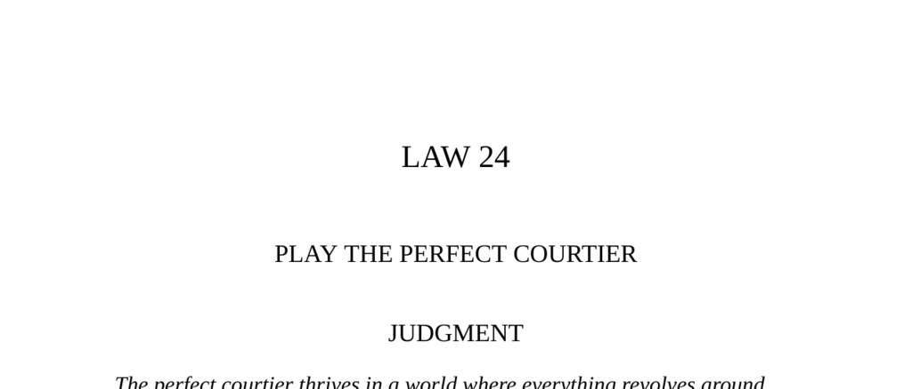

- **Judgment**  
  - The perfect courtier masters indirection, flattering superiors while subtly asserting power over others.  
  - Court politics revolve around power and political dexterity, with courtiers navigating complex social hierarchies.  
  - Courtiers are skilled in appearance, words, and behavior to please the ruler without causing insecurity.  
  - The laws of courtiership remain relevant today as power and court-like dynamics persist.  
  - Further reading: [The 48 Laws of Power](https://en.wikipedia.org/wiki/The_48_Laws_of_Power)  

- **Court Society**  
  - Historical courts gathered around rulers to solidify social hierarchies and keep nobles close and subordinate.  
  - Courtiers faced danger from displeasing the ruler; success depended on pleasing carefully without threatening authority.  
  - Courtiers used manipulation and masterful social skills to become favorites, often gaining influence surpassing the ruler.  
  - Modern courts may lack power, but the timeless dynamics of power and influence continue.  

- **The Two Dogs**  
  - The fable contrasts the faithful yard-dog’s hard service with the favored lapdog’s privileged life.  
  - Success at court depends on clever behavior (walking on hind legs) rather than mere loyalty or effort.  
  - Talent disguised as grace and fitting into court expectations secures favor and rewards.  
  - Further reading: [Ivan Krylov Fables](https://en.wikipedia.org/wiki/Ivan_Krylov)  

- **The Laws of Court Politics**  
  - Avoid ostentation to prevent envy and suspicion; modesty secures stability.  
  - Practice nonchalance so talent seems effortless, enhancing perceived genius.  
  - Be frugal with flattery and indirect in praising superiors to maintain value and avoid suspicion.  
  - Politeness is essential; being rude causes enemies and damages influence.  
  - Arrange to be noticed subtly by cultivating distinctive appearance and style.  
  - Tailor style and language to social rank and culture to avoid offending or appearing condescending.  
  - Never bear bad news; strive to shift bad news to others and bring only positive news.  
  - Maintain clear social distance; do not feign intimacy with the master.  
  - Criticize superiors only indirectly, with careful and polite wording.  
  - Request favors sparingly to avoid irritating superiors and promote voluntary generosity.  
  - Avoid jokes about appearance or taste, especially regarding superiors.  
  - Avoid cynicism; praise others sincerely to bolster your own reputation.  
  - Be self-observant, monitoring your behavior as others see it to avoid blunders.  
  - Master emotions by disguising true feelings to maintain social composure.  
  - Fit the spirit of the times by adapting dress and mindset without standing out excessively.  
  - Be a source of pleasure, controlling unpleasant qualities and enhancing charm and wit.  
  - Further reading: [Arthur Schopenhauer's Essays](https://en.wikipedia.org/wiki/Arthur_Schopenhauer)  

- **Scenes of Court Life: Exemplary Deeds and Fatal Mistakes**  
  - **Scene I: Alexander the Great and Callisthenes**  
    - Honest and direct criticism of the master in court leads to fatal consequences.  
    - Mastery of indirect communication is essential for survival.  
  - **Scene II: Chinese Histories and Unusual Events**  
    - Courtiers used symbolic natural phenomena in official chronicles to indirectly warn emperors.  
    - Indirect criticism protects the courtier while alerting the master to dangers.  
  - **Scene III: Jules Mansart and Louis XIV**  
    - Mansart strategically made the king appear more skilled by publicly admiring his corrections.  
    - Social skills and flattery can outweigh raw talent in court advancement.  
  - **Scene IV: Jean-Baptiste Isabey and Vienna Congress**  
    - Courtiers must carefully balance attention to multiple masters to avoid offense.  
    - Creative diplomacy satisfies competing patrons simultaneously.  
  - **Scene V: Beau Brummell and the Prince of Wales**  
    - Joking about a master’s personal appearance, especially weight, is a grave error with harsh consequences.  
    - Arrogant behavior without patronage leads to social and financial ruin.  
  - **Scene VI: Fulvio Testi and Pope Urban VIII**  
    - Courtiers must be obsequious when praising a master’s taste and creativity.  
    - Criticism or doubt about the master’s creations risks punishment.  
  - **Scene VII: Crown-Keeper and Han Ruler Chao**  
    - Do not exceed assigned duties; overreaching breeds suspicion and punishment.  
    - Fulfill roles as expected to maintain safety and favor.  
  - **Scene VIII: Fra Filippo Lippi’s Captivity**  
    - Talents used to please and honor a master can secure freedom and favor even in captivity.  
    - Displaying skill through the master’s lens enhances a courtier’s position.  
  - **Scene IX: Alfonso I and the Servant’s Dreams**  
    - The master controls giving; requesting too much risks rejection and loss of favor.  
    - Favor should be earned discreetly rather than demanded.  
  - **Scene X: J.M.W. Turner and Sir Thomas Lawrence**  
    - A courtier must placate equals and subordinates by moderating brilliance to avoid envy.  
    - Managing relationships with peers prevents isolation and backlash.  
  - **Scene XI: Winston Churchill and Henry Luce**  
    - Courtiers show deference and accept criticism from powerful equals or subordinates.  
    - Displaying obliging behavior strengthens mutual respect and influence.  
  - Further reading: [Talleyrand Biography](https://en.wikipedia.org/wiki/Charles-Maurice_de_Talleyrand-P%C3%A9rigord)  

- **The Delicate Game of Courtiership: A Warning**  
  - Talleyrand’s joke on Napoleon demonstrates the need for subtlety and secrecy in court maneuvers.  
  - Exposure of deception damages trust and reputation irreparably.  
  - Courtiers must conceal their tricks to maintain influence and avoid humiliation.  
  - Even great courtiers can suffer loss of favor if their manipulations are discovered.  
  - Further reading: [Courtiership and Political Intrigue](https://en.wikipedia.org/wiki/Courtier)
