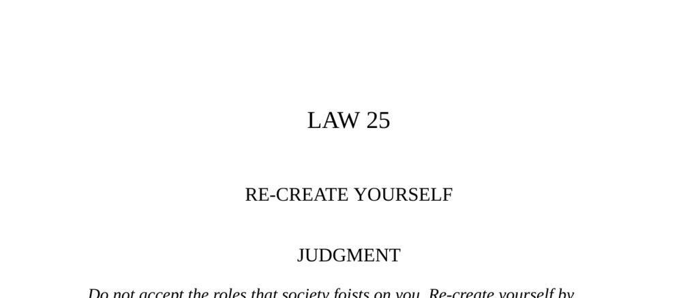

- **Judgment**  
  - Do not accept societal roles; recreate yourself by forging a new identity that commands attention.  
  - Master your public image using dramatic devices to enhance your power and larger-than-life character.  
  - [The Art of Dramatic Self-Presentation](https://www.psychologytoday.com/us/blog/the-athletes-way/201707/the-art-dramatic-self-presentation)

- **Observance of the Law I**  
  - **Julius Caesar's Public Image and Popularity**  
    - Caesar began his public career by sponsoring lavish spectacles, which earned him popularity among the masses.  
    - He used his theatrical interest to make speeches and gestures dramatic, securing loyalty and power.  
    - Caesar’s staged public events, such as mock naval battles, amplified his larger-than-life persona.  
    - His dramatic oratory and costumes, like the laurel wreath, served to maintain an imposing public image.  
    - [Julius Caesar Biography](https://www.britannica.com/biography/Julius-Caesar)  
  - **Casanova on Flexibility and Adaptation**  
    - Success in Rome required a chameleon-like flexibility and concealment of true emotions.  
    - Casanova admitted to embracing hypocrisy as a survival strategy in a politically treacherous environment.  
    - Adaptability and patient control of demeanor were essential qualities for power.  
    - [Biography of Giacomo Casanova](https://www.britannica.com/biography/Giacomo-Casanova)  
  - **Caesar's Crossing of the Rubicon as Dramatic Gesture**  
    - Caesar used theatrical oratory and symbolic gestures to rally his generals in a pivotal moment.  
    - The dramatic declaration “The die is cast” marked the irreversible start of a civil war.  
    - This spectacle secured loyalty and contributed to his eventual dictatorship.  
    - [The Rubicon Crossing](https://www.history.com/topics/ancient-rome/julius-caesar)  
  - **Caesar’s Role in Battle and Public Spectacle**  
    - Caesar positioned himself visibly at the center of battle, serving as a heroic model to his troops.  
    - His staged entertainments and grand public spectacles cemented his image and support.  
    - Even in death, Caesar maintained dramatic presence with choreographed final gestures.  
    - [Caesar’s Military Leadership](https://www.ancient.eu/Julius_Caesar/)  

- **Interpretation**  
  - Julius Caesar merged power and theater, using drama to build loyalty and command attention.  
  - He scripted his public gestures and speeches to appeal to and manipulate his audience’s emotions.  
  - Leaders must enlarge actions through dramatic techniques like surprise and suspense to maintain authority.  
  - Theatrical self-presentation translates into real-world political power.  
  - [Theatricality in Leadership](https://hbr.org/1998/07/the-leader-as-dramatic-communicator)  

- **Observance of the Law II**  
  - **Aurore Dupin Dudevant’s (George Sand) Self-Creation Strategy**  
    - She adopted a male persona to overcome societal restrictions on women writers.  
    - George Sand’s masculine image allowed freer social engagement and artistic acceptance.  
    - She periodically altered her public persona to avoid predictability and grow her influence.  
    - [George Sand Biography](https://www.britannica.com/biography/George-Sand)  
  - **Public Persona versus Private Self**  
    - Sand played a crafted role to retain power, separating the public character from her private identity.  
    - Her strategy underscores the importance of controlling how society defines one’s identity.  
    - Self-creation acts as a defense mechanism and source of theatrical presence.  
    - [The Role of Persona in Public Life](https://www.psychologytoday.com/us/blog/the-squeaky-wheel/201108/the-persona-social-mask)  

- **Interpretation**  
  - Society imposes limiting roles that restrict personal power; self-creation defies these limits.  
  - Actors playing multiple roles possess greater power than those confined to a single identity.  
  - The costume of identity protects and empowers by creating theatrical distance from the self.  
  - Diderot defined great acting as superb simulation without necessarily feeling the emotions portrayed.  
  - [Identity and Power](https://www.ted.com/talks/brenee_brown_the_power_of_vulnerability)  

- **Keys to Power**  
  - **Self-Consciousness and Acting**  
    - The first step to power is awareness of oneself as an actor controlling appearance and emotions.  
    - Over-sincerity weakens authority; controlled externalization of emotion is more effective.  
    - Method acting is counterproductive in leadership; emotional discipline is essential.  
    - [Emotion Management in Leadership](https://hbr.org/2013/12/leadership-emotional-intelligence)  
  - **Creation of a Memorable Character**  
    - Crafting a distinctive persona, like Abraham Lincoln’s homespun image, aids public recognition.  
    - Visual symbols such as clothing and photography enhance and spread this image.  
    - [Abraham Lincoln’s Image](https://www.loc.gov/collections/abraham-lincoln-papers/about-this-collection/)  
  - **Rhythm and Timing in Drama**  
    - Effective drama unfolds with controlled pacing, suspense, and surprise.  
    - Roosevelt’s “Hundred Days” exemplified staged political drama leveraging these principles.  
    - [Staging Political Power](https://www.history.com/topics/great-depression/franklin-d-roosevelt)  
  - **Use of Deception and Charm**  
    - Bertolt Brecht’s testimony before the House Committee illustrated manipulating authority through charm and ambiguity.  
    - Dramatic techniques can confuse and deflect enemies and opponents effectively.  
    - [Brecht and Political Theater](https://www.britannica.com/biography/Bertolt-Brecht)  
  - **Beau Geste and Symbolic Acts**  
    - Climactic symbolic actions, like Caesar’s crossing of the Rubicon or Cleopatra’s carpet entrance, have lasting impact.  
    - Planned and dramatic entrances/exits elevate status and control perception.  
    - [The Power of Symbolism](https://www.psychologytoday.com/us/blog/the-moment-youth/201712/the-power-symbolic-actions)  
  - **Restraint and Presence**  
    - Overacting diminishes impact; imposing stillness and gracefulness are more commanding.  
    - Richard Burton’s learning to stand still exemplifies the power of measured presence.  
    - [Nonverbal Communication and Power](https://www.psychologytoday.com/us/blog/all-in-the-mind/201611/why-power-poses-might-be-bunk)  
  - **Playing Many Roles**  
    - Adaptability to different situations (the Proteus strategy) avoids predictability and increases influence.  
    - Bismarck exemplified this by embodying contradictory personas as needed.  
    - [Adaptability in Leadership](https://hbr.org/2016/11/why-adaptability-is-essential-to-leadership)  

- **Image: The Greek Sea-God Proteus**  
  - Proteus’s power came from shape-shifting into forms like lion, serpent, water, or tree to evade capture.  
  - His adaptability symbolizes the ultimate ability to change identity according to circumstance.  
  - Baltasar Gracián recommended discreet emotional adaptation to win over others.  
  - [Myth of Proteus](https://www.theoi.com/Ocean/Proteus.html)  

- **Reversal**  
  - There is no true reversal to this law: poor acting and overacting are always counterproductive.  
  - Naturalness requires artful control; sincerity without control leads to embarrassment and loss of respect.  
  - Poor theatricality fails to command power or attention.  
  - [The Importance of Social Acting](https://www.psychologytoday.com/us/blog/words-matter/201309/the-art-act-social-life)
