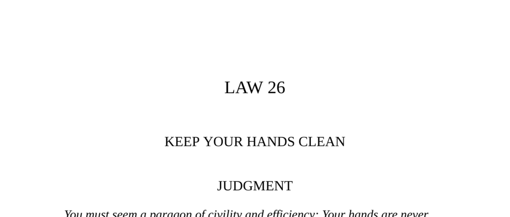

- **LAW 26: KEEP YOUR HANDS CLEAN**
  - **Judgment**
    - Maintain a spotless appearance by using scapegoats and cat’s-paws to conceal mistakes and wrongdoing.
    - Appear as a paragon of civility and efficiency to preserve reputation.
    - Learn more about reputation management in [Baltasar Gracián’s works](https://en.wikipedia.org/wiki/Baltasar_Gracián).

  - **PART I: CONCEAL YOUR MISTAKES—HAVE A SCAPEGOAT AROUND TO TAKE THE BLAME**
    - **Chelm Justice**
      - The town substitute a scapegoat when the only cobbler was sentenced to death to avoid community harm.
      - The community's needs influence scapegoat selection.
      - For cultural scapegoat practices see [A Treasury of Jewish Folklore](https://archive.org/details/treasuryofjewish00ausu).

    - **Observance of the Law I: Ts‘ao Ts’ao**
      - Ts‘ao Ts’ao sacrificed his chief of commissariat to prevent mutiny caused by food shortages.
      - He chose execution over apology to maintain appearances of competence and fairness.
      - Excuses and apologies weaken power, scapegoats distract blame effectively.
      - Study Machiavellian strategy in [The Art of War by Sun Tzu](https://en.wikipedia.org/wiki/The_Art_of_War).

    - **Observance of the Law II: Cesare Borgia and Remirro de Orco**
      - Cesare Borgia appointed a brutal lieutenant to impose order, then publicly executed him to dissociate from cruelty.
      - Planned scapegoats serve as offensive tools and later as shields for the leader’s image.
      - The ritualistic public display redirected public blame and satisfied the populace.
      - For political scapegoats see [Machiavelli’s The Prince](https://en.wikipedia.org/wiki/The_Prince).

    - **Keys to Power**
      - Scapegoating is an ancient and cross-cultural practice shifting guilt onto innocent parties.
      - Innocent or close associates used as scapegoats reduce risk and increase public acceptance.
      - Modern leaders continue scapegoating to protect image, as exemplified by Mao Tse-tung and Franklin D. Roosevelt’s secretary.
      - The “fall of the favorite” is a strategic scapegoat technique.
      - Explore scapegoating in [The Golden Bough by Sir James George Frazer](https://en.wikipedia.org/wiki/The_Golden_Bough).

  - **PART II: MAKE USE OF THE CAT’S-PAW**
    - **The Monkey and the Cat**
      - The cat’s-paw performs unpleasant or risky tasks for another, absorbing negative consequences.
      - The strategy enables a leader to remain untainted while achieving goals through others.
      - Classic example of indirect action using others’ effort at minimal personal risk.
      - Read more in [Jean de La Fontaine’s Fables](https://en.wikipedia.org/wiki/La_Fontaine's_Fables).

    - **Observance of the Law I: Cleopatra**
      - Cleopatra manipulated Roman leaders Caesar and Antony as cat’s-paws to eliminate rivals and secure power.
      - She leveraged others to do the dirty work without tarnishing her reputation.
      - Cat’s-paws often come from outside immediate circles and are unwittingly used.
      - For insights on power and influence see [The Craft of Power by R. G. H. Siu](https://archive.org/details/craftofpower00siur).

    - **Observance of the Law II: Chiang Kai-shek and Mao Tse-tung**
      - Mao spared Chiang to use him as cat’s-paw against Japanese invaders.
      - The Japanese invasion weakened Nationalists, indirectly aiding Mao’s communists.
      - Using third parties’ energy and aggression saves resources and facilitates long-term dominance.
      - Understand strategic patience in [The Long March](https://en.wikipedia.org/wiki/Long_March).

    - **Observance of the Law III: Kuriyama Daizen’s Indirect Favor**
      - Daizen cleverly exchanged gifts to indirectly relieve a friend’s debt without imposing favor.
      - Making favors subtle prevents resentment and builds power through grace.
      - The cat’s-paw serves in reciprocal social exchanges to maintain relationships and influence.
      - Explore Japanese etiquette and influence in [Sen no Rikyu and the Japanese Tea Ceremony](https://en.wikipedia.org/wiki/Sen_no_Riky%C5%AB).

    - **Keys to Power**
      - True power avoids direct labor and unpleasant acts by delegating to cat’s-paws.
      - Disguising intentions enables manipulation and baiting rivals to do one’s work unknowingly.
      - Using lower-ranked individuals as intermediaries can increase access to powerful targets.
      - Historical examples include Chuko Liang’s arrows and con artist Yellow Kid Weil’s manipulation.
      - Learn more from [The 48 Laws of Power by Robert Greene](https://en.wikipedia.org/wiki/The_48_Laws_of_Power).

    - **Reversal**
      - Using scapegoats and cat’s-paws carries risk: exposure as the manipulator results in backlash.
      - Catherine de’ Médicis’s failed plot demonstrates how misuse can cause unintended civil conflicts.
      - Sometimes, taking responsibility personally can strengthen authority if used sparingly.
      - Wise leaders balance direct and indirect actions to maintain power and avoid resentment.
      - For guidance on political intrigue, see [The Prince by Niccolò Machiavelli](https://en.wikipedia.org/wiki/The_Prince).
