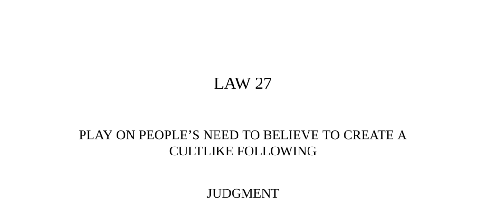

- **Law 27: Play on People’s Need to Believe to Create a Cultlike Following**
  - **Judgment**
    - People have an overwhelming desire to believe in something, making them highly gullible.
    - Offer a cause or new faith with vague but promising words and enthusiastic delivery.
    - Followers perform rituals and sacrifices to bond with the cause and increase the leader’s power.
    - Absence of established religions or causes magnifies the opportunity to gain power.
    - For more on belief psychology, see [The Belief Instinct](https://www.penguinrandomhouse.com/books/302722/the-belief-instinct-by-jesse-birkholt).
  - **The Science of Charlatanism, or How to Create a Cult in Five Easy Steps**
    - Cultlike followings create power with minimal effort by exploiting humans’ need to believe.
    - Group settings enhance emotional contagion, reducing skepticism and increasing loyalty.
    - The five steps: 1) Keep it vague and simple; 2) Emphasize visuals and senses over intellect; 3) Borrow religious forms; 4) Disguise income sources; 5) Create an us-versus-them dynamic.
    - Early charlatans exploited social conditions during periods of religious decline and scientific upheaval.
    - For historic cases of charlatanism, see [Charlatans and Swindlers](https://www.britannica.com/topic/charlatanism).
    - **Step 1: Keep It Vague; Keep It Simple**
      - Use vague promises and resonant but unclear words to inspire followers’ imaginations.
      - Simplicity appeals because many people seek easy solutions to complex problems.
      - Be cautious: specificity invites accountability and scrutiny.
      - Creating new words and concepts adds an aura of exclusive knowledge.
    - **Step 2: Emphasize the Visual and the Sensual over the Intellectual**
      - Use theatrical spectacle and sensory experiences to distract from logical doubts.
      - Employ luxury, incense, music, colorful displays, and exotic elements.
      - Avoid encouraging critical thinking; prefer emotional engagement.
      - The “Owl Who Was God” story illustrates how group enthusiasm overwhelms reason.
    - **Step 3: Borrow the Forms of Organized Religion to Structure the Group**
      - Organize followers hierarchically with religious titles and rituals.
      - Frame yourself as a priest, guru, or prophet to cloak power in spiritual authority.
      - Use rituals and sacrifices to deepen followers’ commitment and extract resources.
      - Religious forms grant legitimacy and continuity even in secular contexts.
    - **Step 4: Disguise Your Source of Income**
      - Hide the fact that wealth comes from followers; attribute wealth to the validity of the belief system.
      - Luxury serves as visible proof of the cult’s power and success.
      - Followers imitate the leader’s lifestyle, reinforcing the illusion of efficacy.
    - **Step 5: Set Up an Us-Versus-Them Dynamic**
      - Promote exclusivity and common goals to create in-group cohesion.
      - Manufacture or identify enemies to unify followers against outsiders.
      - Enemies include skeptics or those exposing the cult as a sham.
      - This dynamic maintains activity and loyalty, preventing boredom or dissension.
  - **Observances of the Law**
    - **Observance I: Francesco Giuseppe Borri (1653)**
      - Borri claimed visions from archangel Michael and power to see souls.
      - He formed an order with six degrees of discipleship, requiring strict poverty.
      - Borri’s wealth grew through collecting assets from followers based on false promises.
      - Maintained a lavish lifestyle to impress and legitimize his claims.
      - His career ended imprisoned by the Inquisition but supported by wealthy believers.
      - For more on Borri, see [Historical Occult Figures](https://www.occultopedia.org).
    - **Interpretation of Borri’s Cultmaking**
      - Conversion stories serve better when attributed to mystical experiences rather than mundane causes.
      - Grand visions and sacrifices increase followers’ buy-in.
      - People prefer romanticized, otherworldly explanations for change.
      - The messiah figure must mirror followers’ desires and aim high.
    - **Observance II: Michael Schüppach, the Mountain Doctor (Mid-1700s)**
      - Schüppach used natural remedies with pleasant names and tastes.
      - His alpine location and dramatic natural setting enhanced appeal.
      - Employed staged cures and theatrical effects, including hired actors and props.
      - Attracted well-to-do patients, including Goethe.
      - His naturalistic cult soothed hypochondria and psychological ailments.
      - For herbal cure history, see [Herbal Medicine: Biomolecular and Clinical Aspects](https://www.ncbi.nlm.nih.gov/books/NBK92752/).
    - **Interpretation of the Mountain Doctor**
      - Healing relied on psychological influence and patients’ belief (placebo effect).
      - Belief in nature’s healing is a romanticized myth constructed theatrically.
      - The cult’s power stemmed from blending simplicity with staged naturalism.
      - Effective cult leaders do not become ‘one with nature’ but control and mold nature’s image.
    - **Observance III: Franz Mesmer (1788)**
      - Mesmer promoted animal magnetism and staged cures in sensory-rich environments.
      - Group magnetism sessions created emotional contagion and hysterical reactions.
      - Enjoyed support from French elite including Marie-Antoinette.
      - After medical condemnation, Mesmer’s movement persisted and spread internationally.
      - Societies of Harmony formed, often with libertine reputations.
      - For historical magnetism research, see [Mesmerism and Hypnosis](https://www.britannica.com/science/animal-magnetism).
    - **Interpretation of Mesmer’s Cult**
      - Shifted from genuine belief to strategic use of theater and social dynamics.
      - Group setting suppressed individual skepticism via emotional contagion.
      - Repressed sexuality underpinned participants’ emotional responses.
      - Effective cults blend religion and scientific veneer to expand appeal.
      - Leader must function as the “magnet” attracting imaginations and loyalty.
  - **Authority**
    - Charlatans’ power derives from enabling people to believe what they already desire.
    - Credulous individuals surrender to the charlatan’s aura with solemnity.
    - Group dynamics amplify the illusion and commitment of followers.
  - **Reversal**
    - Cult leaders risk violent backlash if followers detect deception.
    - Constant vigilance is required to monitor doubts and enemies.
    - Moving frequently and using spies helps avoid exposure.
    - Isolating individuals may be safer than mass followings.
    - See [Psychology of Group Dynamics](https://www.apa.org/education/k12/group-dynamics).
