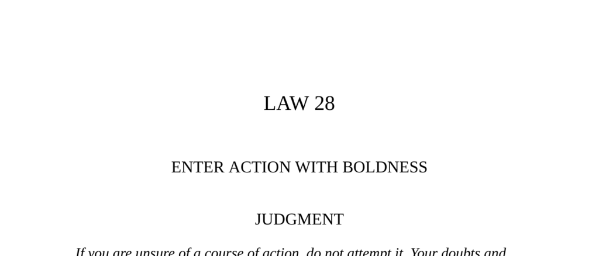

- **Judgment**
  - Summarizes the importance of bold action and the dangers of hesitation.
  - Emphasizes that bold mistakes are correctable but timidity leads to failure.
  - Advocates choosing boldness over doubt in pursuing goals.
  - References the story of Hercules and knightly adventure as symbolism.
  - For deeper context, see [The 48 Laws of Power](https://en.wikipedia.org/wiki/The_48_Laws_of_Power).

- **The Two Adventurers**
  - Illustrates the contrast between cautious calculation and bold action through a fable.
  - Demonstrates success via audacity despite apparent impossibility.
  - Suggests over-calculation wastes time and opportunities are seized by the bold.
  - Highlights that daring spirits achieve great enterprises.
  - Related reading: [La Fontaine's Fables](https://www.gutenberg.org/ebooks/21090).

- **Boldness and Hesitation: A Brief Psychological Comparison**
  - Boldness removes obstacles, hesitation creates them.
  - The audacity of lies or demands makes them more credible.
  - Hesitation signals weakness, encouraging others to dominate.
  - Bold moves intimidate and establish authority.
  - Boldness prevents doubts and seals success in seduction and negotiation.
  - Source for concepts: [Psychology of Confidence](https://www.psychologytoday.com/us/blog/mind-my-business/201206/the-power-british-boldness).

- **Observances of the Law**
  - **Observance I: The Story of Count Victor Lustig**
    - Describes a con artist who sold the Eiffel Tower twice through audacity.
    - Large-scale boldness exploits disbelief to deceive targets effectively.
    - Increasing demands during a con prevent suspicion and strengthen the ruse.
    - Demonstrates that fear of imprudence restricts action, but fortune favors boldness.
    - See more: [Victor Lustig's Cons](https://www.history.com/news/victor-lustig-the-man-who-sold-the-eiffel-tower).
  - **Observance II: Ivan the Terrible’s Rise**
    - Details how Ivan IV used feigned timidity before executing a swift bold strike to secure power.
    - Illustrates how hesitation or negotiation provides openings for adversaries.
    - Bold, sudden action establishes authority and instills fear in opponents.
    - Highlights patience and timing in deploying boldness strategically.
    - Further reading: [Ivan the Terrible Biography](https://www.britannica.com/biography/Ivan-IV).
  - **Observance III: Pietro Aretino’s Pamphlet**
    - Showcases a poor writer gaining fame through a daring public attack on powerful figures.
    - Bold public criticism attracts attention and respect despite low origins.
    - Fear magnifies perceived threats making boldness more impactful.
    - Encourages attacking large targets boldly to gain status and influence.
    - Explore: [Pietro Aretino's Works](https://www.britannica.com/biography/Pietro-Aretino).

- **The Boy and the Nettle**
  - Provides a fable illustrating that bold handling can prevent harm.
  - Suggests active, confident engagement eliminates obstacles.
  - Summarizes the overall lesson of fearless interaction.
  - See source: [Aesop's Fables](https://www.gutenberg.org/ebooks/19994).

- **Keys to Power**
  - Most people avoid boldness due to fear and desire for acceptance.
  - Boldness draws admiration and reduces social tension by projecting confidence.
  - Seduction requires boldness manifested in total surrender rather than mere words.
  - Practical applications include negotiations where high demands yield higher results.
  - Boldness is an acquired habit countering self-absorption and timidity.
  - Reference: [Seduction and Power Dynamics](https://www.psychologytoday.com/us/blog/mind-games/201405/the-psychology-seduction).

- **How to Be Victorious in Love**
  - Women prefer boldness and assertiveness over timidity in romantic pursuits.
  - Excessive respect or hesitation diminishes attraction; controlled force heightens it.
  - Boldness relaxes both parties and prevents romantic gamesmanship.
  - Cites Ninon de Lençlos emphasizing the importance of audacity in courtship.
  - See [Ninon de Lençlos’s Letters and Philosophy](https://en.wikipedia.org/wiki/Ninon_de_Lenclos).

- **Authority: Machiavelli’s Insight**
  - Asserts that fortune favors the bold, especially young, aggressive men.
  - Boldness is essential to conquer fortune and master opportunities.
  - Advocates forceful action over cautious hesitation.
  - Read further: [Machiavelli’s The Prince](https://www.gutenberg.org/ebooks/1232).

- **Reversal**
  - Boldness is a tactical tool, not a universal strategy.
  - Overuse or uncontrolled audacity leads to failure and loss of favor.
  - Timidity can be feigned strategically to disarm opponents before striking boldly.
  - Historical examples like Lola Montez and Ivan the Terrible show risks of excessive boldness.
  - Suggests learning to deploy boldness selectively and manage its timing.
  - Related concept: [Strategic Use of Boldness](https://hbr.org/2019/06/the-power-of-bold-decision-making).
