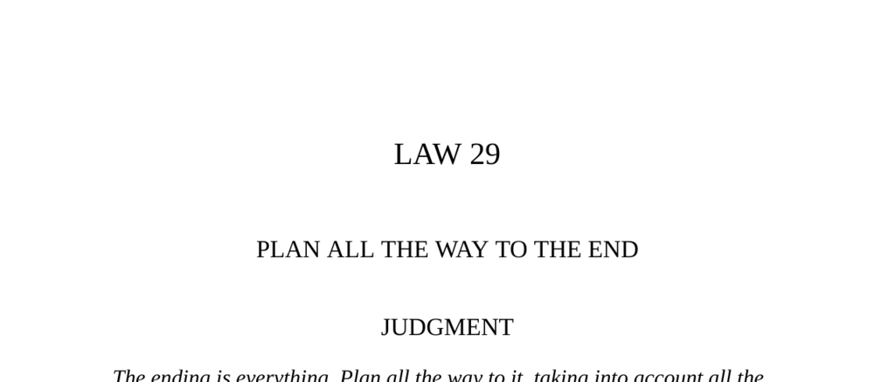

- **Judgment**  
  - The ending of any plan determines its success or failure.  
  - Planning must consider all consequences, obstacles, and unexpected changes.  
  - Success requires controlling fortune and guiding outcomes through foresight.  
  - [The Art of War](https://en.wikipedia.org/wiki/The_Art_of_War) by Sun Tzu illustrates similar strategic foresight.

- **Transgression of the Law**  
  - Vasco Núñez de Balboa stowed away on a ship in 1510 with ambitions to find gold and glory.  
  - Balboa seized power in the new colony of Darien but was declared a murderer under Spanish law after a governor’s accidental drowning.  
  - His impulsiveness and failure to plan strategically allowed rivals to overtake his achievements.  
  - [Balboa’s Biography](https://www.britannica.com/biography/Vasco-Nunez-de-Balboa) offers greater detail on his life.

- **The Two Frogs**  
  - Two frogs debate moving into a deep well without considering the consequences of being trapped.  
  - The fable warns against acting without foresight and ignoring potential risks.  
  - This illustrates the necessity of planning with awareness of future obstacles.  
  - The original fable appears in [Aesop’s Fables](https://www.gutenberg.org/ebooks/11339).

- **The King, The Sufi, and The Surgeon**  
  - An ancient king receives advice to never begin anything without reflecting on its end, engraved on his silver basin.  
  - The advice prevents a plot against the king by forcing the surgeon to reconsider the consequences.  
  - This story highlights the power of foresight in preventing disaster.  
  - See [Caravan of Dreams](https://en.wikipedia.org/wiki/Idries_Shah) for the source of the story.

- **Interpretation (Balboa’s Story)**  
  - Balboa’s emotional, short-sighted approach compromised his ability to secure lasting power and glory.  
  - He failed to anticipate rivals and did not plan secretively or strategically enough.  
  - Power requires prudence, foresight, and keeping plans to the end with secrecy as necessary.  
  - For strategic errors in exploration, consult [Conquistadors: How Spain Forged the Americas](https://www.historynet.com/conquistadors/).

- **Observance of the Law**  
  - Otto von Bismarck’s political career exemplifies planning all the way to the end, uniting German states under Prussia.  
  - Bismarck carefully orchestrated wars with Denmark, Austria, and France to achieve a clear goal: German unification.  
  - Once his goal was achieved, he exercised restraint to maintain peace and consolidate power.  
  - [Bismarck and German Unity](https://www.britannica.com/biography/Otto-von-Bismarck) offers detailed historical context.

- **Interpretation (Bismarck’s Strategy)**  
  - Most people fail because they lack a concrete end goal and overreach beyond their victories.  
  - Bismarck’s success was due to his clear focus, stopping conquests to preserve what he had gained.  
  - Long-term planning and self-control are essential to maintain power and avoid decline.  
  - See [The Iron Chancellor](https://www.historyextra.com/period/victorian/the-iron-chancellor/) for further analysis.

- **Keys to Power**  
  - Ancient Greek gods symbolized complete foresight; humans are generally trapped by immediate emotions.  
  - Successful leaders approximate divine foresight by imagining long-term outcomes and consequences.  
  - Vague or desire-driven plans cause failure; most people neglect remote dangers for short-term gains.  
  - Examples include the Athenian disaster in Sicily and Louis Bonaparte’s unexpected ambition.  
  - Cardinal de Retz noted that underestimating remote dangers is a common cause of failure.  
  - Proper planning involves anticipating crises, protecting achievements, and never succumbing to emotion.  
  - [The Peloponnesian War](https://www.britannica.com/event/Peloponnesian-War) explains the Athenian expedition’s failure.

- **Authority**  
  - Montaigne emphasizes the ease of avoiding problems by not initiating risky endeavors.  
  - Early stages of power grant control; if actions proceed without planning, circumstances control the actor.  
  - Prudence advises beginning gently and reserving energy to finish decisively.  
  - Montaigne’s essays [Montaigne: The Essays](https://www.gutenberg.org/ebooks/3600) provide deeper insights.

- **Reversal**  
  - Plans must have flexibility and alternatives to handle sudden changes in fortune.  
  - Rigidity can be harmful, but vagueness and constant improvisation are worse.  
  - Clear objectives and detailed, long-range plans enable adaptability without losing the goal.  
  - Strategic planners must embrace uncertainty by envisioning various scenarios while maintaining focus.  
  - See [Adaptive Strategy](https://hbr.org/2008/07/adaptive-strategy) in business contexts for comparison.
