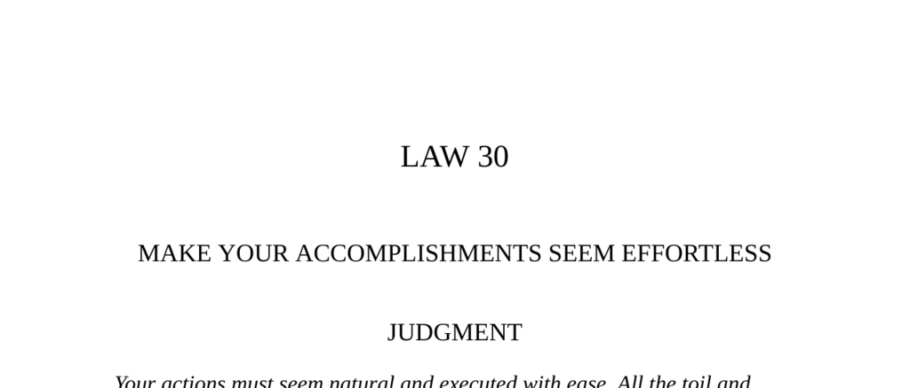

- **Judgment**  
  - Your actions must seem natural and effortless, concealing all toil, practice, and clever tricks.  
  - Revealing how hard you work raises questions and weakens your perceived power.  
  - Teaching your tricks risks them being used against you.  
  - Relevant resource: [The 48 Laws of Power](https://en.wikipedia.org/wiki/The_48_Laws_of_Power)  

- **Kano Tannyu, Master Artist**  
  - Tannyu initially appeared to make a mess when painting gold screens, later transforming the chaotic marks into beautiful images.  
  - Masamune’s initial irritation turned to overjoyed admiration, illustrating the power of concealed effort.  
  - The story exemplifies how the appearance of effortlessness enhances admiration for accomplishments.  

- **Observance of the Law I**  
  - Sen no Rikyu emphasized naturalness and concealing effort as key to aesthetic and political power in the Japanese tea ceremony.  
  - Artificial or planned gestures reveal effort and spoil the effect, leading Rikyu to leave ceremonies that lacked natural ease.  
  - Instances include Rikyu’s cushions in the snow and the stone lantern in Yorinobu’s garden to create natural beauty through concealed effort.  
  - The failure of gardeners to alter the lantern’s windows destroyed its natural grace, showing the importance of effortless appearance.  
  - Further reading: [Cha-no-yu: Japanese Tea Ceremony](https://en.wikipedia.org/wiki/Chanoyu)  

- **The Wrestling Master**  
  - A master taught 359 of 360 wrestling techniques to a favorite pupil, reserving one secret trick to maintain superiority.  
  - The pupil’s boast led to a public match where the master used the secret technique to defeat him.  
  - The story stresses the value of keeping some abilities hidden to sustain power.  
  - Source: The Craft of Power, R.G.H. Siu, 1979  

- **Interpretation (of artistic and natural effortlessness)**  
  - Authentic beauty comes from natural, effortless appearance, concealing the labor that creates it.  
  - Showing effort or contrivance spoils the effect, as with the tea ceremony gate and the staged lemon cutting.  
  - Tricks and planning must remain invisible to maintain the impression of spontaneity and natural grace.  

- **Observance of the Law II – Houdini’s Escapes**  
  - Houdini’s escapes appeared effortless despite being products of extensive practice, research, and physical conditioning.  
  - His act included dramatized delays and apparent ease to heighten the audience’s awe and mystery.  
  - Houdini concealed his methods to maintain his reputation, countering claims that he relied on gadgets.  
  - The famous handcuff challenge with Kleppini demonstrated Houdini preserving secrecy and controlling perceptions.  
  - Further reading: [Harry Houdini](https://en.wikipedia.org/wiki/Harry_Houdini)  

- **Interpretation (of Houdini’s method and concealment)**  
  - Houdini’s successes relied on exhaustive preparation and physical control, never luck or magic.  
  - Concealing effort and appearing calm amplified his perceived superhuman abilities.  
  - Exposing the labor behind his acts would have diminished their impact and the awe they inspired.  
  - A wise person must keep some abilities unknown to maintain honor and reverence, as per Baltasar Gracián.  

- **Keys to Power**  
  - Power admired by humans originates from awe at natural forces that act without visible effort.  
  - The Renaissance concept of sprezzatura emphasizes making difficult acts appear effortless to increase admiration.  
  - Revealing the roots of one’s skill diminishes its perceived greatness by making it seem accessible.  
  - Historical figures like Talleyrand enhanced their power by appearing to exert little effort, while relying heavily on others’ work.  
  - Concealing tricks prevents others from countering them and preserves a sense of exclusive talent.  

- **Reversal**  
  - Concealing your work must feel lighthearted to avoid seeming overly secretive or paranoid.  
  - Overzealous secrecy damages one’s reputation, as with the painter Pontormo who isolated himself.  
  - Revealing some tricks selectively can engage certain audiences, as P.T. Barnum did to satisfy democratic tastes.  
  - Partial disclosure must be strategic to maintain overall mystery while granting a controlled sense of involvement.
