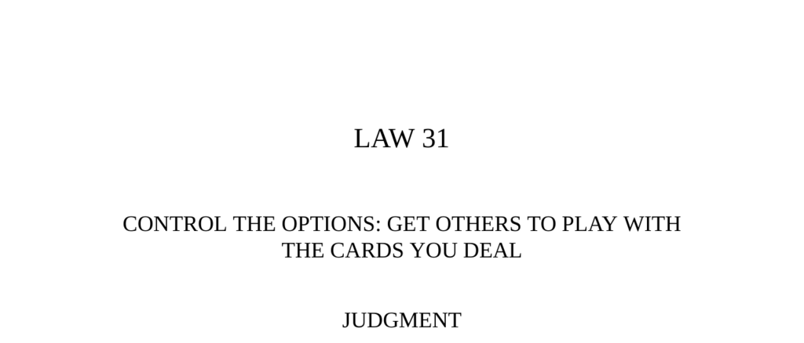

- **Judgment**
  - The best deceptions offer victims an illusion of choice while directing outcomes in the deceiver’s favor.  
  - Giving choices that force opponents to choose between two evils effectively traps them on the "horns of a dilemma."  
  - Strategic control of options creates puppetry by allowing others to think they are in control.  
  - See [The Art of Deception](https://en.wikipedia.org/wiki/Deception) for general principles of deception.

- **Observance of the Law I**
  - Ivan the Terrible confronted the boyars’ opposition limiting his power to reform Russia.  
  - Ivan feigned abdication by withdrawing from Moscow, forcing society to choose absolute power for him or face anarchy.  
  - His withdrawal pressured society into granting him dictatorial powers, reducing direct resentment.  
  - Related historical analysis: [Ivan the Terrible and Russian Autocracy](https://www.britannica.com/biography/Ivan-IV)

- **The Liar**
  - An Armenian king’s contest for the most outrageous liar ended with a poor man’s logical trap winning a golden apple.  
  - The man created a dilemma for the king, forcing him to concede without clear defeat.  
  - This tale illustrates the power of clever option control to force opponents into no-win situations.  
  - Folklore source: [Armenian Folk Tales and Fables](https://archive.org/details/armenianfolktale00down)

- **Observance of the Law II**
  - Courtesan Ninon de Lenclos devised a dual-option system ("payeurs" and "martyrs") controlling access to her favors and friendship.  
  - This system maintained her independence, wealth, and social power by giving suitors the illusion of choice.  
  - The remote possibility of becoming a favored lover motivated persistent suitors to accept unequal terms.  
  - See [Ninon de Lenclos Biography](https://www.britannica.com/biography/Ninon-de-Lenclos) for broader context.

- **Keys to Power**
  - Choice and freedom are powerful illusions used to manipulate by limiting real options while seeming fair.  
  - Too much freedom causes anxiety; limited choices comfort individuals and increase susceptibility to deception.  
  - Common forms of controlling options include “Color the Choices,” “Force the Resister,” “Alter the Playing Field,” “Shrinking Options,” “The Weak Man on the Precipice,” “Brothers in Crime,” and “The Horns of a Dilemma.”  
  - Effective manipulation minimizes direct confrontation by allowing victims to feel responsible for their choices.  
  - Additional reading: [Psychology of Choice](https://www.psychologytoday.com/us/basics/decision-making)

- **Reversal**
  - Controlling others’ options disguises the manipulator as a facilitator rather than an enforcer of power.  
  - Direct, open exercise of power often evokes resistance and resentment, making indirect control preferable.  
  - Allowing rivals more freedom can provide strategic intelligence and better opportunities for long-term control.  
  - James Rothschild exemplified benefiting from opponents’ freedom by observing their strategy before acting decisively.  
  - See [Power Dynamics and Strategy](https://hbswk.hbs.edu/item/understanding-power) for more insights.
