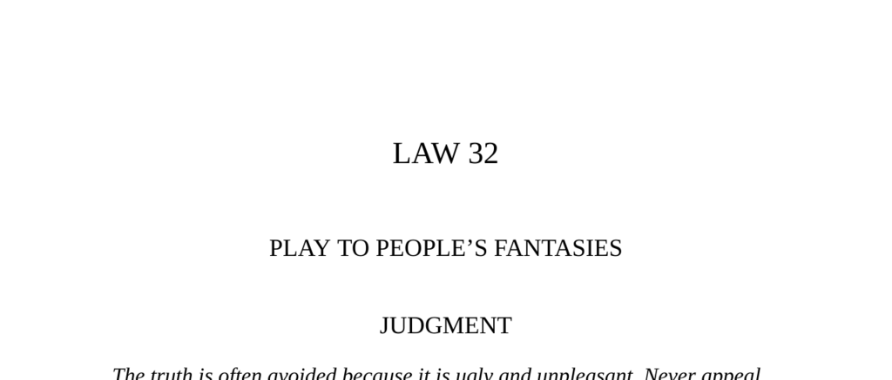

- **Judgment**
  - **The truth is often avoided because it is ugly and unpleasant**
    - People prefer fantasies and romances because reality is harsh and distressing.  
    - Tapping into the fantasies of the masses grants great power.  
    - Appealing to harsh truths invites anger and disenchantment.  
  - **The Funeral of the Lioness (Fable)**
    - The lion mourns his queen and demands loyalty from courtiers, who mimic his grief.  
    - The stag, enemy of the lioness, laughs, inciting the lion's anger but is spared when the queen's spirit appears in a comforting fantasy.  
    - The fable illustrates the power of storytelling and flattering fantasies to win a ruler’s favor.  
    - The story is from Jean de La Fontaine’s fables.  

- **Observance of the Law**
  - **The rise and fall of Venice and Bragadino’s alchemy scam**
    - Venice declined economically due to shifting trade routes and military losses in the 16th century.  
    - The alchemist Bragadino capitalized on Venetian hopes by creating an aura of gold-making wealth without producing real results.  
    - The public and nobles irrationally believed in his fantasies due to their desperate need for sudden redemption.  
    - Bragadino’s success depended on spectacle, patience, and exploiting human desire for easy salvation.  
    - The tale highlights the use of fantasy to manipulate masses in times of decline.  

- **Interpretation**
  - **Mamugnà as Bragadino and the psychology behind his scam**
    - Mamugnà exploited Venice’s gloom and the city’s longing for a swift return to glory through a fantasy of alchemy.  
    - Wealth and reputation reinforced by appearance and patronage convinced people to believe obvious deceptions.  
    - People prefer fantasies to harsh realities, especially when solutions require hard work and sacrifice.  
    - Successful fantasy peddlers promise sudden transformation like wealth or health without effort.  
    - The quotes from David Hume and Tokugawa Ieyasu emphasize that fantasy is preferable to uncomfortable truth.  

- **Keys to Power**
  - **Fantasy requires the contrast of oppressive reality**
    - Fantasy thrives when reality is harsh, slow-changing, and burdensome.  
    - Identifying oppressive realities allows one to craft fantasies that appeal to masses.  
    - Examples of reality vs. fantasy: gradual change vs. sudden transformation; social limits vs. new adventures; societal conflict vs. spiritual unity; death vs. revival.  
    - The examples include historical figures like Leonhard Thurneisser, George Psalmanazar, Mata Hari, and Oscar Hartzell applying these fantasies.  
    - Fantasy must maintain distance and vagueness to preserve its allure.  
  - **Authority and the palatability of lies over truth**
    - Lies can be embellished into appealing fantasies, while truth is often uncomfortable.  
    - Joseph Weil’s quote explains how romance and lies produce greater influence and profit than truth.  
  - **Reversal**
    - There is risk in fantasy if audiences demand tangible results and the fantasy provider fails.  
    - Bragadino’s downfall in Munich illustrates the danger of overpromising and underdelivering.  
    - Fantasy may also reflect theatrical realities, as seen in figures like Abraham Lincoln and P. T. Barnum who cultivated approachable yet distant personas.  
    - Maintaining some distance and mystery is essential for sustaining power through fantasy.

- **Further Reading**
  - [Jean de La Fontaine's Fables](https://www.britannica.com/topic/Fables) – Source of the lioness fable.  
  - [The Alchemy of Power in Renaissance Venice](https://www.historytoday.com/archive/fantasy-and-power-venice) – Historical context of alchemy and power struggles.  
  - [David Hume’s Essays on Human Understanding](https://plato.stanford.edu/entries/hume/) – Discussion on human belief and fantasy.  
  - [Tokugawa Ieyasu and Political Strategy](https://www.britannica.com/biography/Tokugawa-Ieyasu) – Historical figure on leadership and perception.  
  - [Psychology of Con Artists and Fantasy](https://www.psychologytoday.com/us/blog/the-human-equation/201905/how-con-artists-exploit-our-fantasies) – Understanding manipulation through fantasy.
