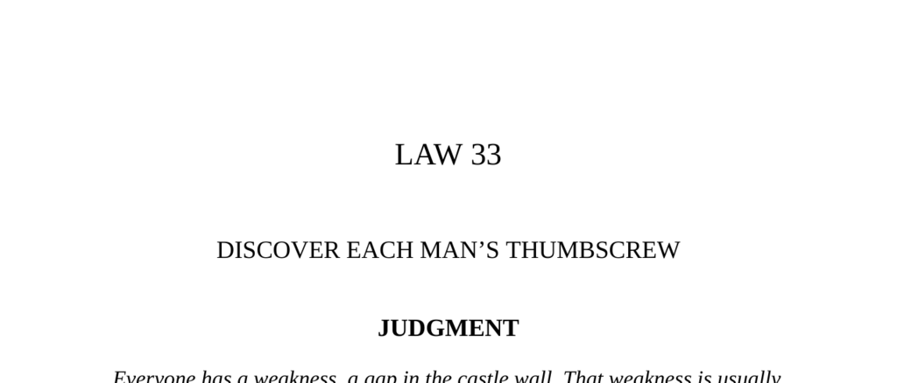

- **Judgment**
  - Everyone has a weakness, usually an insecurity, uncontrollable emotion, need, or secret pleasure.
  - Such a weakness acts as a "thumbscrew" that can be leveraged for advantage.
  - The key is discovering where a person’s psychological armor is vulnerable.
  - People’s conscious behavior often conceals weaknesses; these show most clearly in unconscious signals.
  - Further reading: [Psychology Today on Emotional Vulnerabilities](https://www.psychologytoday.com/us/basics/emotional-vulnerability)

- **Finding the Thumbscrew: A Strategic Plan of Action**
  - People resist change, but all have psychological weak points that will yield if properly targeted.
  - Resistances incur energy costs, making strategic subtlety essential.
  - Weaknesses may be openly displayed or hidden behind appearances.
  - Further reading: [Strategic Psychological Influence](https://www.psychologytoday.com/us/blog/influence/201207/persuasion-the-power-motivation)

- **The Lion, The Chamois, and The Fox (Fable)**
  - The fable illustrates how hidden limitations and the advice of others can result in downfall.
  - Flattery and tempting someone to overreach can backfire fatally.
  - Weaknesses may lie in hubris despite apparent strength.
  - Further reading: [Fables and Moral Lessons](https://www.gutenberg.org/ebooks/34247)

- **In Planning Your Assault, Keep These Principles in Mind**
  - **Pay Attention to Gestures and Unconscious Signals**
    - Unconscious signals betray secrets despite attempts to conceal.
    - Open, sympathetic listening encourages revealing responses.
    - Probing through indirect methods, such as flattery, reveals soft spots.
    - Further reading: [Freud’s Theory of the Unconscious](https://plato.stanford.edu/entries/freud/)
  - **Find the Helpless Child**
    - Childhood emotional needs create enduring vulnerabilities.
    - People may revert to childlike behavior when such needs are touched.
    - Supplying unmet childhood needs can gain profound influence.
    - Further reading: [Attachment Theory Overview](https://www.apa.org/ptsd-guideline/patients-and-families/attachment)
  - **Look for Contrasts**
    - Visible traits often mask the opposite trait as a weakness.
    - Carefully probing beyond surface traits uncovers true vulnerabilities.
    - Further reading: [The Psychology of Contrasts](https://www.frontiersin.org/articles/10.3389/fpsyg.2019.00057/full)
  - **Find the Weak Link**
    - Power may reside with those behind the scenes or with weak individuals in a group.
    - Influencing the weak link can grant indirect control over powerful figures.
    - Further reading: [Network Theory and Power](https://www.sciencedirect.com/science/article/abs/pii/S0378873318311126)
  - **Fill the Void**
    - Insecurity and unhappiness are primary emotional voids to exploit.
    - Delivering validation or addressing unhappiness creates dependency.
    - These voids diminish the ability to mask weakness.
    - Further reading: [Emotional Needs and Dependency](https://www.psychologytoday.com/us/blog/the-new-grief/201711/understanding-emotional-needs)
  - **Feed on Uncontrollable Emotions**
    - Uncontrollable base emotions like lust, greed, and fear are exploitable weaknesses.
    - Such emotions impair self-control, allowing others to manipulate outcomes.
    - Further reading: [Emotions and Decision Making](https://www.ncbi.nlm.nih.gov/pmc/articles/PMC4709827/)

- **Irving Lazar Case Study**
  - Lazar exploited Jack Warner’s vanity and discomfort about nudity to force an agreement.
  - The use of an embarrassing situation manipulated Warner into a quick “yes.”
  - Strategic timing and environment selection enhanced Lazar’s leverage.
  - Further reading: [Hollywood Power Brokers](https://www.britannica.com/biography/Irving-Lazar)

- **Observances of The Law**
  - **Observance I: Cardinal Richelieu**
    - Richelieu leveraged Marie de Médicis’s insecurities to gain influence before controlling King Louis XIII.
    - He played the queen mother as the weak link rather than confronting the king directly.
    - Later, he exploited the king’s childish nature to keep power through dependency.
    - Further reading: [Biography of Cardinal Richelieu](https://www.britannica.com/biography/Armand-Jean-du-Plessis-cardinal-Richelieu)
  - **The Little Things Count (Yellow Kid Weil)**
    - Small details like a wife’s fondness for perfume can create major shifts in loyalty and decisions.
    - Personal interactions and subtle gifts influence trust and investment.
    - Exploiting emotional validation is highly effective.
    - Further reading: [Psychology of Persuasion](https://en.wikipedia.org/wiki/Influence:_The_Psychology_of_Persuasion)
  - **Observance II: Count Victor Lustig**
    - Lustig capitalized on Herman Loller’s need for social validation and insecurity.
    - He used fabricated friendship and impressive but fake technology to lure Loller.
    - Targeting the insecure and unhappy amplifies susceptibility to deception.
    - Further reading: [Famous Con Men](https://www.history.com/topics/crime/famous-con-artists)
  - **Observance III: Catherine de’ Médicis’s Flying Squadron**
    - Catherine used attractive women to seduce and spy on powerful men in court.
    - Exploiting men’s uncontrollable passions gave her control over political rivals.
    - Visible passions often reveal underlying helplessness.
    - Further reading: [Catherine de’ Médicis’s political strategies](https://www.britannica.com/biography/Catherine-de-Medicis)
  - **The Battle at Pharsalia (Plutarch)**
    - Caesar exploited his enemy’s vanity by instructing his soldiers to aim javelins at faces.
    - Pompey’s cavalry broke ranks due to fear of being disfigured, leading to defeat.
    - Understanding emotional vulnerabilities in opponents can decide battles.
    - Further reading: [Plutarch’s Lives](https://en.wikipedia.org/wiki/Plutarch%27s_Lives)
  - **Observance IV: Arabella Huntington and Joseph Duveen**
    - Duveen waited to build Arabella’s confidence before selling art, addressing her social insecurity.
    - He methodically elevated her taste and status to secure lasting patronage.
    - Exploiting need for social recognition yields long-lasting influence.
    - Further reading: [Art Patronage and Social Status](https://www.theartnewspaper.com/feature/the-power-of-patrician-patrons)
  - **Observance V: Bismarck and King William of Prussia**
    - Bismarck used the king’s fear and desire for honor to push through military expansion.
    - He amplified William’s latent need for courage and glory, overriding influences of queen and parliament.
    - Appealing to an opposite hidden tendency can overcome outward timidity.
    - Further reading: [Otto von Bismarck Biography](https://www.britannica.com/biography/Otto-von-Bismarck)

- **Reversal**
  - Exploiting vulnerabilities risks triggering uncontrollable responses beyond one’s control.
  - Powerful emotions can disrupt carefully laid plans if pushed too far.
  - Controlling victims requires awareness of limits and foresight to avoid backfire.
  - Power is the goal, not the thrill of manipulation.
  - Further reading: [Managing Emotional Risks in Influence](https://hbr.org/2016/11/how-to-influence-people#:~:text=Emotions%20are%20a%20powerful%20force)
