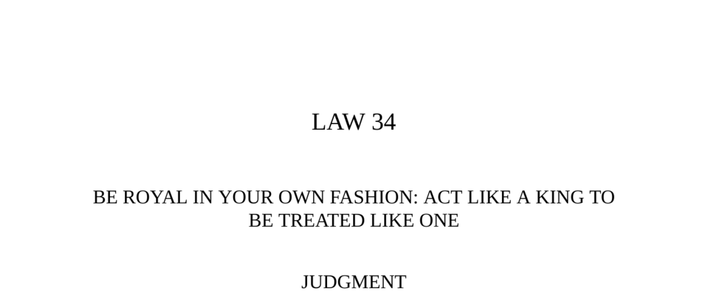

- **Judgment**  
  - The way you carry yourself determines how others treat you.  
  - Appearing vulgar or common leads to disrespect.  
  - Acting regally and confidently inspires respect and suggests destined greatness.  
  - See [Baltasar Gracián's works](https://en.wikipedia.org/wiki/Baltasar_Graci%C3%A1n) for related philosophical context.

- **Transgression of the Law**  
  - Louis-Philippe, the "bourgeois king," rejected royal ceremony and associated with bankers and the middle class.  
  - His informal style and lack of regal dignity caused loss of respect from aristocracy, radicals, and bankers.  
  - Public insults, such as from banker James Rothschild, illustrated his declining authority.  
  - The 1848 revolution forced his abdication and exile, dissolving his government.  
  - See [French Revolution of 1848](https://en.wikipedia.org/wiki/February_Revolution) for historical background.

- **Interpretation**  
  - Louis-Philippe's downplaying of royal grandeur failed to secure loyalty or inspire confidence.  
  - People expect rulers to project presence and grandeur; false commonness is seen through and breeds contempt.  
  - Franklin Roosevelt's style shows effective common touch combined with maintained elite status.  
  - Leaders losing regal distance lose their power and may vanish without impact.  
  - See [Leadership and charisma theory](https://en.wikipedia.org/wiki/Charisma) for similar analyses.

- **Observance of the Law**  
  - Christopher Columbus invented a noble lineage to project confidence and legitimacy.  
  - His fabricated aristocratic background enabled him to marry into royal connections and petition monarchs.  
  - Despite limited navigational skills, Columbus secured royal sponsorship by projecting certainty and high demands.  
  - King João II and Queen Isabella treated his bold requests seriously due to his self-assured presentation.  
  - See [Christopher Columbus biography](https://www.britannica.com/biography/Christopher-Columbus) for further details.

- **Hippocleides at Sicyon**  
  - Hippocleides won favor as a suitor through manners and qualities but lost the marriage by undignified dancing.  
  - Cleisthenes valued regal demeanor and decorum over informal behavior during critical social tests.  
  - The story illustrates the importance of maintaining noble conduct to secure lasting respect.  
  - See [Herodotus' Histories](https://en.wikipedia.org/wiki/Histories_(Herodotus)) for primary source context.

- **Interpretation (Columbus and Self-Presentation)**  
  - Columbus succeeded by projecting noble confidence despite lacking qualifications.  
  - His calm self-assurance mirrored traditional aristocratic demeanor, which earned him trust.  
  - Self-presentation can influence others’ perceptions, independent of actual status.  
  - See [Impression management](https://en.wikipedia.org/wiki/Impression_management) for behavioral parallels.

- **Keys to Power**  
  - The "Strategy of the Crown" involves demanding and expecting greatness like a child.  
  - Belief in personal destiny creates an aura that influences others to treat you accordingly.  
  - Historical figures of low birth, such as Columbus, succeeded using regal confidence and bold demands.  
  - Regal bearing requires dignity and differentiation without arrogance; it must be calm and self-assured.  
  - Haile Selassie's composed dignity under attack exemplifies royal demeanor’s power.  
  - Outward strategies include bold demands, targeting highest authority, and offering gifts to patrons.  
  - Confidence leads to respect and often unexpected opportunities.  
  - See [Haile Selassie biography](https://en.wikipedia.org/wiki/Haile_Selassie) and [The 48 Laws of Power](https://en.wikipedia.org/wiki/The_48_Laws_of_Power) for further reading.

- **Reversal**  
  - Overextension of regal bearing by humiliating others or arrogantly looming risks alienation and downfall.  
  - Charles I’s inflexible kingly pose provoked revolts and led to his execution.  
  - Arrogance betrays insecurity and contrasts with effective royal demeanor.  
  - Extreme vulgarity as a power strategy is dangerous due to replacement by more vulgar successors.  
  - See [English Civil War](https://en.wikipedia.org/wiki/English_Civil_War) for historical analysis of Charles I’s fate.
