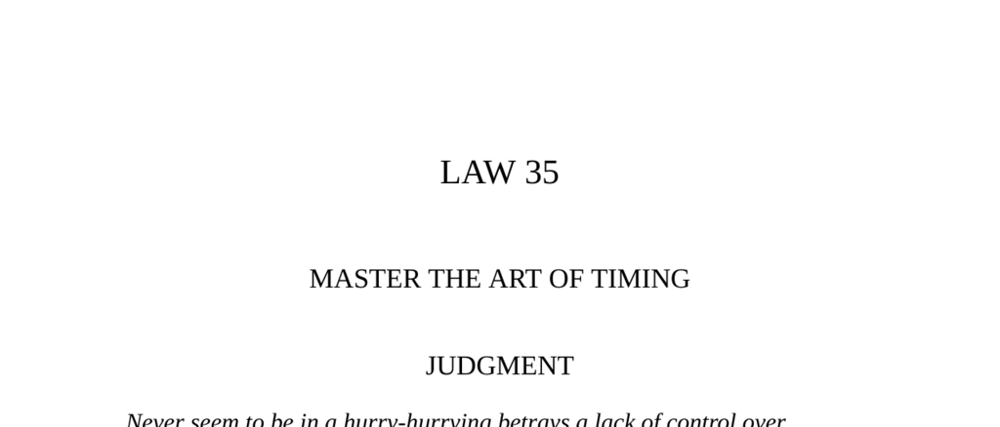

- **Judgment**  
  - Judgment requires patience and control to avoid appearing hurried.  
  - Success depends on detecting the right moment and understanding trends.  
  - Delaying action until the time is ripe increases the chances of victory.  
  - See also [The Art of Strategy](https://en.wikipedia.org/wiki/Game_theory#Strategic_thinking) for strategic patience insights.

- **Sertorius’s Lesson**  
  - Sertorius managed unruly troops by allowing a controlled defeat to teach discipline.  
  - He illustrated perseverance over brute strength through a horse-tail tugging parable.  
  - Mastery of time and steady effort can subdue even the greatest powers.  
  - Refer to [Plutarch’s Lives](https://classics.mit.edu/Plutarch/sertorius.html) for detailed biography.

- **Observance of the Law**  
  - Joseph Fouché exemplifies mastery of timing during the French Revolution.  
  - He changed political allegiances based on the prevailing power dynamics and popular mood.  
  - Fouché used patience, patience, and adaptability to survive multiple regime changes.  
  - Reference [Fouché: Napoleon’s Minister of Police](https://www.britannica.com/biography/Joseph-Fouche) for further reading.  

- **Interpretation**  
  - Recognize the spirit of the times and anticipate how social trends will evolve.  
  - Aligning with early or late phases of power shifts requires careful calculation.  
  - Patience is critical to building power and capitalizing on opportunities.  
  - See [Timing in Politics](https://books.google.com/books?id=YzEVtQEACAAJ) for political timing strategies.

- **Keys to Power**  
  - Time is subjective and can be altered by controlling emotional responses.  
  - Long time demands patience and defensive strategy; forced time involves offensive disruption; end time requires swift execution.  
  - Examples include delaying action to prevent mistakes and forcing opponents to rush decisions.  
  - For more on time management, see [The Power of Now](https://en.wikipedia.org/wiki/The_Power_of_Now).

  - **Long Time**  
    - Acting hastily often causes greater delays due to mistakes and disorder.  
    - Waiting deliberately can reveal unexpected opportunities and reduce risk.  
    - Patience allows better perception of future trends and stabilizes progress.  
    - Study [Tokugawa Ieyasu’s tactics](https://www.britannica.com/biography/Tokugawa-Ieyasu) for historical patience.

  - **Forced Time**  
    - Disrupt opponents’ timing by making them wait or hurry to gain advantage.  
    - Use deadlines strategically to pressure indecisive parties into decisions.  
    - Magicians and showmen illustrate how controlling pacing affects perception of time.  
    - Explore [Machiavelli’s tactics](https://plato.stanford.edu/entries/machiavelli/) for timing disruption techniques.

  - **End Time**  
    - Final actions must be swift and decisive to seal victory and prevent counterattack.  
    - Speed at the end confuses opponents and emphasizes authority.  
    - Successful timing is measured by the effective transition from patient buildup to rapid conclusion.  
    - Consider [Sun Tzu’s Art of War](https://en.wikipedia.org/wiki/The_Art_of_War) for endgame strategy insights.

- **The Trout and the Gudgeon**  
  - Caution and deliberate timing prevent premature, fatal actions.  
  - Impatience leads to failure, while careful testing of situations builds security.  
  - The fable illustrates the virtue of assessing threats before engagement.  
  - Relevant reading includes [Aesop’s Fables](https://www.gutenberg.org/ebooks/21).

- **Authority**  
  - Shakespeare’s quote emphasizes seizing opportunities at their peak for success.  
  - Missing the decisive moment results in prolonged struggle and failure.  
  - Timing is crucial in seizing fortune and avoiding miseries.  
  - See [Shakespeare’s Julius Caesar](https://www.britannica.com/topic/Julius-Caesar-tragedy-by-Shakespeare).  

- **Reversal**  
  - Power requires active guidance of timing rather than passive adaptation.  
  - Failure to control timing results in becoming a victim of time’s inevitability.  
  - There is no successful strategy in relinquishing control over timing.  
  - Consult [Leadership and Timing](https://hbr.org/1996/11/leading-change-getting-and-keeping-your-leadership-edge) for leadership timing principles.
