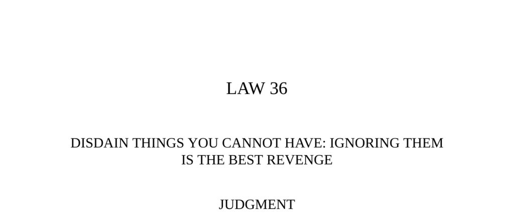

- **Judgment**  
  - Acknowledging a petty problem gives it existence and strengthens an enemy.  
  - Paying excessive attention to small mistakes or enemies worsens the problem.  
  - Showing contempt for what cannot be had makes one appear superior.  
  - Ignoring small annoyances is recommended as the best form of revenge.  
  - Further reading: [The 48 Laws of Power by Robert Greene](https://en.wikipedia.org/wiki/The_48_Laws_of_Power)

- **Transgression of the Law**  
  - Pancho Villa, initially a revolutionary hero, returned to banditry and lost popularity.  
  - Villa's 1916 raid on Columbus, New Mexico, provoked a U.S. Punitive Expedition led by General Pershing.  
  - The expedition failed due to Villa's cunning and local Mexican support, resulting in American humiliation.  
  - Overextension and local resentment made the expedition costly and ineffective.  
  - Further reading: [Pancho Villa and the U.S. Punitive Expedition](https://www.britannica.com/event/Pancho-Villa-expedition)

- **The Fox and the Grapes**  
  - The fable illustrates contempt for unattainable desires by devaluing them.  
  - Demonstrates the power of the sour-grapes attitude in maintaining self-control.  
  - Emphasizes the wisdom of ignoring unavailable things to avoid frustration.  
  - Further reading: [Jean de La Fontaine's Fables](https://en.wikipedia.org/wiki/Jean_de_La_Fontaine)

- **Observance of the Law**  
  - Henry VIII ignored Pope Clement VII's authority to annul his marriage to Catherine of Aragon.  
  - Henry's disdain led to the establishment of the Church of England with himself as its head.  
  - Ignoring opponents cancels out their influence and unsettles them without direct conflict.  
  - Disdain can consolidate friendship by showing selective attention.  
  - Further reading: [Henry VIII and the English Reformation](https://www.history.com/topics/british-history/henry-viii)

- **The Monkey and the Peas**  
  - The fable warns against overreacting to minor losses or mistakes, which worsens the situation.  
  - Advocates for measured responses rather than emotional outbursts.  
  - Further reading: [Leo Tolstoy’s Fables](https://en.wikipedia.org/wiki/Leo_Tolstoy#Fables)

- **The Prodigy Ox**  
  - An ox wandering freely was seen as a portent but ignored by authorities, resulting in no harm.  
  - Ignoring phenomena that attract too much attention can prevent creating unnecessary problems.  
  - Treating some problems with indifference preserves their eventual natural resolution.  
  - Further reading: [Essays in Idleness by Kenko](https://en.wikipedia.org/wiki/Essays_in_Idleness)

- **Interpretation**  
  - Ignoring petty problems denies them power and avoids unproductive entanglements.  
  - Drawing attention to irritants often strengthens their influence.  
  - Political and social examples illustrate the effectiveness of disdain as a strategy.  
  - Successful use of contempt allows control over conflict conditions and dynamics.  
  - Further reading: [The Art of Contempt in Power Dynamics](https://www.psychologytoday.com/us/blog/hide-and-seek/201808/the-art-contempt)

- **Keys to Power**  
  - Desire and attention often repel rather than attract the object of pursuit.  
  - Showing contempt and disdain creates psychological superiority and can provoke stronger responses.  
  - Public contempt can increase the rival’s popularity if not managed carefully.  
  - Minimizing mistakes and ignoring attacks diminish the power of opponents.  
  - Further reading: [Idries Shah's Caravan of Dreams](https://en.wikipedia.org/wiki/Idries_Shah)

- **The Man and His Shadow**  
  - The fable demonstrates that avoidance can attract what one desires.  
  - Pursuing something too aggressively often leads to failure; strategic retreat can be more effective.  
  - Further reading: [Ivan Kriloff’s Fables](https://en.wikipedia.org/wiki/Ivan_Krilov)

- **Reversal**  
  - Contempt must be balanced with vigilance to avoid allowing minor threats to grow unchecked.  
  - Ignoring a rising threat can lead to its empowerment, as with Cesare Borgia in Renaissance Italy.  
  - Effective power requires private monitoring while publicly showcasing disdain.  
  - Early detection and handling of issues prevent escalation and maintain control.  
  - Further reading: [Cesare Borgia’s Rise and Fall](https://www.britannica.com/biography/Cesare-Borgia)
