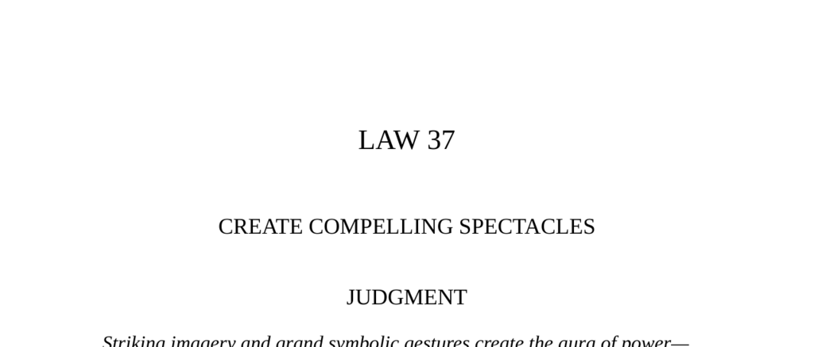

- **Law 37: Create Compelling Spectacles**
  - **Judgment**
    - Striking imagery and grand symbolic gestures create an aura of power that everyone responds to.  
    - Spectacles full of arresting visuals and radiant symbols heighten presence and distract observers from one’s true actions.  
    - External resource: [The 48 Laws of Power](https://en.wikipedia.org/wiki/The_48_Laws_of_Power) by Robert Greene.
  - **Antony and Cleopatra**
    - Cleopatra used lavish and dramatic imagery to create an enchanting spectacle that impressed Antony and the crowd.  
    - The barge was adorned with gold, purple sails, silver oars, music, perfumes, and symbolic figures embodying gods and nymphs.  
    - The staged event attracted large crowds and spread the rumor that divine figures had joined Antony and Cleopatra.  
  - **Observance of the Law I: The Moon Doctor of Berlin**
    - Dr. Weisleder gained celebrity by staging a spectacle where patients were exposed to moonlight, creating the illusion of miraculous cures.  
    - The show relied on emotional appeal and symbolic association with the moon rather than scientific evidence or complex explanations.  
    - The simplicity of the spectacle was crucial; the moon’s symbolic power drew people regardless of actual visibility or medical efficacy.  
    - External resource: [Symbolism in Healing Practices](https://www.ncbi.nlm.nih.gov/pmc/articles/PMC3324257/).  
  - **Observance of the Law II: Diane de Poitiers and Henri II**
    - Diane de Poitiers maintained influence over King Henri II through symbolism, intertwining their initials and adopting the image of goddess Diana.  
    - She transformed her château into a temple-like edifice displaying her insignia and symbolic artifacts to reinforce her power and purity image.  
    - Diane’s use of symbolism redefined her role from a mere mistress to a mythic and respectable presence at court.  
    - External resource: [Women and Power in Renaissance France](https://www.britannica.com/topic/Queen-Diane-de-Poitiers).  
  - **The Waning of the Middle Ages: Symbolism**
    - Symbolism acts as a shortcut of thought, linking ideas through signification instead of causal connection.  
    - Objects and images can embody multiple symbolic meanings and elevate mundane things to the sublime.  
    - The walnut and roses exemplify how physical things symbolize complex spiritual or abstract ideas.  
    - External resource: [Symbolism in Medieval Literature](https://www.britannica.com/art/symbolism-literary-movement).  
  - **Keys to Power**
    - Words are risky and invite reflection, argument, or opposition, whereas images deliver immediate emotional impact and discourage doubt.  
    - Visual symbols can unify, communicate complex ideas instantly, and create powerful emotional associations transcending social divisions.  
    - Color, arrangement, and symbolic fusion amplify the impact of images and build compelling mythology around a person or cause.  
    - Leaders use positioning and visual sequence to assert authority, as exemplified by de Gaulle’s appearance during Paris liberation.  
    - External resource: [Visual Communication Theory](https://www.tandfonline.com/doi/full/10.1080/17544750.2019.1565954).  
  - **Authority**
    - People are captivated by superficial appearances, making festivals and spectacles useful tools for occupying and distracting populations.  
    - Machiavelli advised rulers to use spectacles strategically to maintain power and public interest.  
    - External resource: [Machiavelli’s Political Lessons](https://plato.stanford.edu/entries/machiavelli/).  
  - **Reversal**
    - Ignoring the power of images and symbols forecloses the possibility of gaining influence via spectacle.  
    - No reversal to this law is possible because visual symbolism is an essential instrument of power.
