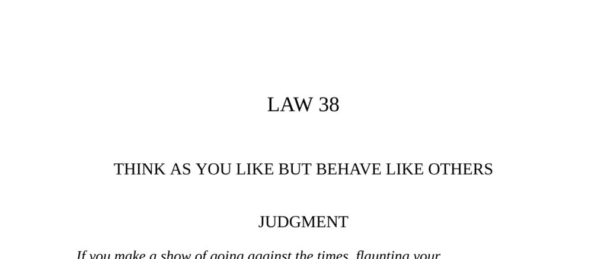

- **Judgment**
  - People who flaunt unconventional ideas provoke resentment and punishment from those who feel inferior.
  - Blending in and sharing originality only with tolerant friends is safer than open defiance.
  - Disagreement offends because it condemns others' views, and truth is only grasped by a few.
  - Wise men speak publicly with universal folly but reserve true thoughts for discreet audiences.
  - See [The Art of Worldly Wisdom by Baltasar Gracián](https://en.wikipedia.org/wiki/The_Art_of_Worldly_Wisdom).

- **Transgression of the Law**
  - Pausanias, a Spartan commander, adopted Persian luxury and alienated his Greek allies.
  - His behavior was seen as contempt for Greek customs, leading to his dismissal and eventual death.
  - Flaunting foreign ways signals disdain for one's own culture, causing isolation or punishment.
  - Contempt for laws and imitation of foreign customs creates suspicion and powerlessness.
  - Refer to Thucydides’ historical accounts for further detail.

- **Interpretation (on Pausanias)**
  - Cultural adoption often indicates disdain for one's own culture and a desire for superiority.
  - Dramatic difference makes one disliked and vulnerable, even without direct offense.
  - Social norms embody shared, long-standing values that cannot be easily dismissed without consequence.
  - Isolation is the common punishment for those flaunting foreign ways.
  - Quote by Sir Walter Raleigh underlines the value of concealment and discretion.

- **When the Waters Were Changed**
  - Khidr’s warning symbolizes societal shifts in thinking that isolate individuals who remember old ways.
  - The lone man’s preservation of old water illustrates the alienation of dissenters.
  - Eventually conforming to new ways brings both acceptance and loss of individuality.
  - The story highlights the difficulty of maintaining dissent in changing societies.
  - See [Tales of the Dervishes by Idries Shah](https://en.wikipedia.org/wiki/Idries_Shah).

- **Observance of the Law**
  - Tommaso Campanella suffered persecution for heretical beliefs during the Italian Counter-Reformation.
  - He survived by feigning madness, writing a false-conformist book, and subtly insinuating true ideas.
  - Public conformity combined with private dissent allows survival and influence under persecution.
  - Campanella’s work, “Atheism Conquered,” became a covert manifesto for heretics.
  - For context, see historical works on the Inquisition and the Roman Catholic Counter-Reformation.

- **Interpretation (on Campanella)**
  - Strategic disguise and irony protect dissidents from overt persecution.
  - Conformity in appearance preserves life and allows covert expression of true beliefs.
  - Martyrdom is ineffective compared to surviving and influencing subtly.
  - Trying to forcibly correct others' beliefs causes offense and resistance.
  - Schopenhauer’s and Machiavelli’s quotes reinforce the difficulty of openly challenging opinions.

- **Keys to Power**
  - Society enforces masks and concealment of true thoughts from an early age.
  - Open expression of unconventional beliefs offends and isolates most people.
  - Successful individuals blend in publicly while privately maintaining different beliefs.
  - Historical examples include Marranos in Spain who secretly preserved Jewish faith.
  - Public conformity combined with private dissent ensures safety and influence over time.

- **The Citizen and the Traveller (Fables and Quotes)**
  - Appearances and claims to superiority in society often lead to rejection or hostility.
  - Voltaire and others highlight the paradox of outward opposition serving inward agendas.
  - Scientific and political figures breaking norms (e.g., Jonas Salk) experience isolation.
  - Bertolt Brecht’s ambiguous responses exemplify successful navigation of ideological persecutions.
  - Study political satire and literature for parallels, e.g., Brecht’s works.

- **Reversal**
  - Displaying difference is only safe and effective once one attains unassailable power.
  - Extreme eccentricity without popularity risks overthrow or destruction (e.g., Caligula).
  - Even powerful figures often maintain or simulate common touch for political support.
  - Social gadflies like Oscar Wilde rely on wit and acceptance for their mockery to be tolerated.
  - Consider leadership studies on charisma and populism, such as Roosevelt’s public persona.

- **Authority and Final Warning**
  - Jesus Christ’s advice from Matthew 7:6 warns against revealing valuable insights to unappreciative audiences.
  - The image of the black sheep illustrates the danger of standing apart from the group.
  - Staying within accepted norms and keeping differences private is vital for safety.
  - Social survival depends on balancing authenticity with conformity.
  - For more, see social psychology literature on group dynamics and conformity.
