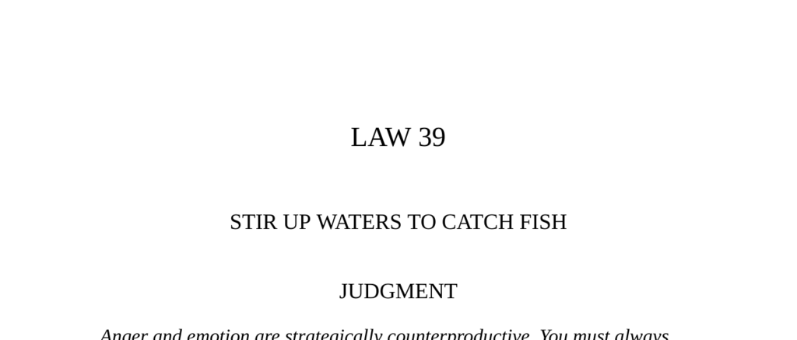

- **Judgment**
  - **Anger and strategic advantage**
    - Anger and emotion weaken strategic position and reduce effectiveness.
    - Maintaining calmness while provoking anger in enemies yields control.
    - Exploiting opponents’ vanity creates an advantage by destabilizing them.
    - See also [The Art of War by Sun Tzu](https://suntzusaid.com).
  - **Itakura Shigemune grinds his own tea**
    - Judge Itakura Shigemune grinds tea in court to maintain calm composure.
    - His method prevents anger from influencing judicial decisions.
    - Public criticism about his sharpness led to this innovative practice.
    - This practice ensured impartial justice and public satisfaction.
    - Further reading: [Cha-no-yu: The Japanese Tea Ceremony](https://archive.org/details/chanoyu00sadl).
- **Transgression of the Law**
  - **Napoleon’s angry outburst**
    - Napoleon publicly lost control when confronting ministers allegedly conspiring against him.
    - His furious tirade exposed weakness and diminished his public image.
    - Talleyrand maintained composure, exploiting Napoleon’s loss of control.
    - This incident initiated Napoleon’s slow decline, culminating at Waterloo.
    - Related resource: [Napoleon: A Life by Andrew Roberts](https://www.andrewrobertsbooks.com/napoleon).
  - **Interpretation of Napoleon’s tantrum**
    - Public anger intimidates only temporarily and causes loss of respect.
    - Demonstrating frustration signifies loss of power over events.
    - Alternative actions include quiet severing of ties or winning opponents back.
    - Tantrums cause more harm than controlled, measured responses.
    - See [Emotional Intelligence by Daniel Goleman](https://www.danielgoleman.info/topics/emotional-intelligence/).
- **Observance of the Law**
  - **Haile Selassie’s strategy**
    - Selassie provoked Ras Gugsa by ordering an unwanted military campaign.
    - This goading forced Gugsa to rebel prematurely, on Selassie’s terms.
    - Selassie secured church support and bribed key allies to weaken Gugsa.
    - The rebellion collapsed leading Selassie to claim the imperial throne.
    - Further info at [Haile Selassie: The Formative Years](https://www.britannica.com/biography/Haile-Selassie).
  - **The monkey and the wasp fable**
    - The wasp’s anger leads to self-inflicted death after stinging the monkey.
    - The fable illustrates the dangers of losing control and acting rashly.
    - Emphasizes strategic disadvantage of uncontrolled emotions.
    - Refer to [Aesop’s Fables](https://www.gutenberg.org/ebooks/21) for similar lessons.
- **Ditch High Priest**
  - **Kenko’s anecdote on anger escalation**
    - High Priest Ryogaku’s anger over insults led him to repeatedly destroy a tree and its remains.
    - Each reaction worsened his reputation, causing escalating nicknames.
    - Demonstrates how anger can produce unintended social consequences.
    - See [Essays in Idleness by Kenko](https://www.sacred-texts.com/shi/hag/hag12.htm).
  - **Sun-tzu’s counsel on anger in leadership**
    - Leaders must never start wars or launch armies out of anger or wrath.
    - Controlled emotion is essential for effective, strategic leadership.
    - See [The Art of War by Sun Tzu](https://suntzusaid.com).
- **Keys to Power**
  - **The ineffectiveness of anger**
    - Anger often appears exaggerated and makes the angry party look ridiculous.
    - Petulance signals helplessness rather than strength.
    - Repeated tantrums erode respect and invite undermining.
    - Power depends on emotional control and not repressing feelings.
  - **Not taking things personally**
    - Anger frequently arises from a complex, historical chain of prior hurts.
    - Recognizing anger as a power move disguised as emotion aids clarity.
    - This perspective prevents overreaction and enables strategic advantage.
  - **Ts‘ao Ts’ao versus Napoleon**
    - Ts‘ao Ts’ao suppressed anger over conspiracies to maintain morale and options.
    - Napoleon’s public outburst contrasted negatively with Ts‘ao Ts’ao’s composed strategy.
  - **Playing with emotions**
    - Stir insecure opponents by attacking pride or luring them with bait.
    - Houdini’s tactic of feigned weakness lured a rival into rash action.
    - Sun Pin’s strategic fires demoralized the enemy before ambush.
    - An indifferent, composed demeanor frustrates hot-headed foes effectively.
    - Further reading: [Emotional Intelligence for Leadership](https://hbr.org/topic/emotional-intelligence).
- **Image: The Pond of Fish**
  - **Fish rising to bait when waters stirred**
    - Calm, clear waters conceal fish that remain below the surface.
    - Stirring waters provokes fish to emerge, become angry, and bite.
    - Angrier fish lose control and risk capture.
    - Symbolizes that provoking emotional opponents causes them to act rashly.
- **Authority (Sun-tzu)**
  - **Manipulating enemy action**
    - Skilled aggressors create situations that force the enemy to act predictably.
    - Presenting irresistible bait provokes enemy moves.
    - Maintaining control and flexibility is key to exploiting enemy reactions.
    - See [The Art of War](https://suntzusaid.com).
- **Reversal**
  - **Dangers of baiting the powerful**
    - Provoking a strong opponent without a clear weakness risks catastrophic retaliation.
    - The city of Tyre provoked Alexander the Great and suffered total destruction.
    - Testing the waters and identifying vulnerabilities is essential before provocation.
    - Controlled bursts of anger can be effective if rare and deliberate.
    - Related reading: [Alexander the Great by Philip Freeman](https://www.philipfreemanbooks.com/alexander).
