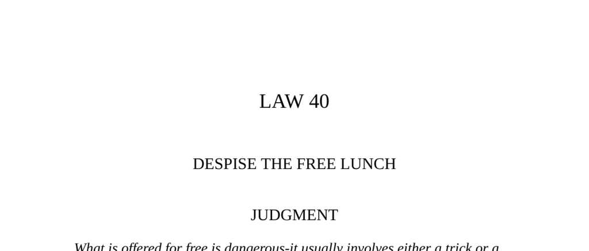

- **LAW 40: DESPISE THE FREE LUNCH**
  - **Judgment**
    - What is offered for free usually comes with hidden obligations or tricks.  
    - Paying your own way avoids gratitude, guilt, and deceit.  
    - Paying full price ensures excellence and sustains power through generosity.  
    - Generosity signals power and keeps money circulating.  
    - Further reading: [The 48 Laws of Power](https://en.wikipedia.org/wiki/The_48_Laws_of_Power) by Robert Greene.

  - **Buried Treasure**
    - Treasure hunting based on dubious documents often preys on the weak-minded Berber “students.”  
    - Treasure findings are rare and accidental, not systematic or scientific.  
    - Laziness and inability to earn legitimately drive such futile pursuits.  
    - People should seek refuge in God rather than indulge in absurd treasure hunting.  
    - Further reading: [Ibn Khaldun's Muqaddimah](https://www.britannica.com/topic/Muqaddimah) for historic perspectives on fortune and work.

  - **Money and Power**
    - Power requires judgment of resources based on full cost, including psychological and quality factors.  
    - Strategic generosity creates obligations, softens adversaries, and builds alliances.  
    - Masters of power freely spend money, using it to influence and charm.  
    - Four negative money user types threaten power: Greedy Fish, Bargain Demon, Sadist, and Indiscriminate Giver.  
    - Each negative type is summarized with behavioral traits and strategic advice for engagement.  
    - Further reading: [Psychology of Money](https://www.psychologyofmoney.net/) for insight into money behavior.

  - **The Miser**
    - The miser’s treasure hoarding causes loss since unused wealth offers no utility.  
    - True value of money lies in its use, not mere possession.  
    - The story illustrates folly in hoarding and detachment from power.  
    - Further reading: [Aesop's Fables](https://www.gutenberg.org/ebooks/21) for classical insights on moral lessons.

  - **Transgressions of the Law**
    - **Transgression I: The Search for El Dorado**  
      - Spanish expeditions to find El Dorado led to disastrous loss of life and resources without gains.  
      - False stories driven by Indian misinformation and brutal tactics compounded failure.  
      - The obsession with sudden wealth caused Spain’s decline economically and demographically.  
      - Real power depends on self-control and long-term strategies rather than chasing quick riches.  
      - Further reading: [History of El Dorado](https://www.britannica.com/topic/El-Dorado) for detailed historical background.
    - **Transgression II: The Duchess of Marlborough and Blenheim Palace**  
      - The duchess’s miserly control and petty interference caused delays and ruinous disputes in building Blenheim Palace.  
      - Her sadistic approach alienated allies and damaged relationships, including with Queen Anne and architect Vanbrugh.  
      - The duke died never living in his palace, symbolizing loss from poor money management.  
      - Powerful must display grandeur and generosity instead of pettiness with money.  
      - Further reading: [Blenheim Palace History](https://www.blenheimpalace.com/about-us/history/).

  - **The Story of Moses and Pharaoh**
    - Pharaoh maintained his power by generously providing resources to his people for 400 years.  
    - God’s promise to destroy Pharaoh was delayed due to Pharaoh’s continued generosity.  
    - Withholding abundance signals decline and impending downfall of power.  
    - Generosity secures renown; misers and avaricious lose respect and power.  
    - Further reading: [The Book of Government, Nizam al-Mulk](https://en.wikipedia.org/wiki/Nizam_al-Mulk) for political philosophy.

  - **Observances of the Law**
    - **Observance I: Pietro Aretino’s Strategic Generosity**  
      - Aretino used lavish giving to create an image of power and attract influential patrons in Renaissance Italy.  
      - Gift-giving implied equality or superiority and created reciprocal obligations.  
      - Circulation of money translated into expanding influence beyond financial means.  
      - Strategic use of gifts allows the powerless to ascend socially by masquerading as equals.  
      - Further reading: [Patronage in Renaissance Italy](https://www.britannica.com/art/patronage-art).
    - **Observance II: Baron James Rothschild’s Social Acceptance**  
      - Rothschild won acceptance in xenophobic French society through extravagant entertainment and spending.  
      - Money was strategically wasted to demonstrate cultural value beyond wealth.  
      - The strategy resembled potlatch feasts that symbolized power through lavish destruction of wealth.  
      - Strategic generosity builds support and softens social barriers for outsiders.  
      - Further reading: [The Rothschild Family](https://www.britannica.com/topic/Rothschild-family).
    - **Observance III: The Medicis’ Distraction via Arts Patronage**  
      - Lorenzo de’ Medici used lavish patronage of arts to mask the unpopularity of banking wealth.  
      - Spending on culture placated enemies and converted resentment into admiration.  
      - Arts patronage served both personal interest and political strategy.  
      - Further reading: [Medici Art Patronage](https://www.metmuseum.org/toah/hd/medp/hd_medp.htm).
    - **Observance IV: Louis XIV’s Strategic Generosity**  
      - Louis impoverished nobles then softened them with lavish gifts to ensure obedience and loyalty.  
      - Unexpected, rare gifts loosened wills more effectively than bribes.  
      - Emotional aspects of gift-giving reflect childhood associations with approval and love.  
      - Overuse of gifts could cause resentment or loss of weapon efficacy.  
      - Further reading: [Louis XIV and Court Life](https://www.britannica.com/biography/Louis-XIV).
    - **Observance V: Fushimiya and the Legendary Tea Cup**  
      - The value of objects stems from human sentiment and associations, not intrinsic worth.  
      - Gifts that evoke emotions hold more power than expensive but lifeless presents.  
      - Reputation and legend can increase perceived value over time.  
      - Further reading: [Japanese Tea Ceremony](https://www.japan.travel/en/uk/in-depth/japanese-tea-ceremony/).
    - **Observance VI: Akimoto Suzutomo and Paying Full Price**  
      - Paying less than full price insults sellers and damages reputation.  
      - Full payment respects the feelings and circumstances of the seller, preserving social capital.  
      - Reputation is prioritized above short-term savings in powerful circles.  
      - Further reading: Han Feizi writings on power and law (https://sourcebooks.fordham.edu/ancient/hanfeizi.asp).
    - **Observance VII: Lord Date Masamune’s Gift of Pleasure**  
      - Turning a small gift into something magnificent demonstrates wealth and power.  
      - The ability to enhance gifts impresses others and gains admiration.  
      - Strategic giving amplifies influence through generosity beyond expectation.  
      - Further reading: [Date Masamune Biography](https://www.britannica.com/biography/Date-Masamune).

  - **Reversal**
    - Free offers always entail hidden obligations or consequences.  
    - Paying well protects independence and renders social entanglements less harmful.  
    - Con artists exploit greed with promises of easy money, as exemplified by Joseph Weil (“The Yellow Kid”).  
    - Greed blinds victims, facilitating manipulation and deception in money matters.  
    - Further reading: [Con Artist Psychology](https://www.psychologytoday.com/us/blog/the-science-deception).
