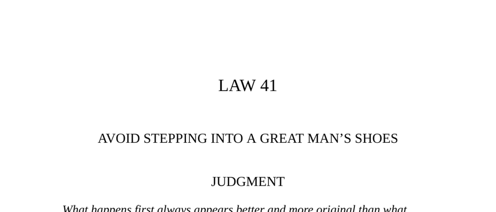

- **Judgment**  
  - First achievements appear superior and more original than subsequent ones.  
  - Successors to great men must exceed twice their accomplishments to outshine them.  
  - Creating an independent identity requires disparaging the predecessor’s legacy and changing course.  
  - Originality and novelty ensure lasting eminence in any profession or art.  
  - [The Excellence of Being First](https://en.wikipedia.org/wiki/Innovation)

- **Transgression of the Law**  
  - Louis XV failed to live up to the legacy of Louis XIV, choosing pleasure over governance.  
  - The indulgence of Louis XV led to corruption, state debt, and decline of the monarchy’s authority.  
  - Influence of royal mistresses extended into political power, worsening government inefficiency.  
  - The failure of Louis XV’s reign set the stage for the French Revolution.  
  - [Louis XV of France](https://www.britannica.com/biography/Louis-XV)

- **Interpretation**  
  - Louis XIV built a new royal order emphasizing personal power and novel symbolism (Versailles).  
  - Louis XV represents heirs who squander inherited power due to lack of necessity and complacency.  
  - Necessity drives ambition; absent it, degeneracy and decay follow.  
  - Power requires occupying a void created by the past’s failure and establishing new authority.  
  - [Machiavelli's Views on Power and Necessity](https://plato.stanford.edu/entries/machiavelli/#NecPol)

- **Life of Pericles**  
  - Pericles initially avoided politics due to fear of ostracism linked to family resemblance to a tyrant.  
  - After rivals disappeared, Pericles embraced the people’s party contrary to his aristocratic background.  
  - Aligning with the democratic faction created a new path devoid of overshadowing predecessors.  
  - Political success may depend on choosing an unoccupied position rather than competing directly.  
  - [Life of Pericles - Plutarch](https://www.gutenberg.org/ebooks/674)

- **Observance of the Law**  
  - Alexander the Great despised his father Philip’s cautiousness and sought to be radically different.  
  - He challenged and surpassed his father by bold decisiveness and strategic innovation.  
  - Alexander’s cutting of the Gordian knot symbolized rejecting tradition to forge a new path.  
  - He expanded his empire far beyond his father’s attainments through relentless ambition.  
  - [Alexander the Great Biography](https://www.history.com/topics/ancient-history/alexander-the-great)

- **Interpretation (Alexander the Great)**  
  - Sons of famous men rarely surpass fathers due to inherited privilege impeding necessity-driven ambition.  
  - Fathers impose their legacy and control, limiting sons’ freedom to innovate.  
  - True independence requires psychologically discarding the past, including earlier personal achievements.  
  - Only relentless renewal and rejection of past laurels prevent stagnation in the game of power.  
  - [Psychology of Power Succession](https://www.psychologytoday.com/us/blog/hide-and-seek/201105/the-problem-father-and-son-successions)

- **The Problem of Paul Morphy**  
  - Chess symbolically represents a struggle to overcome the father figure.  
  - Morphy’s rise and collapse may reflect psychological conflict following his father’s sudden death.  
  - Excessive success can provoke mental collapse due to unconscious guilt and inability to handle public scrutiny.  
  - Sublimation of father-murder impulse can manifest in competitive and creative pursuits.  
  - [Paul Morphy and Psychological Analysis](https://www.chess.com/article/view/psychology-of-paul-morphy)

- **Keys to Power**  
  - Ritual execution of kings in some cultures symbolizes renewal and clearing the way for new leadership.  
  - Myths of fatherless heroes (Moses, Hercules, Alexander) exemplify breaking free from paternal shadows.  
  - Young successors borne down by inherited symbols and traditions must create new orders to gain power.  
  - Strategies include public disparagement of the past, new symbolic acts, and occupying power vacuums.  
  - Avoid copying predecessors blindly; circumstances require innovation, not imitation.  
  - [Ritual Renewal and Political Power](https://www.cambridge.org/core/journals/american-political-science-review/article/ritual-violence-and-ceremonial-execution/B1B9D95D48CFDB1EB33D691C153E24F2)

  - **Examples of Symbolic Break with Tradition**  
    - Louis XIV rejected the Louvre, building Versailles as a new symbol of unprecedented monarchy.  
    - Philip II of Spain created El Escorial to signify a new center of power.  
    - John F. Kennedy differentiated himself from Eisenhower through youth-oriented symbolism and style.  
    - Pericles allied with popular factions to avoid aristocratic shadows, creating a niche for power.  
    - Velázquez innovated art style instead of imitating predecessors, appealing to patrons wanting novelty.

  - **Dangers of Complacency and Prosperity**  
    - Wealth and security can cause loss of creative and active drive, leading to decline (Louis XV example).  
    - Artists like Tennessee Williams and Dostoyevsky needed crises or poverty to stimulate creation.  
    - Picasso maintained power by constant innovation and rejecting past success.  
    - Constant psychological renewal is necessary to avoid becoming what you once rebelled against.  
    - [Psychology of Success and Decline](https://hbr.org/2010/08/how-success-can-wreck-your-career)

- **Reversal**  
  - Using a predecessor’s shadow tactically can jumpstart power but must be discarded afterward (Napoleon III).  
  - Selective appropriation of predecessor’s qualities can strengthen authority if logically integrated.  
  - Failure to differentiate effectively can appear childish and weaken credibility.  
  - Mediocre successors should learn from predecessors rather than rebel ineffectively (Joseph II vs. Maria Theresa).  
  - Vigilance is needed as one can become the father figure to future rivals seeking to displace them.  
  - Psychological control of potential rivals, as Bernini did with Borromini and Algardi, preserves dominance.  
  - [Napoleon III and Political Legacies](https://www.britannica.com/biography/Napoleon-III)
