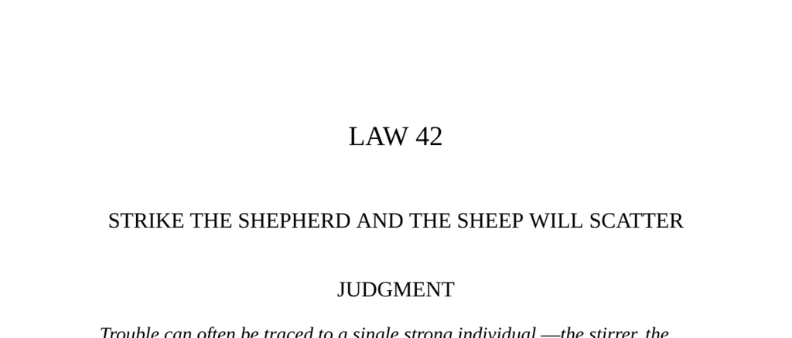

- **Judgment**  
  - Trouble often originates from one strong individual who stirs dissent and spreads ill will.  
  - Neutralize such persons by isolating or banishing them to prevent further group disruption.  
  - Negotiating or trying to reform troublemakers is ineffective and may worsen the situation.  
  - Acting decisively against the source causes the rest to disperse and stabilizes the group.  
  - See [The 48 Laws of Power](https://en.wikipedia.org/wiki/The_48_Laws_of_Power) for related strategies.

- **Observance of the Law I**  
  - Athens used ostracism, a democratic practice banning a disruptive individual for ten years, to preserve unity.  
  - Prominent figures like Aristides and Themistocles were ostracized due to their arrogance despite their achievements.  
  - Ostracism was a public ritual serving as a societal safety valve to remove divisive leaders.  
  - The practice ended after the banishment of the insignificant Hyperbolus, which degraded its prestige.  
  - For further detail, consult [Ostracism in Ancient Athens](https://www.britannica.com/topic/ostracism).

- **The Conquest of Peru**  
  - The capture and execution of Incan king Atahualpa led to rapid disintegration of Incan political cohesion.  
  - Atahualpa’s supreme authority was the keystone of the Incan state, whose removal caused chaos and flight.  
  - Spanish conquerors exploited the power vacuum by targeting the sovereign rather than confronting entire armies.  
  - The chapter illustrates the tactical advantage of eliminating a central leader to collapse a vast empire.  
  - See [The Conquest of Peru by William H. Prescott](https://www.gutenberg.org/ebooks/40760).

- **Interpretation (Athenians' Approach to Troublemakers)**  
  - The Athenians recognized antisocial behavior cloaked in arrogance and envy as threats to civic harmony.  
  - Their solution was simple and effective: removal of the disruptive individual rather than punishment or reeducation.  
  - Early detection and prompt banishment prevented factionalism and the erosion of democratic spirit.  
  - The fable "When the tree falls, the monkeys scatter" underscores the principle of targeting key troublemakers.  
  - Refer to [Social Dynamics in Ancient Athens](https://www.cambridge.org/core/books/abs/athens-and-democracy/social-dynamics-in-athenian-politics/).

- **Observance of the Law II**  
  - Pope Boniface VIII sought to conquer Florence by exploiting internal faction rivalries between Blacks and Whites.  
  - Dante Alighieri, a leader of the Whites faction, was isolated by the pope through negotiation ploys and political exile.  
  - The pope’s strategy combined military threat and diplomacy to neutralize the key opponent and destabilize Florence.  
  - With Dante removed, Florence’s resistance collapsed, enabling the Blacks’ takeover and papal influence expansion.  
  - See [Dante and Politics in Florence](https://www.britannica.com/biography/Dante).

- **The Wolves and the Sheep (Fable)**  
  - The fable illustrates how removing protective elements (dogs) from a group leaves it vulnerable to foes (wolves).  
  - It conveys the danger of trusting adversaries and the need to protect key defenders in any power struggle.  
  - The moral supports the broader theme of striking at critical protectors to weaken an opposing group.  
  - For more on Aesop’s Fables, see [Aesop’s Fables Collection](https://www.gutenberg.org/ebooks/19994).

- **The Life of Themistocles**  
  - Themistocles was ostracized despite his military achievements due to public jealousy and perceived arrogance.  
  - Ostracism functioned to maintain democratic equality by humbling individuals who rose too far above the citizenry.  
  - His temple construction and self-aggrandizement exacerbated public resentment leading to his banishment.  
  - This example illustrates how democratic societies can check power through social mechanisms like ostracism.  
  - Relevant resource: [Plutarch’s Life of Themistocles](https://www.perseus.tufts.edu/hopper/text?doc=Perseus%3Atext%3A2008.01.0008%3Achapter%3D16).

- **Interpretation (Boniface and Dante)**  
  - Boniface used isolation of Dante, Florence’s rallying figure, to dismantle opposition without direct confrontation.  
  - Removing one resolute leader disbands unified resistance and causes the rest to scatter.  
  - Isolation tactics may be physical, political, or psychological to weaken an opponent’s influence effectively.  
  - Timely removal of influential figures halts factional cohesion and yields strategic advantage.  
  - For related concepts, see [Power and Isolation in Political Strategy](https://www.jstor.org/stable/262020).

- **Keys to Power**  
  - Power concentrates inevitably around a few strong personalities even in democratic or diffused systems.  
  - Recognizing and targeting the main power centers is critical in strategic conflict or influence games.  
  - Isolation is more effective than direct destruction in neutralizing foes and appears less brutal.  
  - Strategies include luring key enemies away, dividing their allies, and exploiting their absence to consolidate control.  
  - For a modern overview, see [Power Dynamics in Organizations](https://hbr.org/2017/05/the-dynamics-of-power).

- **Examples of Isolation in History**  
  - Mao eliminated rivals by isolating them politically, shrinking their support base before removal.  
  - Robert Cecil removed rivals by sending them away on missions, securing influence with the queen.  
  - Rasputin gained power by exploiting the czarina’s isolation, demonstrating use of isolated leaders as power conduits.  
  - Hernando Cortés and Francisco Pizarro won empires by capturing and killing their leaders, causing collapse.  
  - See [Leadership Targeting in History](https://www.historyextra.com/period/ancient/targeting-leaders-strategy-political-military-history/).

- **Reversal**  
  - Acting from a position of strength to isolate enemies reduces risk of retaliation and revenge.  
  - The example of Andrew Johnson’s failed attempt to isolate Ulysses S. Grant illustrates dangers of provoking enemies.  
  - Keeping potential troublemakers close allows control over their influence and easier neutralization.  
  - Strategic isolation should be done carefully to avoid creating new formidable opponents.  
  - Consult [Machiavelli’s The Prince](https://www.gutenberg.org/ebooks/1232) for foundational insights on power and revenge.
