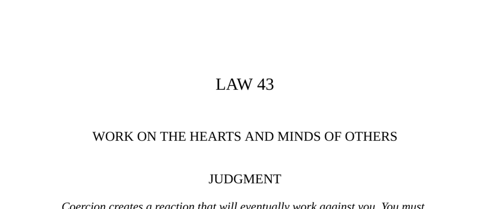

- **Judgment**  
  - Coercion causes backlash and resistance among those coerced.  
  - Seduction is necessary to gain loyalty by appealing to individual psychologies and emotions.  
  - Ignoring others’ hearts and minds leads to hatred and opposition.  
  - See also [The Art of Seduction](https://en.wikipedia.org/wiki/The_Art_of_Seduction).

- **Cyrus’s Ruse**  
  - Cyrus used a staged sequence of labor followed by pleasure to persuade Persians to revolt.  
  - He promised freedom and relief from menial tasks if they followed him.  
  - The Persians enthusiastically embraced Cyrus as their leader and rebelled against the Medes.  
  - Refer to [The Histories by Herodotus](https://www.gutenberg.org/ebooks/2707) for original context.

- **Transgression of the Law**  
  - Marie-Antoinette alienated the French people by indulging in extravagance amid social unrest.  
  - She failed to engage with or persuade the populace, treating them with disdain.  
  - Her disregard for the subjects’ psychology fueled widespread resentment leading to the French Revolution.  
  - This exemplifies the dangers of neglecting to win hearts and minds in leadership.  
  - For more, see [Marie Antoinette’s biography](https://www.britannica.com/biography/Marie-Antoinette).

- **Observance of the Law**  
  - Chuko Liang preferred winning loyalty over force in conflicts with southern barbarians.  
  - He alternated mercy and harshness to erode resistance and gain devoted allies.  
  - The strategy created lasting peace and alliance without continued occupation.  
  - Demonstrates long-term benefits of psychological persuasion over immediate conquest.  
  - Consult [Seven Pillars of Wisdom](https://en.wikipedia.org/wiki/Seven_Pillars_of_Wisdom) by T. E. Lawrence for related insights.

- **The Gentle Art of Persuasion**  
  - Aesop’s fable illustrates that warmth and gentle persuasion succeed where force fails.  
  - Persuasion influences people’s emotions, leading to voluntary compliance.  
  - Force creates resistance and strengthens opposition rather than breaking it down.  
  - See [Aesop’s Fables](https://www.gutenberg.org/ebooks/21) for original stories.

- **Life of Alexander the Great**  
  - Alexander demonstrated self-restraint to inspire and maintain his soldiers’ morale.  
  - His example fostered loyalty and made his troops feel nearly invincible.  
  - Leadership through example helps secure followers’ hearts and minds more than orders alone.  
  - See [Plutarch’s Life of Alexander](https://en.wikisource.org/wiki/Lives_of_the_Noble_Greeks_and_Romans_(Plutarch)/Alexander).

- **Interpretation**  
  - True power requires understanding and addressing the emotional and psychological makeup of others.  
  - Winning hearts avoids long-term resentment and paranoia inherent in rule by force.  
  - Alternating firmness and kindness exploits basic human emotions for lasting allegiance.  
  - Failing to engage people’s hearts leads to alienation and eventual downfall.  
  - For leadership psychology, see [Emotional Intelligence](https://www.psychologytoday.com/us/basics/emotional-intelligence).

- **Keys to Power**  
  - People aid only when their self-interest is addressed and they feel individually understood.  
  - Seduction combines emotional appeal and intellectual engagement to soften resistance.  
  - Dramatic contrasts of hardship followed by relief effectively win loyalty.  
  - Symbolic gestures of shared sacrifice build identification and goodwill.  
  - Retaining artists and intellectuals aids communication with the broader public.  
  - Broad support prevents isolated opposition from overthrowing power.  
  - Study [The 48 Laws of Power](https://en.wikipedia.org/wiki/The_48_Laws_of_Power) for expanded principles.

- **Authority**  
  - Persuasion requires insight into the target’s secret desires, fears, and emotional states.  
  - Tailoring communication to these internal states is essential to winning hearts.  
  - This principle highlights the psychological complexity underlying effective influence.  
  - Han-fei-tzu’s work provides foundational perspective on ancient Chinese political philosophy.  
  - See [Han Feizi](https://plato.stanford.edu/entries/han-feizi/) for more on this philosophy.

- **Reversal**  
  - This Law—working on hearts and minds to seduce rather than coerce—has no reversal.  
  - Omitting this approach leads invariably to failure and opposition.
