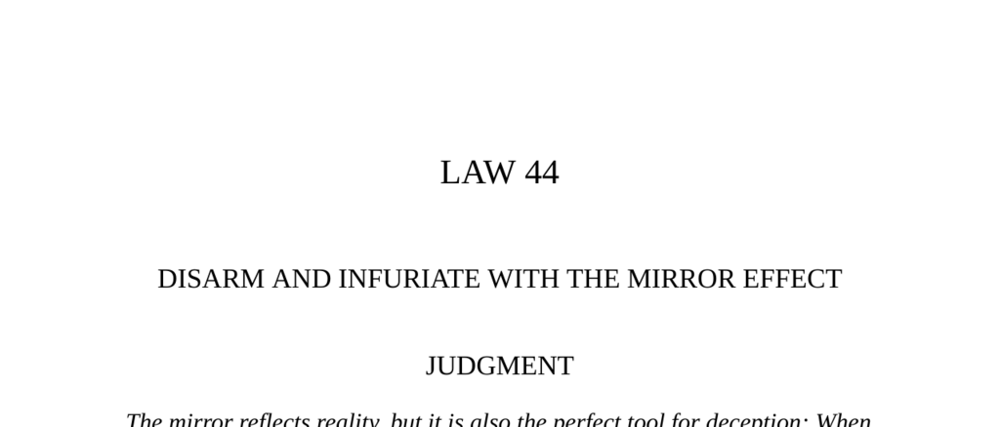

- **Judgment**
  - The mirror can both reflect reality and serve as a tool for deception.
  - Mirroring enemies confounds their strategy and provokes overreaction.
  - The Mirror Effect manipulates primitive emotions, enabling control or seduction.
  - Further reading: [The 48 Laws of Power](https://en.wikipedia.org/wiki/The_48_Laws_of_Power)

- **Mirror Effects: Preliminary Typology**
  - Mirroring actions unsettles or disarms opponents by reflecting their behavior.
  - The Effect operates on primitive emotions, conferring significant manipulative power.
  - It includes four main types: Neutralizing, Narcissus, Moral, and Hallucinatory Effects.
  - Further reading: [Psychology of Mirrors](https://www.psychologytoday.com/us/blog/science-choice/201103/the-psychology-mirroring)

  - **The Neutralizing Effect**
    - Mirroring enemy actions blinds them to one’s own strategy.
    - The technique mocks and infuriates opponents, making them predictable.
    - It has roots in ancient mythology and military strategies like those of Sun-tzu.
    - Further reading: [Sun-tzu’s Art of War](https://suntzusaid.com/)

  - **The Shadow (Reverse Neutralizing Effect)**
    - Shadowing opponents covertly gathers intelligence to later neutralize their moves.
    - It is widely used by spies and detectives for insight into opponents’ habits.
    - Further reading: [Principles of Shadowing in Intelligence](https://www.cia.gov/readingroom/document/cia-rdp80r01443r017900030001-1)

  - **The Narcissus Effect**
    - Reflecting another’s desires and values psychologically seduces and disarms them.
    - It plays on universal narcissism, creating a mirroring of the soul.
    - Effective in social and business contexts as the Seducer’s and Courtier’s Mirror.
    - Further reading: [Narcissism and Mirror Imaging](https://www.psychologytoday.com/us/blog/the-narcissism-epidemic/201402/the-power-mirror-narcissism)

  - **The Moral Effect**
    - Mirrors unpleasant actions back to offenders to teach lessons without direct complaint.
    - It lowers defenses and provokes self-realization by experiencing their own behavior reflected.
    - Commonly used by educators and psychologists as the Teacher’s Mirror.
    - Further reading: [Social Psychology of Reciprocity](https://www.simplypsychology.org/reciprocity.html)

  - **The Hallucinatory Effect**
    - Creates a perfect copy or façade that deceives by mimicking reality.
    - Employed by con artists and in camouflage to induce belief in false appearances.
    - Known as the Deceiver’s Mirror.
    - Further reading: [Psychology of Deception](https://www.apa.org/monitor/2017/05/cover-deception)

- **Observances of Mirror Effects**
  - **Observance I: Joseph Fouché and Napoleon**
    - Fouché used mirroring and double espionage to survive Napoleon’s suspicion.
    - He adapted fluidly to changing regimes, echoing dominant sentiments.
    - The mirror strategy shielded Fouché’s true intentions and enabled offensive plotting.
    - Further reading: [Joseph Fouché Biography](https://www.britannica.com/biography/Joseph-Fouche)

  - **Observance II: Alcibiades’ Seductive Mirroring**
    - Alcibiades tailored his behavior to match and flatter diverse audiences’ values.
    - He seduced key figures by reflecting their ideals, gaining immense influence.
    - Overuse of mirroring caused alienation and eventual downfall.
    - Further reading: [Alcibiades in Ancient Greece](https://www.ancient.eu/Alcibiades/)

  - **Observance III: Marie Mancini and King Louis XIV**
    - Marie studied Louis XIV’s romantic ideals and mirrored them to win his love.
    - Her mirror fed his ego and provided an idealized self-image.
    - The Seducer’s Mirror operates by reflecting hidden yearnings and fantasies.
    - Further reading: [Lorenzo de’ Medici and the Courtier’s Mirror](https://www.britannica.com/biography/Lorenzo-de-Medici)

  - **Observance IV: Ivan the Terrible’s Moral Mirror**
    - Ivan abdicated in favor of a weak double to reflect the boyars’ disrespect.
    - The mirror forced the boyars to realize their behavior’s consequences.
    - This dramatic lesson restored Ivan’s authority and curbed resistance.
    - Further reading: [Ivan IV and Boyar Relations](https://www.britannica.com/biography/Ivan-the-Terrible)

  - **Observance V: Dr. Milton H. Erickson’s Therapeutic Mirror**
    - Erickson used indirect metaphorical mirroring to bypass patient resistance.
    - He allowed patients to solve their own problems by reflecting their dynamics.
    - Entering patients’ fantasy worlds and working within them aids transformation.
    - Further reading: [Milton Erickson and Hypnotherapy](https://www.erickson-foundation.org/milton-erickson/)

  - **Observance VI: Sen no Rikyu’s Courtier’s Mirror**
    - Rikyu harmonized with guests by intuiting and reflecting their unspoken desires.
    - He embraced host’s wishes, even when playful or humiliating, to maintain harmony.
    - The Courtier’s Mirror operates via keen observation and unspoken communication.
    - Further reading: [Sen no Rikyu and the Japanese Tea Ceremony](https://www.britannica.com/biography/Sen-no-Rikyu)

  - **Observance VII: Yellow Kid Weil and the Deceiver’s Mirror**
    - Weil created perfect facsimiles of institutions to execute cons convincingly.
    - The detailed mirroring of props, personnel, and environment engendered trust.
    - The Deceiver’s Mirror exploits natural human credulity and trust in appearances.
    - Further reading: [Famous Con Artists and Cons](https://www.britannica.com/topic/con-artist)

- **A Warning: Beware of Mirrored Situations**
  - Mirrored situations resemble past events but can trap individuals with unwanted associations.
  - Being compared unfavorably to predecessors can damage reputation and control.
  - Richard Wagner’s Munich episode exemplifies dangers of unwanted mirroring.
  - It is vital to distinguish oneself and break unwanted reflections swiftly.
  - Further reading: [Risks of Mimicry and Reputation](https://hbr.org/2015/12/the-danger-of-being-assigned-a-label)
