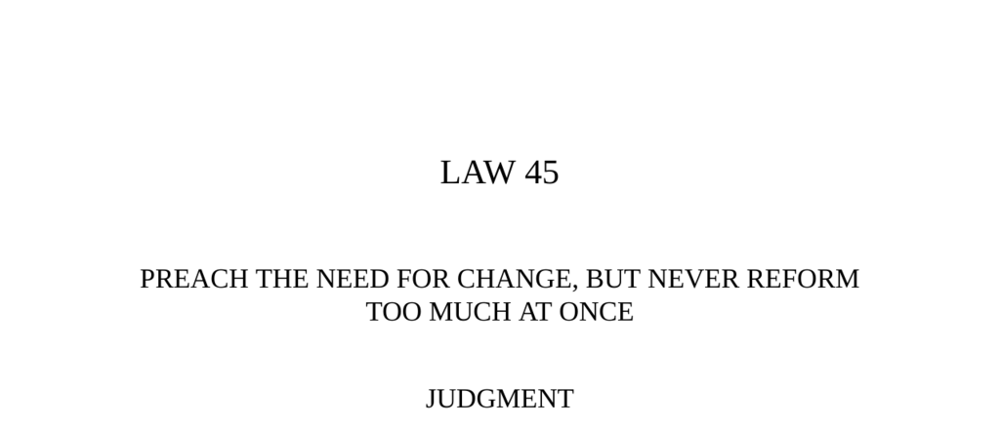

- **Judgment**  
  - People accept change in theory but resist it in daily life due to habit.  
  - Rapid innovation causes trauma and can provoke revolt.  
  - New leaders should respect traditions and make changes feel like improvements.  
  - See Niccolò Machiavelli’s writings on reform for related insights.

- **Transgression of the Law**  
  - Thomas Cromwell engineered England’s break with Rome to allow Henry VIII’s divorce.  
  - Cromwell seized church wealth, imposed Protestantism, and triggered widespread social unrest.  
  - Reforms caused terror due to destruction of religious symbols and economic hardship.  
  - Cromwell’s fall was precipitated by unpopular policies and a failed royal marriage.  
  - For more, see the history of the English Reformation on [Britannica](https://www.britannica.com/event/English-Reformation).

- **Where Christmas Came From**  
  - Midwinter celebrations predate Christianity and often involve light and fertility rites.  
  - Roman and Germanic festivals honored gods like Saturn, Mithras, Wotan, and Freyja.  
  - The Christian church appropriated December 25 from Mithras’ birthday in 354 AD.  
  - The syncretism helped ease Christianization by linking new rituals to established customs.  
  - See [History.com Christmas Origins](https://www.history.com/topics/christmas/history-of-christmas).

- **Interpretation**  
  - Cromwell underestimated backlash from rapid reforms and loss of ancient church connections.  
  - Reformers often become scapegoats due to people’s attachment to familiar rituals and stability.  
  - Human psychology resists deep change despite intellectual acceptance of necessity.  
  - Effective reform disguises change, sweetens its impact, and respects the past’s hold.  
  - Niccolò Machiavelli’s advice on reform is foundational for understanding such dynamics.

- **Observance of the Law**  
  - Mao used Chinese historical figures and literature to legitimize Communist revolution.  
  - The revolution was presented as an extension of familiar past struggles, easing peasant acceptance.  
  - Mao contrasted himself with opponents by referencing differing philosophies tied to Chinese tradition.  
  - He reinterpreted ancient figures like Emperor Ch‘in to justify his reforms and violence.  
  - Learn more about Mao’s use of history in revolution from [Stanford’s Mao biography](https://spice.fsi.stanford.edu/docs/mao_tse_tung).

- **Interpretation (of Mao’s strategy)**  
  - Mao cloaked radical change in the legitimacy of historical precedents to reduce resistance.  
  - The past holds deep emotional and cultural power that reformers can leverage.  
  - Destroying familiar institutions creates chaotic voids, which people fear intensely.  
  - Using tradition provides comfort and masks the disruptive nature of reforms.  
  - See [Machiavelli’s quote on initiating new orders](https://en.wikiquote.org/wiki/Niccol%C3%B2_Machiavelli).

- **Keys to Power**  
  - People desire abstract change but resist disruption of core habits and routines.  
  - Revolutions invariably provoke counter-revolutions because they create unsettling voids.  
  - Machiavelli advised reformers to be ready to use force and to create new rituals quickly.  
  - Playing the courtier’s game means paying lip service to tradition to ease reforms.  
  - Science also shows resistance to radical change, as exemplified by opposition to Darwin and Planck.  
  - Incremental change aligned with zeitgeist achieves more sustainable power.  
  - Additional reading: [Darwin and scientific opposition](https://www.britannica.com/biography/Charles-Darwin).

- **Authority (Machiavelli on reform)**  
  - Reformers must maintain the semblance of old forms to gain popular acceptance.  
  - Human beings accept appearances as reality, making outward continuity crucial.  
  - Machiavelli’s political philosophy emphasizes the power of tradition in governance.  
  - Reference: Niccolò Machiavelli’s *The Prince* and related political treatises.

- **Image: The Cat**  
  - The cat symbolizes creatures of habit that become unmanageable if routines are disrupted.  
  - Maintaining familiar stimuli soothes anxiety caused by change.  
  - This metaphor illustrates how people require comforting rituals during reform.  
  - Use of familiar objects and symbols masks the disruptive nature of changes.

- **Reversal**  
  - Leaders must adapt to the mood of their time and avoid creating voids of uncertainty.  
  - Napoleon established a sober court to distance himself from the excesses of the French Revolution.  
  - New rituals and forms must immediately replace old ones to prevent terror and chaos.  
  - Innovation in arts and technology carries risks of rapid obsolescence and fleeting power.  
  - Long-term power derives more from connecting to tradition than from radical rupture.  
  - For more on Napoleon’s political symbolism, see [Napoleon: Symbolist of the Modern Age](https://www.metmuseum.org/toah/hd/napo/hd_napo.htm).
