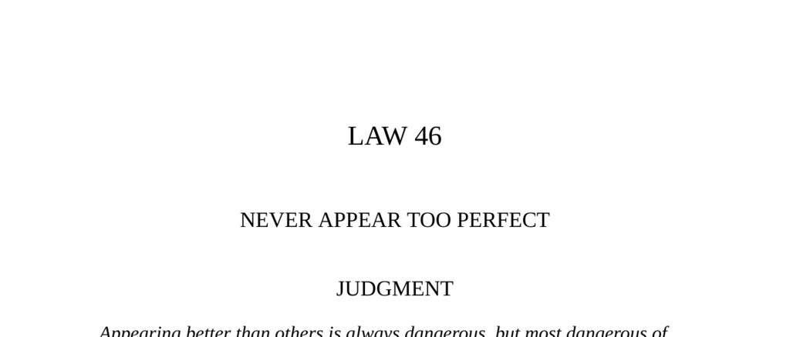

- **Judgment**
  - Envy creates silent enemies when someone appears without faults or weaknesses.  
  - Displaying occasional defects or harmless vices deflects envy and makes one seem more human.  
  - Only gods and the dead can appear perfect without repercussions.  
  - See [The Art of Seduction by Robert Greene](https://en.wikipedia.org/wiki/The_Art_of_Seduction).  

- **Transgression of the Law**
  - Joe Orton and Kenneth Halliwell’s acting careers failed, and they became writers supported initially by inheritance.  
  - Orton gained recognition after imprisonment, ultimately achieving success with plays and commissions.  
  - Halliwell’s envy and sense of inferiority worsened as Orton’s fame grew, culminating in Orton’s murder by Halliwell.  
  - Envy deteriorated Halliwell’s mental state, exacerbated by Orton’s inability to deflect or escape it.  
  - See [Joe Orton Biography](https://www.britannica.com/biography/Joe-Orton).  

- **The Parable of the Greedy Man and the Envious Man**
  - The envious man self-destructively chose to lose an eye rather than let another have twice as much as him.  
  - Envy is described as unhappy self-assertion contrasting with admiration.  
  - Envy leads individuals to irrational and self-harming decisions to equalize perceived inequalities.  
  - See [Seven Deadly Sins: Envy](https://www.jewishvirtuallibrary.org/seven-deadly-sins).  

- **Environmental Effects of Envy**
  - Envy causes friends and peers to feel threatened by another’s success, leading to resentment and undermining behavior.  
  - Democratic environments intensify envy due to its veneer of equality and disdain for overt power displays.  
  - Envy’s effects are insidious, often hidden in excessive praise or criticism.  
  - See [Psychology of Envy](https://www.psychologytoday.com/us/basics/envy).  

- **Observance of the Law**
  - Cosimo de’ Medici gained power by quietly supporting allies and avoiding overt displays of ambition or wealth.  
  - Public modesty and generosity deflected envy while maintaining influence behind the scenes.  
  - Visible humility and charity helped build a wide support base and reduced threats from rivals.  
  - See [Cosimo de’ Medici's Leadership](https://www.britannica.com/biography/Cosimo-de-Medici).  

- **Interpretation**
  - Avoid flaunting superiority as it provokes “unhappy admiration” and envy, destabilizing support.  
  - Envy is socially denied but actively undermines those envied through hypercriticism and sabotage.  
  - Building alliances with those below and appearing modest helps neutralize envy’s destructive power.  
  - See [The Psychology of Envy by Schopenhauer](https://plato.stanford.edu/entries/envy/).  

- **Keys to Power**
  - Envy arises when people face inferiority and leads to disguised attacks through criticism or backstabbing.  
  - Successful individuals must recognize envy in their environment to protect themselves.  
  - Strategies include deflecting envy by showing minor flaws or claiming luck and avoiding arrogance.  
  - Sir Walter Raleigh’s downfall exemplifies the dangers of flaunting many talents openly.  
  - See [Lessons from Raleigh’s Court Intrigues](https://www.historytoday.com/archive/sir-walter-raleight-courtier-explorer).  

- **Joseph and His Coat**
  - Joseph’s multicolored coat symbolizes favoritism that stimulated venomous envy, leading to conspiracy and harm.  
  - Envy among peers can trigger destructive behaviors to undermine successful individuals.  
  - See [Genesis 37:3-20 Commentary](https://www.biblestudytools.com/commentaries/matthew-henry-complete/genesis/37.html).  

- **The Tragedy of the Tomb**
  - Michelangelo faced envy-driven sabotage, notably from Bramante, who delayed his tomb work and limited his artistic freedom.  
  - Envy from powerful rivals can manifest as political and creative obstruction.  
  - Despite obstacles, Michelangelo’s excellence continued to torment his envious adversaries.  
  - See [Michelangelo and the Sistine Chapel](https://www.britannica.com/biography/Michelangelo).  

- **Reversal**
  - When envy takes root, openly displaying disdain and increasing visible success can unnerve envious opponents.  
  - Turning an envious rival’s hate into motivation can produce one’s greatest achievements, as Michelangelo did.  
  - Excessive humility or false modesty can worsen envy; genuine behavior is key to deflection strategies.  
  - See [Power Dynamics and Envy Management](https://hbr.org/2013/05/how-to-handle-envy-at-work).
