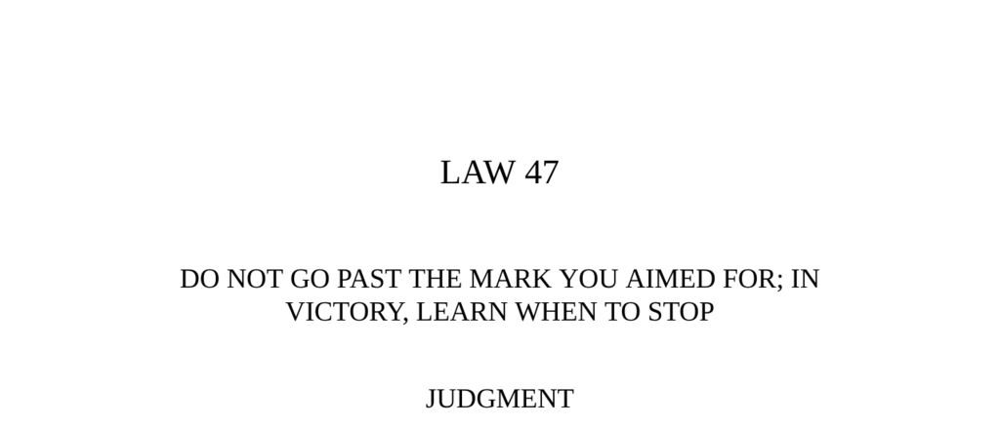

- **Judgment**  
  - Victory is the moment of greatest peril due to potential arrogance and overconfidence.  
  - One must set a goal and stop upon reaching it to avoid creating more enemies.  
  - Strategy and careful planning are indispensable for sustainable success.  
  - Related reading: [The Art of War](https://en.wikipedia.org/wiki/The_Art_of_War) by Sun Tzu.
  
- **Transgression of the Law**  
  - Cyrus the Great expanded his empire through successive victories but overreached against the Massagetai.  
  - He used cunning tactics leading to initial success, but arrogance caused him to reject peace offers and overextend.  
  - His refusal to heed warnings resulted in defeat and death, unraveling his empire.  
  - Historical example of hubris leading to downfall is documented.  
  - Related reading: [Cyrus the Great](https://www.britannica.com/biography/Cyrus-the-Great).
  
- **The Vainglorious Cockerel**  
  - A victorious cockerel boasted loudly of his strength, drawing deadly attention from an eagle.  
  - Excessive pride and public display of victory invite greater dangers.  
  - The fable warns against arrogance in moments of triumph.  
  - Related reading: [Fables of Leo Tolstoy](https://en.wikipedia.org/wiki/Leo_Tolstoy#Fables_and_other_works).  
  
- **Interpretation**  
  - Victory intoxicates and makes leaders prone to mistakes by underestimating costs and opponents.  
  - Historical empires like Assyria and Persia fell due to overextension after victories.  
  - Success demands reasoned reflection and adaptation to changing circumstances.  
  - Repeating past strategies blindly after victory is perilous.  
  - Related reading: [Collapse of Empires](https://www.history.com/topics/ancient-history/fall-of-rome).  
  
- **The Sequence of Cross-Examination**  
  - Cross-examiners must stop immediately after achieving a significant triumph.  
  - Continuing questions beyond a point risks losing jury impact and undermining previous success.  
  - The principle highlights the importance of knowing when to conclude to preserve advantage.  
  - Related reading: [The Art of Cross-Examination](https://archive.org/details/artcrossexamina00wellgoog).  
  
- **The Overreaching General**  
  - Victorious generals risk provoking suspicion and jealousy from their sovereigns.  
  - Displays of arrogance and high reputation may lead to loss of favor or execution.  
  - Princes may diminish generals’ achievements to secure their own authority.  
  - Related reading: [Machiavelli’s The Prince](https://en.wikipedia.org/wiki/The_Prince).  
  
- **Observance of the Law**  
  - Madame de Pompadour rose from middle-class origins to become a powerful royal mistress.  
  - She maintained power for twenty years through charm, political acumen, and strategic withdrawal from bedroom duties.  
  - She avoided arrogance, cultivated allies including the queen, and managed court enemies with politeness.  
  - Her reign ended only due to declining health, making her an exceptional example of moderation in power.  
  - Related reading: [Madame de Pompadour](https://www.britannica.com/biography/Madame-de-Pompadour).  
  
- **Interpretation (Madame de Pompadour’s example)**  
  - Victories often induce a frenzy to accumulate power and money, which can cause downfall.  
  - Successful figures like Pompadour avoid pressing their luck by graciously consolidating power.  
  - Accepting limitations and adapting strategies prolong influence despite weakening positions.  
  - Related reading: [Essays in Idleness by Kenko](https://en.wikipedia.org/wiki/Essays_in_Idleness).  
  
- **Keys to Power**  
  - Power operates in rhythms and patterns requiring control, variation, and adaptability.  
  - Victory can blind leaders to changing conditions and tempt repetition of past methods.  
  - Luck plays a role, and unexpectedly good fortune may be more dangerous than bad luck.  
  - Leaders must learn to moderate ambition, maintain emotional control, and alter strategies post-victory.  
  - Historical examples include Pericles' moderation and Hideyoshi’s alternating use of force and cunning.  
  - Related reading: [The 48 Laws of Power](https://en.wikipedia.org/wiki/The_48_Laws_of_Power).  
  
- **Reversal**  
  - Machiavelli advises destroying enemies completely or leaving them alone to avoid ongoing resentment.  
  - Victories should be decisive against foes but not overextended to create new enemies.  
  - Caution post-victory acts as a safeguard, not a hindrance to momentum.  
  - Momentum is created by one’s own actions, not an automatic force to rely on.  
  - Related reading: [Machiavelli on Power](https://plato.stanford.edu/entries/machiavelli/#2).
