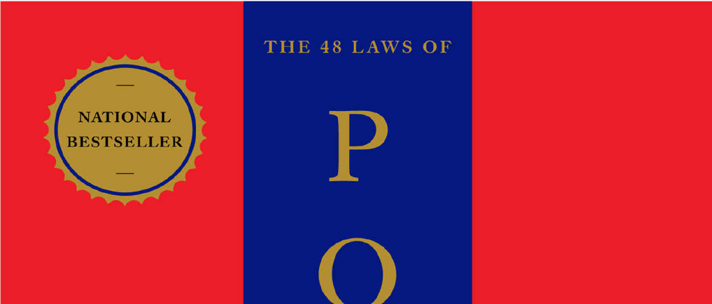

- **About the Authors**
  - Robert Greene has a degree in classical studies and has been an editor at Esquire and other magazines.
  - Joost Elffers is the producer of bestselling titles for Penguin Studio and lives in New York City.
  - Both authors collaborated on this book, combining historical knowledge and production expertise.
- **Penguin Books Publication Information**
  - The book was first published in the United States by Viking Penguin in 1998 and in Penguin Books in 2000.
  - Copyright belongs to Joost Elffers and Robert Greene, 1998.
  - The book is protected against unauthorized electronic distribution by law.
- **Permissions and Sources**
  - The text includes excerpts or permissions from numerous works, including historical texts, fables, and philosophical writings.
  - Notable sources include works by Herodotus, Baldesar Castiglione, Sun-tzu, Michel de Montaigne, and Niccolò Machiavelli.
  - These references provide historical depth and credibility to the book’s content.
- **Acknowledgments**
  - The authors thank Anna Biller, Michiel Schwarz, Henri Le Goubin, Les and Sumiko Biller, Elizabeth Yang, and several publishing professionals.
  - The UCLA Research Library is credited as a vital source of research material.
  - Personal thanks include the authors’ families and even a cat named Boris for companionship.
- **Table of Contents**
  - **Preface**
    - Discusses the universal desire for power and the necessity of subtlety in modern power dynamics.
    - Compares contemporary power struggles to the scheming world of aristocratic courts.
    - Emphasizes the role of emotions, deception, patience, and indirect strategies in attaining power.
    - Recommends the book as both a practical guide and a historical exploration of power techniques.
    - Suggests mastery of power improves personal relationships and social interactions.
  - **Law 1: Never Outshine the Master**
    - Advises making superiors feel superior by hiding or downplaying one’s talents to avoid envy.
    - Gives historic examples including Nicolas Fouquet, who was punished for outshining Louis XIV.
    - Contrasts with Galileo’s strategy of flattering the Medicis by linking their power to cosmic forces.
    - Highlights the dangers of appearing too talented or ambitious in the presence of insecure superiors.
    - Offers advice on discreet flattery, humility, and subtlety to maintain favor and power.
  - **Law 2: Never Put Too Much Trust in Friends, Learn How to Use Enemies**
    - Warns that friends are more likely to betray out of jealousy than former enemies.
    - Describes the downfall of Byzantine Emperor Michael III through misplaced trust in his friend Basilius.
    - Presents Chinese Emperor Sung’s strategy of neutralizing potential threats by offering generals estates.
    - Explains how former enemies become more loyal due to their need to prove themselves.
    - Recommends cultivating enemies for their usefulness while remaining cautious of friends’ potential ingratitude.
