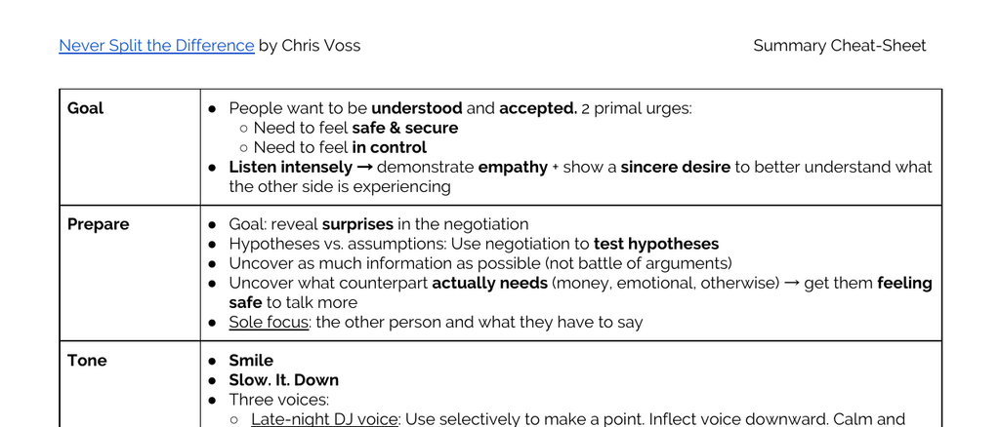

- **Goal**
  - People have two primal urges: need to feel safe & secure and need to feel in control.
  - Effective negotiation requires intense listening to demonstrate empathy and a sincere desire to understand the counterpart's experience.
  - For deeper insight, see [Negotiation: How to listen](https://www.harvardlawreview.org/2020/04/the-art-of-negotiation/).

- **Prepare**
  - The goal of preparation is to uncover surprises and test hypotheses rather than argue.
  - Gathering as much information as possible helps reveal what the counterpart truly needs, including emotional needs.
  - Focus exclusively on the counterpart’s statements and perspective.

- **Tone**
  - Use three distinct voice tones: Late-night DJ (calm, trustworthy), Positive & playful (default, relaxed), and Direct/Assertive (rarely used).
  - Smiling and slowing down speech support creating trust and reducing defensiveness.
  - Tone management is critical; see [Voice and Negotiation](https://hbr.org/2016/05/what-your-voice-really-says-in-negotiations).

- **Mirror**
  - Mirroring involves repeating the last three words or critical parts of the counterpart’s statement.
  - This technique insinuates similarity and facilitates emotional bonding.
  - Mirroring functions as connectors that help counterparts connect their thoughts.

- **Mirror Process**
  - Employ the Late Night FM DJ Voice with empathetic phrasing like "I’m sorry…".
  - Mirror the counterpart’s words and pause silently for at least four seconds.
  - Repeat as necessary to enhance engagement and information flow.

- **Tactical Empathy**
  - Imagining oneself in the counterpart’s situation helps recognize and vocalize their perspective.
  - Observing words, tone, and body language reveals emotional obstacles.
  - Vocalizing understanding helps overcome emotional barriers to agreement.

- **Labels**
  - Labels validate emotions by acknowledging feelings using phrases like "It seems like…" or "It sounds like…".
  - Pausing after labeling allows the counterpart to fill the silence with more information.
  - Utilize every fourth verbalization as a label to maintain rapport.

- **Neutralize the Negative**
  - Begin by observing without judgment, then label negative emotions to diffuse their power.
  - Replace negative feelings with positive, compassionate, and solution-oriented thoughts.
  - Labeling fears helps clear barriers to agreement efficiently.

- **Accusation Audit**
  - Preempt worst-case criticisms by listing them upfront.
  - Use labels to reinforce positive perceptions and encourage openness.
  - Avoid using "I understand" to prevent disengagement.

- **Start with No**
  - Getting a "No" helps the counterpart feel in control and reduces defensiveness.
  - Differentiate types of "Yes": Counterfeit, Confirmation, and Commitment.
  - Triggering a "No" can be done by asking questions designed for negative responses.

- **Email Magic**
  - Using questions like "Have you given up on this project?" prompts engagement.
  - Email phrasing should create room for non-defensive responses.

- **That’s Right**
  - "That’s Right" signals genuine agreement and understanding.
  - Avoid "Yes, You’re Right" as it often reflects surface-level confirmation.
  - Effective summaries trigger "That’s Right" responses.

- **Summary to trigger That’s Right**
  - Use effective pauses, minimal encouragers, mirroring, labeling, paraphrasing, and summarizing.
  - Combine paraphrasing with labeling for full emotional acknowledgment.
  - This approach encourages the counterpart to confirm understanding and agreement.

- **Never Split the Difference**
  - Splitting the difference leads to suboptimal outcomes benefiting neither party.
  - Avoid compromise on asymmetric or qualitatively different items.

- **Deadlines**
  - Deadlines often prompt impulsive decisions.
  - Resist rushing near deadlines and exploit others’ rush strategically.
  - Share own deadlines to reduce information asymmetry.

- **Three uses of Fair**
  - Defensive move: "We just want what’s fair" can be de-escalated by apologizing and recalibrating.
  - Nefarious accusation: "We’ve given you a fair offer" aims to distract.
  - Positive use: Emphasize fairness to maintain trust and invite correction.

- **Extreme Anchor**
  - Emotionally anchor by exaggerating negative consequences to support your extreme starting point.
  - Setting an extreme anchor frames your real offer as reasonable.
  - Using a range softens perceived aggression.

- **Loss Aversion**
  - Counterparts are motivated to avoid losses more than to gain equivalent benefits.
  - Emphasize the cost of inaction to influence decisions.

- **Bend their Reality**
  - Anchor emotions first using accusations audits acknowledging fears.
  - Allow counterparts to set initial prices, adapting to their level of experience.
  - Use bolstering ranges, odd numbers, and non-monetary pivots to shift perception.
  - Surprise gifts leverage reciprocity.

- **Calibrated Questions**
  - Calibrated questions start with "what" or "how" and avoid easily answered yes/no forms.
  - Their goal is to suspend disbelief and invite collaborative problem-solving.
  - Examples include: "What makes you ask?" and "How can I help make this better for us?"

- **How**
  - "How" questions guarantee execution and clarify implementation details.
  - Seek genuine confirmations ("That’s Right") over weak agreements ("I’ll try").
  - Influence behind-the-scenes stakeholders with targeted "how" inquiries.

- **7-38-55 Rule**
  - Communication content accounts for 7%, tone 38%, and body language 55%.
  - Face-to-face meetings enhance interpretation of true intentions.
  - Discrepancies between words and nonverbals should be labeled.

- **Rule of Three**
  - Secure commitments by eliciting "yes" three times: initial commitment, "That’s Right," and implementation questions.
  - This sequence strengthens agreement reliability.

- **Spotting Liars**
  - Liars use more words, avoid first-person pronouns, and form complex sentences to obscure deceit.
  - Observe language distancing indicators like third-person references.

- **Spot Decision Makers**
  - Frequent use of "I," "me," and "my" suggests less control over final decisions.
  - Use of "we," "they," and "them" often signals actual decision-makers keeping options open.

- **Use my own name**
  - Introducing oneself by name creates personal connection.
  - Customized offers or discounts named after oneself personalize negotiation leverage.

- **Saying No 4 times**
  - Effective refusal involves staged statements interspersed with mirroring and empathy.
  - Empathy expressions soften rejection and maintain rapport.

- **Types of Negotiators**
  - Analyst: Prefers data, dislikes calibrated questions, values minimizing errors.
  - Accommodator: Focused on relationships, vulnerable to overpromising, uses calibrated questions.
  - Assertive: Prioritizes being heard and winning, likely to tunnel vision, uses calibrated questions and labels.

- **Deflect the Punch**
  - Use "no" or calibrated questions to deflect extreme anchors.
  - Pivot discussion to non-monetary terms or counter with own extreme anchor.

- **Strategic Umbrage**
  - Express doubts or skepticism ("I don’t see how that would ever work") to gain negotiation leverage.

- **I statements**
  - Structured emotional expressions: "I feel ___ when you ___ because ___" clarify impacts calmly.

- **Ackerman Bargaining**
  - Use a calculated offer sequence: Buyers (65%, 85%, 95%, 100%), Sellers (135%, 115%, 105%, 100%).
  - Add non-monetary items at the final offer.
  - Precede offers with an accusation audit to soften impact.
  - Incorporate empathy and "No" strategically between offers.
  - Use precise odd numbers for finality.

- **Black Swans**
  - Every negotiation contains three unrecognized, game-changing facts ("Black Swans").
  - Treat each negotiation as unique, avoiding assumptions.
  - Continuously question counterpart motivations and communications.

- **3 Types of Leverage**
  - Positive Leverage: possessing something the other party wants.
  - Negative Leverage: capacity to impose losses, exploiting loss aversion.
  - Normative Leverage: leveraging the counterpart’s own norms to highlight inconsistencies.

- **Listen, listen, listen**
  - Review all information carefully and use backup listeners to detect subtleties.
  - Collaborate with team members for comprehensive note comparison.

- **Similarity Principle**
  - Trust is established through perceived similarity in attitudes, beliefs, and behaviors.
  - Mirroring these traits strengthens rapport.

- **Power of Hopes & Dreams**
  - Visualizing and discussing counterpart aspirations inspires cooperation.
  - Offering a purposeful plan toward their goals transforms perceptions of possibility.

- **…because...**
  - People respond more positively to requests justified by a reason, even if the reason is trivial.
  - Reason-giving improves influence effectiveness.

- **Not crazy**
  - Counterparts acting irrationally are often ill-informed, constrained, or motivated by hidden interests.
  - Understanding these factors aids in de-escalation.

- **Get Face Time**
  - Face-to-face interaction is essential for detecting unguarded cues.
  - Moments before, after, and during interruptions reveal opportunities.
  - Investigate inconsistencies for insight.

- **Negotiation One-Sheet**
  - Define and write down a clear, optimistic, and reasonable goal.
  - Prepare summaries aimed at eliciting "That’s Right" responses.
  - Develop labels and accusation audits to preempt objections.
  - Formulate calibrated questions to uncover value and neutralize deal-killers.
  - Identify non-cash items for trade-offs and added value.

For further negotiation mastery, consult [Never Split the Difference Official Site](https://www.neversplitthedifference.com) and [FBI Negotiation Techniques Overview](https://www.fbi.gov/investigate/hostage-rescue/negotiation).
