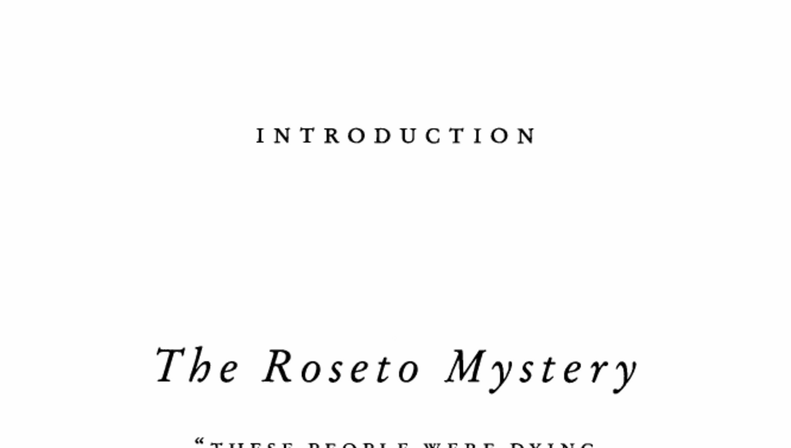

- **Introduction**
  - **The Roseto Mystery**
    - The Rosetans experienced remarkably low rates of heart disease and died mainly of old age.
    - Roseto, Pennsylvania, was founded by immigrants from Roseto Valfortore, Italy, replicating their village culture.
    - The town maintained a strong social fabric with close family ties and communal interactions.
    - The mystery inspired physician Stewart Wolf to investigate the unusual health outcomes.
    - Further reading: [The Roseto Effect](https://www.ncbi.nlm.nih.gov/pmc/articles/PMC1125051/)

- **Outliers**
  - **Migration and Settlement of Rosetans**
    - Rosetans emigrated from Italy to Pennsylvania in the late 19th century, settling near Bangor, PA.
    - They built a tightly-knit community with stone houses, a church named Our Lady of Mount Carmel, and established social institutions.
    - The town remained culturally isolated, maintaining the dialect and traditions of the Italian origin.
    - The cohesive community structure was supported by strong family networks and religious activities.
    - Further reading: [History of Italian Immigration](https://www.loc.gov/collections/italian-american-heritage/about-this-collection/)

  - **Medical Investigation by Stewart Wolf**
    - Wolf observed extremely low heart disease rates in Roseto compared to national averages.
    - A comprehensive study involving death certificates, medical records, and interviews was conducted in the 1960s.
    - Results showed low incidence of heart attacks, suicide, alcoholism, drug addiction, and crime.
    - The town's death rates were significantly below expected national levels.
    - Further reading: [Roseto Mystery: A Case Study](https://jamanetwork.com/journals/jamainternalmedicine/fullarticle/485012)

  - **Diet, Genetics, and Environment Examined**
    - Researchers ruled out diet, as Rosetans consumed high fat/caloric food and were often obese and smokers.
    - Genetic factors were excluded by comparing Rosetans living elsewhere who did not share the same health outcomes.
    - Geographic factors were dismissed after analysis of two neighboring towns with similar demographics but higher disease rates.
    - The investigation concluded that the town's social environment was the critical factor.
    - Further reading: [Social Determinants of Health](https://www.who.int/health-topics/social-determinants-of-health)

  - **Role of Social Cohesion in Health**
    - Roseto’s strong social bonds included multigenerational households, extensive social organizations, and close-knit families.
    - Cultural factors discouraged status flaunting and supported egalitarianism, reducing stress and social conflict.
    - The church played a central unifying role, facilitating community engagement and support.
    - These factors created a protective social environment promoting longevity and resistance to disease.
    - Further reading: [Social Connection and Health](https://www.health.harvard.edu/newsletter_article/the-health-benefits-of-strong-relationships)

  - **Implications for Understanding Health and Success**
    - The Roseto findings challenged conventional medical focus on individual genetics and lifestyle as sole health determinants.
    - Wolf and Bruhn emphasized the need to consider community, culture, and social context in health outcomes.
    - This perspective aligns with the broader thesis in *Outliers* on the importance of one’s environment in shaping success.
    - Their work invited a paradigm shift toward valuing social and cultural factors in medicine and success studies.
    - Further reading: [Outliers: The Story of Success](https://en.wikipedia.org/wiki/Outliers_(book))
