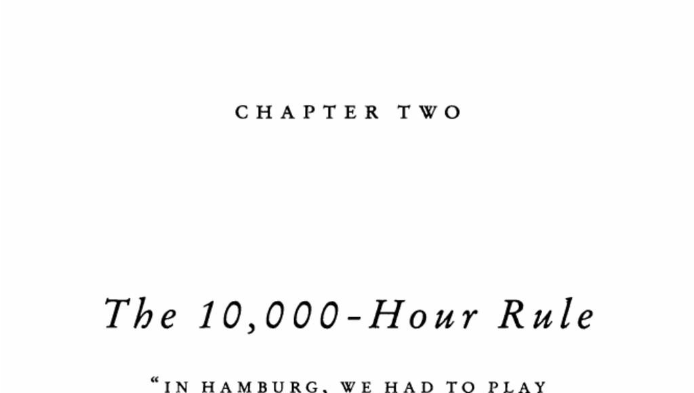

- **1. Opening of the University of Michigan Computer Center**
  - The Computer Center opened in 1971 with advanced mainframe computers and keypunch terminals.
  - Bill Joy arrived simultaneously at sixteen and became deeply immersed in programming there.
  - Early access to cutting-edge technology at Michigan was a pivotal opportunity for developing programming skills.
  - For more on computing history, see [History of Mainframe Computers](https://en.wikipedia.org/wiki/Mainframe_computer).

- **2. Debate on Innate Talent and Preparation**
  - Psychologists have debated the role of innate talent versus preparation in achievement.
  - K. Anders Ericsson’s study at Berlin's Academy of Music showed elite violinists practiced about 10,000 hours by age 20.
  - The "10,000-Hour Rule" appears consistently across multiple domains, including music and chess.
  - Mozart and Bobby Fischer did not achieve mastery without extensive practice.
  - See Ericsson's foundational work: [The Role of Deliberate Practice](https://doi.org/10.1037/h0055862).

- **3. Bill Joy’s Early Programming Experience**
  - Programming in the early 1970s involved tedious punch-card systems until time-sharing terminals were developed.
  - Michigan was among the first universities to adopt time-sharing systems, enabling interactive programming.
  - Bill Joy spent extraordinary amounts of time programming, often all night, enabled by Michigan's 24-hour Computer Center.
  - System bugs and open access allowed unlimited programming time for Joy, facilitating rapid skill acquisition.
  - For technical background, see [Time-sharing System History](https://en.wikipedia.org/wiki/Time-sharing).

- **4. The Beatles and the Hamburg Crucible**
  - The Beatles played extensively in Hamburg, Germany, performing long hours nightly.
  - Their intense Hamburg experience developed stamina, discipline, and a vast repertoire crucial to their later success.
  - Performing live approximately 1,200 times before fame was a key factor in their mastery.
  - Playing continuously in difficult environments was a critical opportunity in their development.
  - For music career development, see [The Beatles' Early Years](https://www.beatlesbible.com/).

- **5. Bill Gates’s Early Programming Access**
  - Gates attended Lakeside School, which acquired a time-sharing terminal in 1968, providing early computer access.
  - Multiple opportunities, including software testing for C-Cubed and ISI, granted Gates extensive programming hours.
  - Gates amassed thousands of computer hours before college, aided by proximity and financial resources.
  - His experience from eighth grade through high school marked an extraordinary early immersion in computing.
  - See [Bill Gates Biography](https://www.biography.com/inventor/bill-gates) for further reading.

- **6. Birth Cohorts and Opportunity in Success**
  - Fourteen of the seventy-five richest people in history were Americans born within nine years in the 1830s.
  - Their success coincided with the transformative economic period of the 1860s-1870s involving railroads and finance.
  - Similarly, the personal computer revolution favored individuals born mid-1950s, who were the right age in 1975.
  - Silicon Valley founders like Gates, Jobs, and Ballmer were born between 1953 and 1956, perfectly timed for tech opportunity.
  - The convergence of historical context, birth timing, and access to resources played a major role in their success.
  - For economic transitions, see [The Second Industrial Revolution](https://www.britannica.com/event/Second-Industrial-Revolution).
