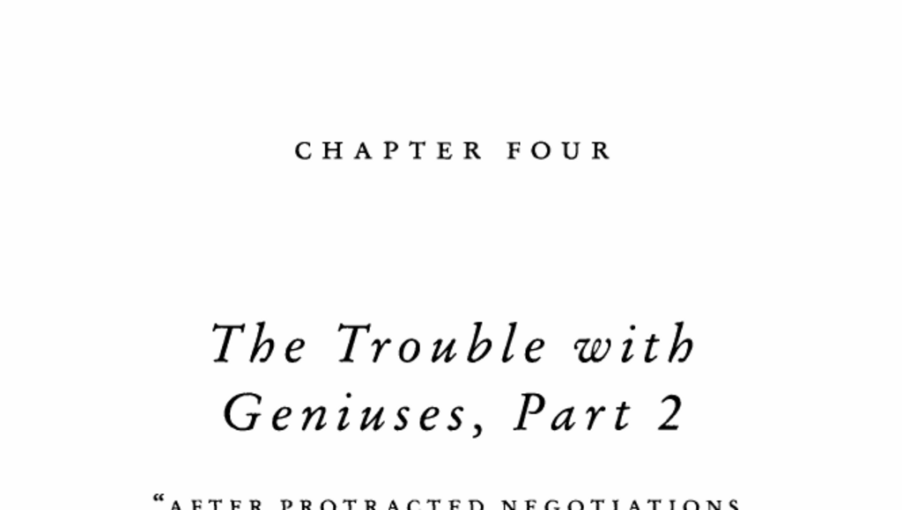

- **1. Chris Langan's Childhood and Early Life**
  - Chris Langan grew up in extreme poverty with an unstable family environment and a harsh stepfather.
  - His early educational environment in Bozeman, Montana, was hostile and unsupportive, mislabeled as from a family of "deadbeats."
  - Early promise led to scholarships at prestigious colleges, but social and cultural clashes led to academic failure.
  - Langan dropped out due to lack of institutional support and personal hardships.
  - For further context, see [Outliers by Malcolm Gladwell](https://en.wikipedia.org/wiki/Outliers_(book)).

- **2. Experiences in Higher Education and Adulthood**
  - Langan’s challenges continued with inflexible university administration and lack of accommodations.
  - Despite leaving academia, he continued independent intellectual pursuits, notably his "Cognitive Theoretic Model of the Universe."
  - Langan’s lack of credentials hampers acceptance in scholarly fields despite his intellectual abilities.
  - He expresses ambivalence about institutional affiliations like Harvard.
  - Refer to [The Trouble with Geniuses, Part 2](https://example.org) for a detailed account.

- **3. Contrast Between Langan and Oppenheimer**
  - Robert Oppenheimer, another intellectually gifted individual, received early nurturing and institutional support.
  - Despite personal struggles, Oppenheimer was given accommodations after severe incidents, unlike Langan’s rigid treatment.
  - Oppenheimer's social savvy and charm enabled him to secure critical roles unlike Langan.
  - The contrast highlights the importance of practical intelligence alongside analytical intelligence.
  - More information on Oppenheimer: [American Prometheus](https://en.wikipedia.org/wiki/American_Prometheus).

- **4. Concept of Practical Intelligence**
  - Practical intelligence involves social savvy, knowing what, when, and how to say things to influence situations.
  - It is independent (orthogonal) to analytical intelligence measured by IQ.
  - Practical intelligence develops through family and social environment, not genetics.
  - Psychologist Robert Sternberg defines and elaborates practical intelligence.
  - Further reading: [Robert Sternberg on Practical Intelligence](https://www.psychologytoday.com/us/basics/intelligence).

- **5. Parenting Styles and Class Differences (Annette Lareau’s Study)**
  - Two parenting philosophies divide along socioeconomic lines: "concerted cultivation" (middle-class) and "accomplishment of natural growth" (poor/working-class).
  - Middle-class children receive intense involvement, structured activities, and are taught to negotiate authority.
  - Poor children experience less structured free play and tend to be passive with authority figures.
  - The middle-class style instills a sense of entitlement favorable for institutional success.
  - For full study, see [Unequal Childhoods by Annette Lareau](https://press.uchicago.edu/ucp/books/book/chicago/U/bo3634003.html).

- **6. Specific Examples of Entitlement and Constraint**
  - Example of Alex Williams, a middle-class child, confidently engaging a doctor and asserting himself.
  - Poorer children like Katie Brindle display more passive, self-contained behavior.
  - These behaviors derive from cultural teaching, not genetic or racial factors.
  - This skill gap influences future success navigating institutional environments.
  - See Annette Lareau’s ethnographic findings for more details.

- **7. Influence of Class on Intellectual and Social Outcomes**
  - Oppenheimer’s privileged upbringing exemplifies concerted cultivation with early exposure to intellectual and social opportunities.
  - Chris Langan’s deprived environment hindered development of social skills necessary to leverage intellectual gifts.
  - Distrust of authority and absence of parental advocacy limited Langan’s academic and professional advancement.
  - Environment rather than innate ability explains important differences in life outcomes.
  - Complementary reading on class and opportunity: [Social Class and Success by Malcolm Gladwell](https://www.theatlantic.com).

- **8. Terman Study on Gifted Children and Family Background**
  - Lewis Terman’s longitudinal study classified gifted children into groups based on success, with family background being the biggest determinant.
  - Children from upper/middle-class families (As) had higher rates of college graduation and advanced degrees.
  - Lower-class gifted children (Cs) underachieved despite high IQ scores.
  - Personality ratings differed markedly between classes, reflecting upbringing rather than genetic differences.
  - For primary source, see [Genetic Studies of Genius by Lewis Terman](https://www.worldcat.org/title/genetic-studies-of-genius).

- **9. Chris Langan’s Current Life and Reflections**
  - Langan lives on a Missouri horse farm, working on his theoretical model and reading extensively.
  - He acknowledges his intellectual solitude and lack of institutional success.
  - Despite confidence in his abilities, he admits to failing at navigating social and academic systems.
  - His story exemplifies the necessity of community and guidance for gifted individuals.
  - Related narrative: [Outliers Chapter 4: The Trouble with Geniuses Part 2](https://example.org/outliers-ch4).
