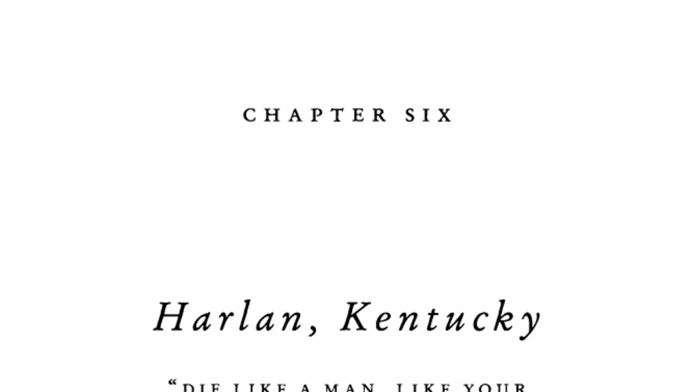

- **1. Setting and Early History of Harlan, Kentucky**  
  - Harlan is located in the Cumberland Plateau, a mountainous and wild region in southeastern Kentucky.  
  - The area was originally covered by dense primeval forest with diverse flora and fauna, and rich coal seams beneath the soil.  
  - Harlan County was founded in 1819 by immigrant families from the British Isles seeking land in the Appalachians.  
  - The early economy was based on small-scale farming, whiskey production, and logging, with poor transport connections.  
  - The founding families, notably the Howards and Turners, held contentious relations that contributed to later violence.

- **2. The Howard-Turner Feud and Its Escalation**  
  - The feud between the Howard and Turner families involved multiple violent encounters including gunfights and ambushes over decades.  
  - Initial disputes escalated from personal conflicts such as accusations of cheating at poker and property trespassing.  
  - The violence resulted in many deaths and heightened community unrest, with no clear resolution for years.  
  - The feud exemplified a broader pattern of family-related violence in the Appalachian region during the nineteenth century.

- **3. Broader Appalachian Feuding Patterns**  
  - Similar violent family feuds occurred throughout the Appalachian region, including the Hatfield-McCoy feud and others.  
  - The region had a high incidence of murder indictments, reflective of a cyclical pattern of violence and lawlessness.  
  - These widespread feuds indicated a shared "pattern" rather than isolated incidents.  
  - The conflicts were underpinned by a deeply ingrained "culture of honor" prevalent in the mountainous terrain.

- **4. Culture of Honor Explanation for Appalachian Violence**  
  - Cultures of honor arise in marginal, rocky regions where herding replaced farming, emphasizing personal reputation and aggression.  
  - Herdsmen face constant threats of theft, leading to behavioral norms requiring quick and violent responses to perceived insults.  
  - The Appalachian culture of honor traces to Scotch-Irish immigrants from the British borderlands known for clannishness and warrior ethics.  
  - This cultural heritage created durable social norms favoring violent defense of family reputation.  
  - For further study, see David Hackett Fischer’s [Albion’s Seed](https://en.wikipedia.org/wiki/Albion%27s_Seed).

- **5. Contemporary Southern Culture of Honor Study by Cohen and Nisbett**  
  - In the 1990s, Cohen and Nisbett conducted an experiment measuring emotional and physiological responses to insults among southern and northern young men.  
  - Southerners exhibited increased aggression, hormonal arousal, and readiness to engage in confrontation after being insulted.  
  - Northerners generally reacted with amusement and reduced aggression to the same insult.  
  - The results demonstrated persistence of the culture of honor in modern southern United States populations.  
  - The experiment included physical interpersonal challenges and subjective measures of anticipated violent responses.

- **6. Persistence and Transmission of Cultural Legacies**  
  - Cultural attitudes like the culture of honor persist across generations, even when economic and social conditions have changed.  
  - The effect was observed in affluent southern families distant from ancestral lifestyles, indicating cultural transmission beyond immediate environment.  
  - Such cultural legacies influence behavior profoundly and resist rapid change over centuries.  
  - Speech patterns and behavioral traits provide vehicles for transmitting cultural norms, as argued by Fischer and others.  
  - To further explore cultural persistence, consult the author’s discussion in prior works and Fischer’s detailed studies.
