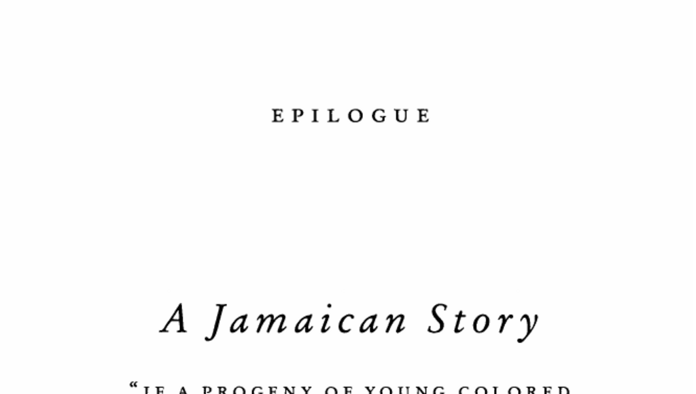

- **Introduction**
  - **Birth and Early Life**
    - Daisy Nation gave birth to twins Faith and Joyce in 1931 in Harewood, Jamaica.
    - The family lived near an Anglican church where Donald and Daisy worked as schoolteachers.
    - Donald was a reader and thinker but lacked the energy to advance his daughters' ambitions.
    - The twins won scholarships to Saint Hilda's, a prestigious Anglican boarding school.
    - For more on Jamaican education history, see [Jamaican Education System](https://en.wikipedia.org/wiki/Education_in_Jamaica).
- **Educational Opportunities and Challenges**
  - **Historical Context and Scholarship System**
    - Jamaica lacked public high schools and universities before the 1940s.
    - Scholar William M. MacMillan's critique of colonial education led to reforms after 1937 riots.
    - All-island scholarships began in 1941 to promote access to private high schools.
    - Joyce and her sister attended Saint Hilda's due to a combination of scholarships and family sacrifice.
    - See [Colonial Education Reform](https://www.jstor.org/stable/24453414) for historical context.
  - **Family Support and Financial Sacrifice**
    - Daisy Nation actively pursued educational opportunities for her daughters.
    - When tuition was unaffordable, Daisy borrowed money from a local Chinese shopkeeper, Mr. Chance.
    - The family overcame financial barriers to enable university attendance abroad.
    - Daisy's determination was critical to her daughters' educational success.
- **Ancestral Legacy and Social Status**
  - **Family Origins and Racial Heritage**
    - Daisy’s great-grandfather William Ford was an Irish plantation owner who fathered a son with a slave woman.
    - This gave descendants a "colored" social status with limited privilege compared to enslaved blacks.
    - Jamaica's social structure historically favored mulattoes as intermediaries between whites and blacks.
    - See [Race and Social Structure in Jamaica](https://www.britannica.com/place/Jamaica).
  - **Social Mobility and Colored Class Influence**
    - Colored Jamaicans achieved civil liberties by 1826 and dominated professional classes.
    - They held influential roles such as doctors, lawyers, politicians, and cultural leaders.
    - The colored class was culturally elite, though not the main economic elite.
    - The racial hierarchy afforded colored people significant occupation advantages by mid-20th century.
- **Cultural Complexities and Color Prejudice**
  - **Inter-family and Societal Color Bias**
    - Lighter skin tones received preferential treatment within families and communities.
    - "Passing" as white was a common aspiration for light-skinned individuals.
    - My family experienced intra-family color prejudice and societal racism.
    - See [Colorism and Social Stratification](https://www.apa.org/monitor/2019/03/ce-corner-colorism).
  - **Personal Experiences and Reflections**
    - The author’s mother experienced discrimination despite multifaceted privileges.
    - She reconciled personal anger by acknowledging shared prejudices in her community.
    - This complexity challenges simple narratives of individual success.
- **Conclusion**
  - **Interconnection of History and Personal Success**
    - The author’s family history is intertwined deeply with Jamaica’s colonial and racial legacy.
    - Educational success derived from historical reforms, family sacrifice, and inherited privilege.
    - Success stories depend on webs of opportunity, including factors beyond individual control.
    - Understanding outliers requires situating them within their communities and histories.
    - For more on success factors, see [Outliers: The Story of Success](https://en.wikipedia.org/wiki/Outliers_(book)).
