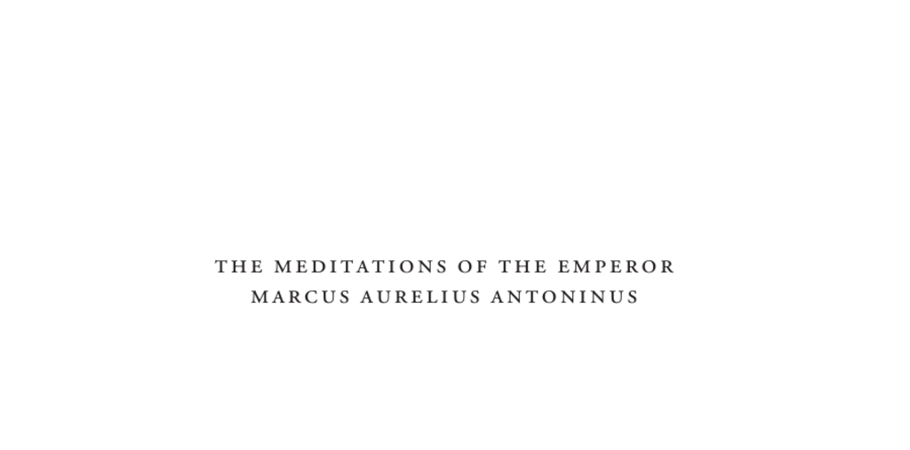

- **Introduction**
  - Francis Hutcheson and James Moor translated and annotated *The Meditations* in 1742 to provide a plain English version based on Gataker’s edition.
  - The translation replaced older versions by Casaubon and Collier, emphasizing simplicity and accessibility.
  - The Meditations reflect Marcus Aurelius’s Stoic philosophy including piety, resignation to God, charity, and contempt for worldly things.
  - The editors avoid elaborate biography and encomiums, instead providing a brief life outline from Dacier and Stanhope collections.
  - Further reading: [Stoicism and Marcus Aurelius - Stanford Encyclopedia of Philosophy](https://plato.stanford.edu/entries/stoicism/)

- **Life of Marcus Aurelius**
  - **Early life and education**
    - Born 121 AD in a noble family, descended from Numa, educated in pronunciation, music, geometry, Greek, and rhetoric.
    - Philosophy, especially Stoicism, became his dominant interest; instructed by notable Stoic philosophers.
    - Early honors from Emperor Hadrian indicate his favored status.
    - Further reading: [Marcus Aurelius Biography - Britannica](https://www.britannica.com/biography/Marcus-Aurelius)

  - **Adoption and rise to power**
    - Adopted by Antoninus Pius as heir in 138 AD on condition of also adopting Lucius Verus.
    - Married Faustina, daughter of Antoninus Pius, who bore him children.
    - Elevated to consulship and honored with imperial powers before ascending to throne.
    - Further reading: [Roman Emperors: Antoninus Pius](https://www.roman-emperors.org/anthoni.htm)

  - **Philosophy and personal virtues**
    - Lived austerely in line with Stoic discipline; avoided luxury and softness from age 12.
    - Remembered teachers with gratitude; ascribed all his virtues to their instruction.
    - Known for temperance, fortitude, and constant equanimity in face of joy or grief.
    - Further reading: Hadot, Pierre, *The Inner Citadel*.

  - **Christianity and persecution**
    - Marcus Aurelius likely never authorized empire-wide Christian persecution; documented leniency and directives to governors.
    - Letter to the Asian council discourages persecution unless Christians commit overt crimes against state order.
    - Christian writers attribute justice and lenity to his temper.
    - Further reading: [Eusebius on Marcus Aurelius and Christians](https://www.tertullian.org/fathers/eusebius_hist_4b.htm)

  - **Wars and military leadership**
    - Faced multiple invasions from Parthians, Catti, Germans, Quadi, and Marcomanni.
    - Demonstrated bravery and military skill in campaigns often leading personally.
    - Managed logistics including funding armies under financial strain by selling palace valuables and employing gladiators.
    - Further reading: [Wars during Marcus Aurelius’s reign - Livius.org](https://www.livius.org/articles/person/marcus-aurelius/)

  - **Co-rule with Lucius Verus and internal challenges**
    - Lucius Verus co-emperor but indulged in debauchery; Marcus gave counsel and oversight while Verus led Parthian campaign.
    - Lucius Verus died after illness, possibly poisoned by his wife Lucilla.
    - Dealt with revolts like that of Cassius, exhibiting clemency and rejecting calls for severe punishment of conspirators.
    - Further reading: [Lucius Verus - Roman Emperor](https://www.roman-emperors.org/verus.htm)

  - **Administration and reforms**
    - Promoted men based on merit; respected Senate and shared imperial power judiciously.
    - Enforced strict military discipline but denied unwarranted pay raises.
    - Enacted laws addressing fraud and justice; upheld moderation and public welfare over personal wealth.
    - Further reading: [Administration of Marcus Aurelius - Encyclopedia Britannica](https://www.britannica.com/biography/Marcus-Aurelius)

  - **Plague and crisis management**
    - Managed devastating plague that struck Italy during his reign.
    - Maintained public order and military readiness amidst population and treasury pressures.
    - Demonstrated personal commitment by not reducing public duties during family tragedies.
    - Further reading: [Plague in Antiquity - Ancient History Encyclopedia](https://www.ancient.eu/article/1230/the-plague-of-antoninus-or-plague-of-galba/)

  - **Final campaigns and legacy**
    - Led soldiers in difficult northern campaigns despite old age and illness.
    - Survived near-disastrous entrapment by enemy through prayers and soldierly perseverance.
    - Showed clemency and compassion toward enemies and conspirators, earning praise and respect.
    - Further reading: [Marcus Aurelius’s Last Years - History Today](https://www.historytoday.com/archive/last-years-marcus-aurelius)

- **Correspondence and political philosophy**
  - Marcus’s letters to Senate and family demonstrate emphasis on clemency, restraint, and virtue in leadership.
  - Advocated for mercy toward defeated enemies and conspirators to promote social stability.
  - His correspondence offers insight into his Stoic outlook on governance and personal loss.
  - Further reading: [Dio Cassius Roman History](https://penelope.uchicago.edu/Thayer/E/Roman/Texts/Cassius_Dio/home.html)
