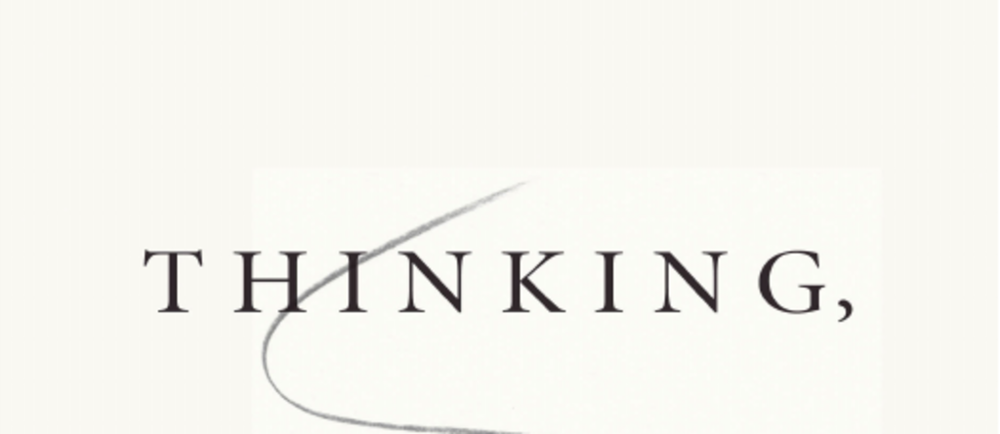

- **In memory of Amos Tversky**
- **Contents**
  - **Introduction**
    - The book aims to enrich the vocabulary used to discuss judgments and choices by identifying systematic errors known as biases.
    - It distinguishes between two systems of thought: System 1 (fast, automatic) and System 2 (slow, deliberate).
    - Collaboration between Kahneman and Tversky explored intuitive statistics and heuristics leading to predictable biases.
    - The work challenges assumptions of human rationality and highlights the influence of heuristics in judgment and decision making.
    - For further reading, see [Thinking, Fast and Slow](https://en.wikipedia.org/wiki/Thinking,_Fast_and_Slow).
- **Part I. Two Systems**
  - **1. The Characters of the Story**
    - Introduces System 1 (automatic, fast thinking) and System 2 (controlled, slow thinking).
    - System 1 generates impressions and feelings effortlessly; System 2 is responsible for deliberate thought and concentration.
    - Examples include automatic detection of emotional states and effortful multiplication tasks.
    - The interaction between systems explains much of human cognition, including errors.
    - See [Dual-process theory](https://en.wikipedia.org/wiki/Dual_process_theory).
  - **2. Attention and Effort**
    - System 2 requires effortful attention and is limited in capacity.
    - Mental effort is measurable through physiological changes, such as pupil dilation.
    - Tasks like Add-1 and Add-3 exemplify cognitive load that demands System 2 engagement.
    - The law of least effort describes how people avoid cognitive strain.
    - See [Cognitive Load Theory](https://en.wikipedia.org/wiki/Cognitive_load).
  - **3. The Lazy Controller**
    - System 2 is naturally lazy and reluctant to exert more effort than necessary.
    - Many errors arise because System 2 endorses intuitive but incorrect answers from System 1 without checking.
    - Cognitive reflection testing (e.g., the bat-and-ball problem) reveals individuals' tendencies to override or accept System 1 intuitions.
    - Intelligence and rationality are distinct; rational thinking involves engagement beyond raw intelligence.
    - See [Cognitive Reflection Test](https://en.wikipedia.org/wiki/Cognitive_Reflection_Test).
