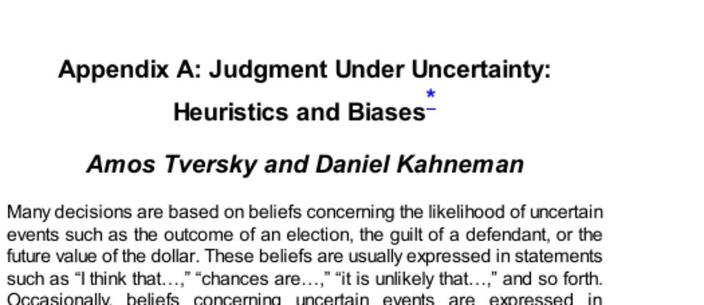

- **Judgment Under Uncertainty: Heuristics and Biases**
  - **Introduction**
    - People base many decisions on beliefs about uncertain events, expressed linguistically or numerically.
    - Judgmental heuristics reduce complexity in assessing probabilities and predicting values but sometimes cause systematic errors.
    - Probability assessments resemble judgments of physical quantities, both relying on heuristics with limited validity.
    - [Thinking, Fast and Slow](https://en.wikipedia.org/wiki/Thinking,_Fast_and_Slow) by Daniel Kahneman expands on these concepts.
  - **Representativeness**
    - Probabilities are judged by the similarity between an event or object and a stereotype or class.
    - Heuristics cause neglect of prior probabilities (base rates), sample size, and reliability, leading to biased judgments.
    - Misconceptions include gambler’s fallacy and insensitivity to predictability and regression toward the mean.
    - The illusion of validity causes overconfidence when input and prediction appear well-matched.
    - [Heuristics and Biases: The Psychology of Intuitive Judgment](https://books.google.com/books?id=BAA9AgAAQBAJ) by Tversky and Kahneman elaborates on these biases.
    - **Insensitivity to prior probability of outcomes**
      - Judgments often ignore base rates, weighting representativeness heavily over statistical likelihood.
      - People utilize base rates only when no descriptive information is given; worthless evidence causes neglect of base rates.
    - **Insensitivity to sample size**
      - People judge sample outcomes by similarity to population parameters, ignoring sample size effects.
      - Statistical theory predicts smaller samples show greater variability, a fact commonly unrecognized.
      - Overemphasis on sample proportion rather than sample size leads to conservatism in posterior probability estimates.
    - **Misconceptions of chance**
      - People expect short sequences to represent randomness locally, causing erroneous expectations like gambler’s fallacy.
      - This bias extends even to experienced psychologists who overestimate small sample replicability.
    - **Insensitivity to predictability**
      - Predictions reflect favorableness of descriptions but ignore the reliability or predictability of evidential information.
      - Intuitive predictions neglect the moderation of prediction extremeness according to predictability level.
    - **The illusion of validity**
      - Confidence in predictions is based on representativeness rather than on factors limiting accuracy.
      - Redundancy among input variables inflates confidence but decreases actual prediction accuracy.
    - **Misconceptions of regression**
      - People fail to recognize regression toward the mean, mistaking it for causal effects.
      - This misunderstanding can lead to erroneous beliefs about the effectiveness of praise and punishment.
  - **Availability**
    - Frequency or probability is judged by ease of recalling instances, which can be affected by familiarity, salience, and recency.
    - Availability biases cause over- or underestimation of class size or event likelihood independent of actual frequency.
    - **Biases due to retrievability of instances**
      - Classes with more familiar or salient members appear larger regardless of actual size.
    - **Biases due to the effectiveness of a search set**
      - Retrieval ease depends on search strategies, causing errors such as overestimation of words beginning with a letter versus words having it in the third position.
    - **Biases of imaginability**
      - When frequency must be constructed mentally rather than recalled, ease of construction distorts estimates.
      - People underestimate large committee sizes because larger committees are harder to imagine.
    - **Illusory correlation**
      - People overestimate frequency of co-occurrence when events are strongly associated, even if data contradict the correlation.
      - Associative strength affects perceived joint frequency, causing persistent biases resistant to contradictory evidence.
    - [Availability Heuristic](https://en.wikipedia.org/wiki/Availability_heuristic) offers further insight.
  - **Adjustment and Anchoring**
    - Estimates are made by starting from an initial value (anchor) and adjusting, but adjustments are typically insufficient.
    - Different anchors lead to systematically biased final judgments.
    - **Insufficient adjustment**
      - Experimental evidence shows arbitrary anchors strongly influence estimates even when known to be irrelevant.
      - Anchoring occurs both with explicit anchors and partial computations.
    - **Biases in evaluation of conjunctive and disjunctive events**
      - People overestimate probabilities of conjunctions and underestimate probabilities of disjunctions due to anchoring on elementary event probabilities.
      - This bias causes optimistic planning and risk underestimation in complex systems.
    - **Anchoring in subjective probability distributions**
      - Experts produce overly narrow confidence intervals due to anchoring on best estimates.
      - Different elicitation methods produce systematically different calibration errors.
    - [Anchoring and Adjustment Heuristic](https://en.wikipedia.org/wiki/Anchoring) explains these effects further.
  - **Discussion**
    - Cognitive biases stem from heuristics, not motivational distortions, and occur even among experts.
    - The failure to infer statistical rules like regression or sample size effects is due to lack of appropriate coding of experiences.
    - External calibration of probability judgments is rarely learned naturally.
    - Subjective probability theory defines probabilities via betting preferences but people form beliefs independently of betting.
    - Internal consistency alone does not guarantee rational probability judgments; they must align with wider beliefs.
  - **Summary**
    - The three key heuristics are representativeness, availability, and adjustment from an anchor.
    - These heuristics economize cognitive effort and are usually effective but cause systematic, predictable errors.
    - Improving understanding of these heuristics could enhance decision-making under uncertainty.
