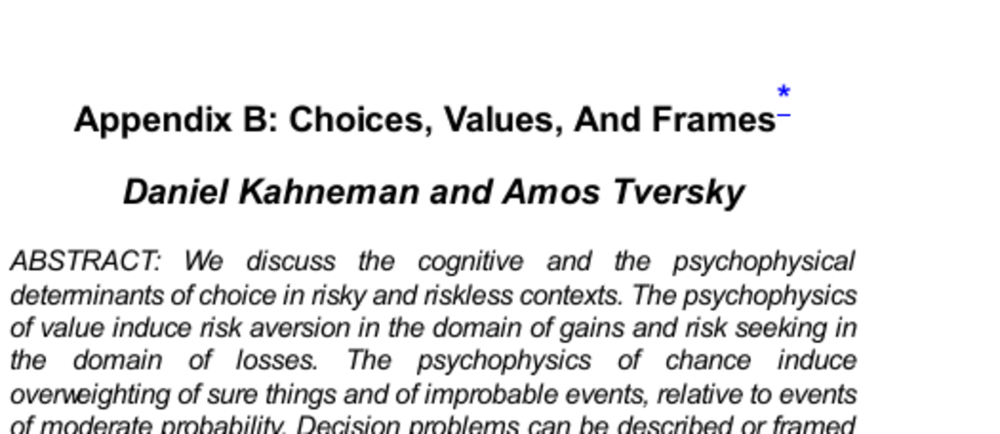

- **Abstract**  
  - Discusses cognitive and psychophysical determinants of choice in risky and riskless contexts.  
  - Describes risk aversion in gains and risk seeking in losses induced by psychophysics of value.  
  - Outlines overweighting of sure things and improbable events in decision making.  
  - Explains framing effects and mental accounting as sources of choice anomalies.  
  - References relation between decision values and experience values.

- **Introduction to Decision Making**  
  - Decision making spans multiple disciplines including mathematics, economics, and psychology.  
  - Differentiates between normative (rationality-focused) and descriptive (actual behavior-focused) analyses.  
  - Emphasizes tension between normative and descriptive perspectives in choice and judgment.

- **Risky Choice**  
  - Defines risky choices as decisions made without knowledge of outcomes and involving probabilistic events.  
  - Recalls Bernoulli’s utility theory explaining risk aversion through concave utility of money.  
  - Shows risk aversion in gains and risk seeking in losses due to concave and convex value functions.  
  - Introduces prospect theory, focusing on gains and losses relative to a reference point rather than total wealth.  
  - Discusses loss aversion where losses weigh more heavily than equivalent gains.  
  - Cites normative principles in modern decision theory including transitivity, substitution, dominance, and invariance.  
  - Notes violations of substitution and invariance axioms in actual human behavior.  
  - Provides [Bernoulli (1954)](https://doi.org/10.2307/1909829) and [Kahneman & Tversky (1979)](https://doi.org/10.2307/1914185) for foundational theory.

- **Framing of Outcomes**  
  - Describes how equivalent problems framed as gains or losses produce different preferences, violating invariance.  
  - Uses the "Asian disease" problem to illustrate shift from risk aversion to risk seeking based on framing as lives saved or lost.  
  - Demonstrates dominance violations in choices between framed gambles.  
  - Explains difficulty of achieving canonical problem representations for invariance in practice.  
  - Advises testing robustness of preferences by multiple framings.  
  - See [Tversky & Kahneman (1981)](https://doi.org/10.1126/science.7455683) for detailed framing research.

- **The Psychophysics of Chances**  
  - Introduces decision weights that transform probabilities nonlinearly, causing deviations from expected utility.  
  - Shows overweighting of low probabilities and underweighting of moderate to high probabilities.  
  - Explains how decision weights induce risk seeking with improbable gains and risk aversion with low probability losses.  
  - Describes the pseudo-certainty effect where uncertain events are perceived as certain due to framing.  
  - Highlights how framing influences acceptability of insurance and protective actions.  
  - References [Slovic, Fischhoff, & Lichtenstein (1982)](https://doi.org/10.1002/9780470133306.ch3) for related methodology.

- **Formulation Effects**  
  - Examines how wording changes (e.g., survival vs. mortality rates) affect preferences without distorting factual information.  
  - Notes framing can be exploited deliberately in marketing and politics to manipulate choices.  
  - Attributes formulation effects to nonlinear value functions and reference points in evaluation.  
  - Contrasts effortless linguistic abstraction with cognitive difficulty recoding equivalent decision problems.  
  - See [Thaler (1980)](https://doi.org/10.1016/0167-2681(80)90051-7) for mental accounting and framing applications.

- **Transactions and Trades**  
  - Proposes mental accounting where people assign advantages and disadvantages relative to a reference state for multiattribute options.  
  - Introduces minimal, topical, and comprehensive accounts for organizing transactions.  
  - Demonstrates topical accounts influence readiness to exert effort for saving money depending on context.  
  - Shows mental accounting violations of rational invariance assumptions in consumer behavior.  
  - Illustrates framing effects with lost ticket vs. lost cash on theater ticket repurchase decisions.  
  - Suggests secondary consequences (e.g., regret) may justify preference differences.  
  - For further reading, consult [Thaler (1985)](https://doi.org/10.1287/mksc.4.3.199).

- **Losses and Costs**  
  - Explains how losses loom larger than gains, biasing decisions toward status quo maintenance.  
  - Describes the endowment effect, where selling prices exceed buying prices for the same asset due to loss aversion.  
  - Notes reluctance to trade even when jobs differ favorably in one attribute and unfavorably in another.  
  - Differentiates framing of negative outcomes as costs or losses affecting risk preferences.  
  - Presents examples where identical options framed as sure loss vs. cost or loss vs. payment generate differing preferences.  
  - Describes the dead-loss effect where individuals endure costs (e.g., playing with injury) to avoid recognizing sunk losses.  
  - See [Knetsch & Sinden (1984)](https://doi.org/10.2307/2118033) for empirical evidence on endowment effects.

- **Concluding Remarks**  
  - Distinguishes between experience value (hedonic outcome) and decision value (anticipated attractiveness in choice).  
  - Notes decision values and experience values often diverge due to adaptation, social comparison, and expectations.  
  - Highlights hedonic treadmill concept positing rapid adaptation diminishes long-term pleasure from improvements.  
  - Emphasizes complexity of hedonic experience reduces accuracy of forecasting in decisions.  
  - Points out framing can produce decision values with no experiential counterpart or actually shape experiences.  
  - Encourages exploring alternative framings as a reflective tool to assess values attached to choices.  
  - See [Brickman & Campbell (1971)](https://doi.org/10.1016/B978-0-12-671960-5.50020-4) for hedonic adaptation theory.
