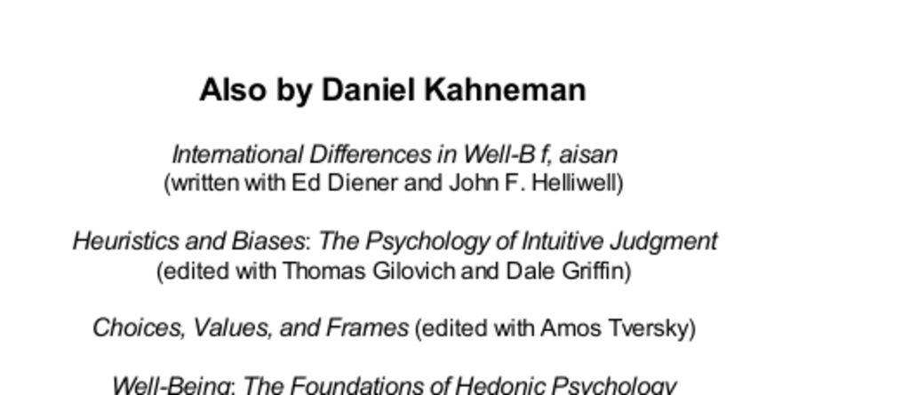

- **Books by Daniel Kahneman**
  - **International Differences in Well-Being (with Ed Diener and John F. Helliwell)**
    - The book examines variations in well-being across different countries.
    - It identifies social, economic, and cultural factors influencing well-being.
    - The authors present empirical data and comparative analyses.
    - Further reading: [World Happiness Report](https://worldhappiness.report)
  - **Heuristics and Biases: The Psychology of Intuitive Judgment (edited with Thomas Gilovich and Dale Griffin)**
    - This volume explores common heuristics and biases affecting human judgment.
    - It focuses on intuitive decision-making processes and their errors.
    - The book compiles research demonstrating frequent cognitive shortcuts.
    - Further reading: [Thinking, Fast and Slow](https://en.wikipedia.org/wiki/Thinking,_Fast_and_Slow)
  - **Choices, Values, and Frames (edited with Amos Tversky)**
    - The book discusses how framing effects influence choices and values.
    - It explores prospect theory and how people evaluate gains and losses.
    - Empirical studies highlight deviations from expected utility theory.
    - Further reading: [Prospect Theory](https://en.wikipedia.org/wiki/Prospect_theory)
  - **Well-Being: The Foundations of Hedonic Psychology (edited with Edward Diener and Norbert Schwartz)**
    - This collection analyzes the psychological foundations of happiness.
    - It presents theories and evidence on subjective well-being measures.
    - The editors emphasize the role of affective experiences and cognitive evaluations.
    - Further reading: [Subjective Well-Being](https://en.wikipedia.org/wiki/Subjective_well-being)
  - **Judgment Under Uncertainty: Heuristics and Biases (edited with Paul Slovic and Amos Tversky)**
    - This work investigates judgment errors under uncertain conditions.
    - It documents heuristics like availability, representativeness, and anchoring.
    - The book integrates experimental findings from cognitive psychology.
    - Further reading: [Heuristics and Biases](https://en.wikipedia.org/wiki/Heuristics_in_judgment_and_decision-making)
  - **Attention and Effort**
    - The book analyzes cognitive resource allocation in attention and mental effort.
    - It proposes models describing the control of attentional processes.
    - The work explains performance limitations related to attentional capacity.
    - Further reading: [Attention (psychology)](https://en.wikipedia.org/wiki/Attention_(psychology))
