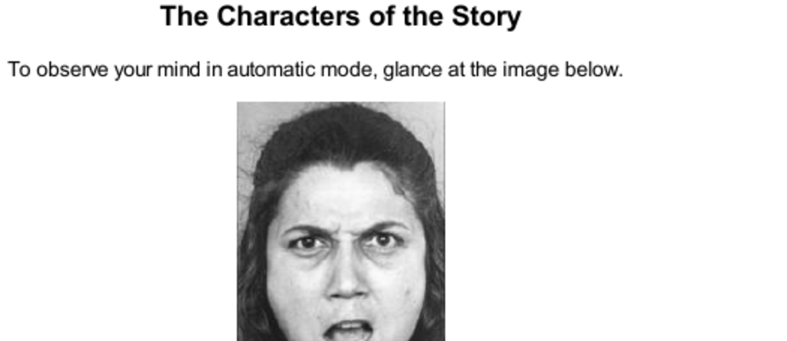

- **The Characters of the Story**
  - **Figure 1**
    - Observing the woman's face triggers automatic, fast thinking and intuitive emotion recognition.
    - System 1 generates impressions and premonitions effortlessly without deliberate intent.
    - This illustrates the combined function of seeing and intuitive thinking.
    - See [Dual Process Theory](https://en.wikipedia.org/wiki/Dual_process_theory_(psychology)) for background.
  - **The Multiplication Problem**
    - Multiplying 17 × 24 requires deliberate, effortful, slow thinking invoking System 2.
    - System 2 uses learned cognitive programs and working memory to solve problems methodically.
    - Mental calculations increase physiological arousal such as pupil dilation and heart rate.
    - For more on cognitive load, see [Cognitive Load Theory](https://en.wikipedia.org/wiki/Cognitive_load).
  - **Two Systems**
    - System 1 operates automatically, quickly, and effortlessly without voluntary control.
    - System 2 controls attention for effortful, complex activities like computations and choices.
    - The two systems collaborate: System 1 proposes impressions; System 2 endorses or overrides.
    - See [Thinking, Fast and Slow](https://en.wikipedia.org/wiki/Thinking,_Fast_and_Slow) by Daniel Kahneman.
  - **System 1 Automatic Activities**
    - Examples include detecting distances, orienting to sounds, completing familiar phrases, and basic arithmetic.
    - It includes innate skills and learned automatic responses like reading and expert pattern recognition.
    - Many System 1 processes are involuntary and accessed without intention or effort.
    - See [Automaticity in Psychology](https://www.verywellmind.com/what-is-automaticity-2794973).
  - **System 2 Effortful Activities**
    - Examples include focused attention, counting, searching memory, monitoring behavior, and logical reasoning.
    - System 2 performance declines when attention is divided or overloaded.
    - It can program and direct System 1’s automatic attention and memory use.
    - See [Executive Functions](https://en.wikipedia.org/wiki/Executive_functions) for related cognitive processes.
  - **Attention Limitations and Dual-Task Interference**
    - Attention is a limited resource that can be allocated to tasks but cannot be overextended without failure.
    - Complex tasks require full attention and can interfere with simultaneous activities.
    - Social norms often reflect awareness of attention limits, such as silence during risky driving.
    - See [Selective Attention](https://en.wikipedia.org/wiki/Selective_attention) for deeper insight.
  - **The Invisible Gorilla Experiment**
    - Concentrated attention on a difficult task leads to inattentional blindness for obvious stimuli.
    - About half the viewers fail to notice a visible gorilla due to task-based selective attention.
    - This illustrates humans’ blindness to the obvious and their blindness to that blindness.
    - See [The Invisible Gorilla](https://www.theinvisiblegorilla.com/) for experiment details.
  - **Plot Synopsis**
    - System 1 runs automatically; System 2 operates in a low-effort default mode.
    - System 1 generates intuitions and feelings; System 2 endorses or overrides them.
    - System 2 activates when System 1 cannot answer or detects surprise or errors.
    - The division of labor optimizes performance but System 1 is prone to biases and errors.
    - For complementary understanding, read [Dual process models of cognition](https://plato.stanford.edu/entries/dual-process/).
  - **Conflict**
    - Classic experiments demonstrate conflict between automatic responses (System 1) and deliberate control (System 2).
    - Tasks like naming word colors versus reading words engage System 2 to override System 1’s automatic reading.
    - Conflict requires effortful control and can cause delays and errors due to competing impulses.
    - System 2 is responsible for self-control and overriding inappropriate automatic responses.
    - See [Stroop Effect](https://en.wikipedia.org/wiki/Stroop_effect) for related cognitive conflict research.
  - **Illusions**
    - Visual illusions like the Müller-Lyer illusion reveal dissociation between perception (System 1) and knowledge (System 2).
    - Even with conscious awareness, System 1 continues to present illusions involuntarily.
    - Cognitive illusions can influence emotions and judgments, such as the attraction to psychopathic charm.
    - Overcoming these illusions requires effortful monitoring by System 2 but cannot fully eliminate System 1 errors.
    - See [Cognitive Illusions](https://en.wikipedia.org/wiki/Cognitive_illusion) for more examples.
  - **Useful Fictions**
    - Referring to System 1 and System 2 as active agents facilitates understanding of mental processes.
    - The terminology is a descriptive shorthand, not a literal explanation of brain systems.
    - Language about the systems captures the interaction of automatic and controlled mental functions.
    - Using nicknames like System 1 and System 2 reduces cognitive load during reasoning.
    - For explanations about cognitive metaphors, see [Metaphors We Live By](https://en.wikipedia.org/wiki/Metaphors_We_Live_By).
