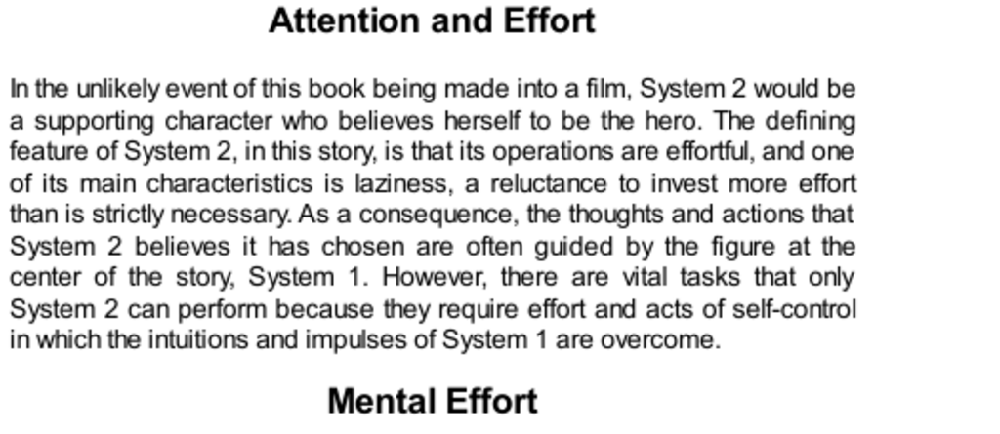

- **Attention and Effort**
  - **System 2 as Effortful and Lazy**
    - System 2 operations require effort and exhibit laziness, avoiding unnecessary investment of effort.
    - System 2 often follows guidance from the automatic and intuitive System 1.
    - System 2 performs vital tasks involving self-control and overcoming impulses of System 1.
  - **Mental Effort and the Add-1 Task**
    - The Add-1 task involves incrementing digits in synchrony with a rhythm, quickly reaching cognitive limits.
    - Add-3 is a more difficult variant of the Add-1 task, requiring greater effort.
    - Pupil dilation measures mental effort and correlates with task difficulty and cognitive load.
    - Relevant resource: [Cognitive Pupillometry](https://en.wikipedia.org/wiki/Pupillometry)
  - **Pupil Dilation as a Measure of Mental Effort**
    - Pupil size closely tracks mental effort during tasks, peaking during maximum cognitive load.
    - The pattern of dilation during tasks forms an inverted V shape corresponding to effort buildup and release.
    - Mental efforts like Add-3 cause up to 50% pupil area dilation and increased heart rate; overload causes pupil constriction.
    - Casual conversation causes minimal pupil dilation, indicating low cognitive effort.
  - **Mental Blindness Under High Effort**
    - High cognitive demand in tasks like Add-1 leads to reduced ability to detect peripheral stimuli despite open eyes.
    - Failure to detect visual targets corresponds with peak mental effort measured by pupil dilation.
    - The ability to allocate attention selectively follows evolutionary advantages favoring threat and opportunity detection.
    - Relevant resource: [The Invisible Gorilla](https://www.theinvisiblegorilla.com/)
  - **System 2 Capacity and Effort Allocation**
    - System 2 has limited capacity and manages overload by prioritizing important tasks.
    - Effort is allocated moment-to-moment based on task demands, unlike electrical circuits with abrupt overload shutdowns.
    - System 1 takes over automatic control in emergencies, acting faster than conscious awareness.
  - **Research Collaboration and Applications**
    - Beatty and the author developed methods to measure pupil responses to mental effort using a chin rest and camera setup.
    - Pupil size provides immediate and clear feedback about cognitive workload during paced mental tasks.
    - Control of attention measured by pupil response predicts job performance in high-demand professions.
  - **Skill and Intelligence Effects on Effort**
    - Skill acquisition reduces mental effort required for tasks by reducing brain region activity.
    - Higher intelligence correlates with lower required cognitive effort as shown through pupil size and brain activity.
    - The "law of least effort" governs both physical and cognitive exertion, favoring the least demanding methods.
  - **Task Demands and Cognitive Load**
    - Cognitive tasks vary in effortfulness: simple memory tasks cause minimal pupil dilation; complex tasks like mental multiplication cause large dilation.
    - Effort is measured by tasks requiring rule-following, multi-attribute comparisons, and deliberate choices, all handled by System 2.
    - System 1 detects simple patterns and similarities but cannot handle multiple topics or purely statistical reasoning.
  - **Task Sets and Executive Control**
    - System 2 can adopt task sets to override habitual responses, exemplified by unfamiliar counting tasks.
    - Switching tasks is effortful and time-pressured, limiting performance on demanding tasks like Add-3.
    - Executive function brain regions mediate conflict resolution and intelligent operations.
    - Relevant resource: [Executive Functions - NIH](https://www.nimh.nih.gov/health/topics/executive-function)
  - **Time Pressure and Working Memory Limits**
    - Tasks requiring fast thinking under time pressure increase mental effort due to memory decay and processing speed demands.
    - Holding multiple digits or ideas at once forces rapid attention and rehearsal, increasing cognitive load.
    - Mental overload is avoided by breaking tasks into simpler steps and externalizing intermediate results.
  - **Summary Quotes on Attention and Effort**
    - Mental effort is recognized as pupil-dilating and taxing; people tend to minimize unnecessary thinking.
    - System 1 provides rapid intuitions while System 2 engages deliberate memory search when intuition fails.
