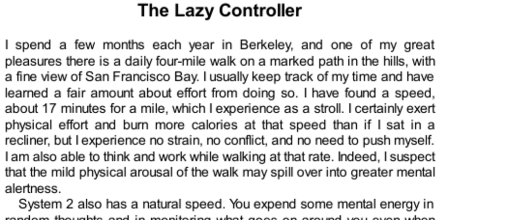

- **The Lazy Controller**  
  - Daily walking at a slow speed allows simultaneous thinking without strain.  
  - System 2 processes some routine mental tasks effortlessly, similar to a leisurely stroll.  
  - Increasing physical or mental effort impairs System 2’s ability to maintain coherent thought.  
  - Self-control and deliberate thinking draw from the same limited mental resources.  
  - Mihaly Csikszentmihalyi’s concept of flow describes effortless concentration freeing cognitive resources for demanding tasks.  
  - Further reading: [Flow: The Psychology of Optimal Experience](https://en.wikipedia.org/wiki/Flow_(psychology))

- **The Busy and Depleted System 2**  
  - Cognitive load reduces self-control, increasing reliance on System 1 and impulsive behavior.  
  - Ego depletion occurs when prior exertion of self-control reduces the ability or willingness to maintain it in subsequent tasks.  
  - Glucose consumption is linked to mental energy; ingesting glucose can reverse ego depletion effects.  
  - A study with Israeli parole judges showed declining approval rates correlated with time since eating, indicating effects of fatigue and depletion on decision-making.  
  - Further reading: [Ego depletion and glucose](https://en.wikipedia.org/wiki/Ego_depletion)

- **The Lazy System 2**  
  - System 2 often endorses intuitive answers from System 1 without verifying correctness, exemplified by the bat-and-ball puzzle.  
  - Over 50% of students at elite universities fail to override intuitive errors, indicating a widespread cognitive laziness.  
  - Logical reasoning errors arise when superficial plausibility prevents System 2 from thoroughly evaluating arguments.  
  - Retrieval of relevant knowledge depends on both System 1 memory and System 2’s reflective search.  
  - Differences in System 2 engagement explain variations in critical thinking and rationality.  
  - Further reading: [Cognitive Reflection Test](https://en.wikipedia.org/wiki/Cognitive_Reflection_Test)

- **Intelligence, Control, Rationality**  
  - Early childhood self-control predicts later cognitive aptitude, executive function, and behavior.  
  - Training attention in young children improves both self-control and intelligence scores.  
  - Individuals scoring low on the Cognitive Reflection Test tend to follow intuitive answers, show impatience, and prefer immediate gratification.  
  - Intelligence and rationality are distinct; high intelligence does not guarantee resistance to cognitive biases.  
  - Keith Stanovich differentiates between algorithmic intelligence and reflective rationality as separate parts of System 2.  
  - Further reading: [Rationality and the Reflective Mind (Stanovich)](https://en.wikipedia.org/wiki/Keith_Stanovich)

- **Speaking of Control**  
  - System 2’s self-control varies with mental state and motivation, influencing task engagement and decision quality.  
  - The state of flow enables sustained focus without noticeable self-control effort.  
  - Ego depletion leads to reliance on habits, defaults, or lazy reasoning in decision-making.  
  - Variability in System 2 activation explains differences in impulsivity and delayed gratification across individuals.  
  - Further reading: [Self-control (psychology)](https://en.wikipedia.org/wiki/Self-control)
