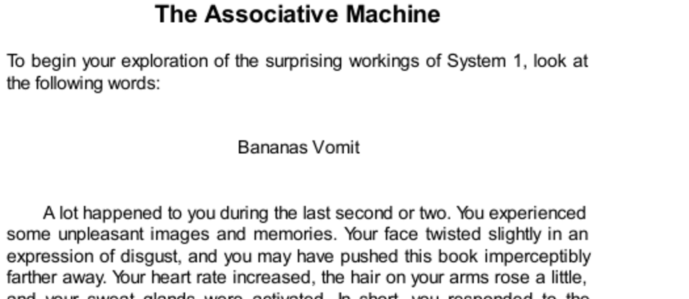

- **The Associative Machine**
  - **Initial Reaction to Words**
    - System 1 automatically links the words "bananas" and "vomit" in a causal sequence, creating a mild aversion.
    - The response includes physical reactions such as facial expressions, increased heart rate, and sweating.
    - The reaction is automatic, uncontrolled, and serves to prepare the individual for possible related events.
    - Further reading: [Thinking, Fast and Slow by Daniel Kahneman](https://en.wikipedia.org/wiki/Thinking,_Fast_and_Slow)
  - **Associative Activation**
    - Ideas evoke many related ideas simultaneously in a spreading cascade within associative memory.
    - Activated ideas support and reinforce each other, creating an associatively coherent mental state.
    - Most associative activations occur outside conscious awareness, with only a few ideas entering consciousness.
  - **Historical Perspective on Association**
    - David Hume identified three principles of association: resemblance, contiguity in time and place, and causality.
    - Modern views see ideas as nodes in a vast associative network with multiple types of links.
    - Associative memory activates many ideas at once, differing from the older concept of sequential conscious ideas.

- **The Marvels of Priming**
  - **Definition and Forms of Priming**
    - Priming is exposure to a word or concept that increases the ease of activating related ideas.
    - Priming can affect recognition speed, word completion, and shifts in physical or emotional states.
    - Activation spreads like ripples through the associative network, affecting many related concepts.
  - **Priming Beyond Conscious Awareness**
    - Priming affects actions and emotions without conscious awareness, demonstrated by experiments like the "Florida effect."
    - The ideomotor effect links subconscious thoughts to related behaviors automatically.
    - Reciprocal priming exists, where behaviors and thoughts reinforce each other, such as smiling increasing amusement.
  - **Physical Gestures and Priming**
    - Simple gestures like nodding or shaking the head unconsciously influence acceptance or rejection attitudes.
    - Facial expressions shaped by physical manipulation can alter emotional responses and humor perception.
    - These findings demonstrate the embodiment of cognition and emotion.
  - **Implications for Self-Image and Autonomy**
    - Priming challenges the belief in conscious control over judgments and choices.
    - Effects of priming are robust across contexts but typically subtle, affecting only some individuals.
    - Priming influences behaviors without subjective awareness, driven by System 1 processes.

- **Primes That Guide Us**
  - **Priming Effects on Behavior and Judgments**
    - Environmental primes such as location or images influence decisions, including voting preferences.
    - Money-related primes increase self-reliance, independence, and reduce prosocial behavior unconsciously.
    - Societies with frequent reminders of authority or respect may shape collective behavior through associative priming.
  - **Symbolic and Metaphorical Priming**
    - Priming with concepts related to morality or shame leads to symbolic cleansing behaviors, e.g., the "Lady Macbeth effect."
    - Specific acts of dishonesty prime matching forms of physical cleansing preferences.
    - Priming effects confirm long-held psychological theories about symbolic unconscious associations.
  - **Evidence and Acceptance of Priming Phenomena**
    - Experimental results on priming effects are reliable and not statistical anomalies.
    - People generally do not recognize or believe the applicability of priming to themselves due to subjective experience.
    - Awareness of priming effects supports a model where System 2 is unaware of many System 1 activities.
  - **Priming and Social Behavior**
    - A British university experiment showed that images of eyes increase honesty in payment behavior compared to flowers.
    - Symbolic reminders of surveillance strengthen prosocial behavior without direct observation.
    - This supports the idea that social cues operate largely at an unconscious level.
  - **Further reading: [Priming (Psychology) - Simply Psychology](https://www.simplypsychology.org/priming.html)**

- **Speaking of Priming**
  - **Selected Quotes Illustrating Priming Concepts**
    - Priming does not always produce expected outcomes, such as uniforms not priming creativity.
    - The mind constructs coherent stories from limited data, often unconsciously accepted as true by System 2.
    - Physical actions like smiling can initiate positive emotions through embodied cognition.
