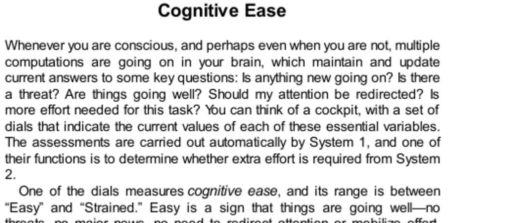

- **Cognitive Ease**
  - **Overview of Cognitive Ease and Strain**
    - Cognitive ease signals that things are going well, while cognitive strain signals a problem requiring more effort from System 2.
    - It integrates diverse inputs and outputs, from font clarity to mood, affecting attention and effort.
    - System 1 automatically monitors cognitive ease to decide on mobilizing System 2.
    - See [Thinking, Fast and Slow](https://en.wikipedia.org/wiki/Thinking,_Fast_and_Slow) for related concepts by Daniel Kahneman.

  - **Causes and Consequences of Cognitive Ease**
    - Clear fonts, repetition, priming, good mood, and smiling induce cognitive ease.
    - Poor fonts, bad mood, complex language, and frowning induce cognitive strain.
    - Cognitive ease leads to trust, superficial thinking, and liking; strain promotes vigilance, effort, and fewer errors.
    - The impressions of ease or strain have multiple interchangeable causes that affect judgment.

- **Illusions of Remembering**
  - **Illusion of Familiarity**
    - Seeing a new name or word repeatedly induces cognitive ease, producing a false sense of familiarity.
    - Familiarity is based on perceptual fluency rather than actual memory of contextual details.
    - Experimental manipulations like priming or font clarity increase false familiarity.
    - Jacoby’s work on memory illusions illustrates these effects ([source](https://doi.org/10.1037/0096-1523.21.6.1349)).

- **Illusions of Truth**
  - **Cognitive Ease Influences Belief**
    - Familiarity caused by repetition or ease of processing biases people to accept statements as true.
    - Frequent exposure to even partial phrases increases perceived truthfulness of entire statements.
    - Logical analysis (System 2) can override this only when strongly motivated.
    - This phenomenon is exploited in marketing and propaganda to foster illusory truth.

- **How to Write a Persuasive Message**
  - **Maximizing Cognitive Ease for Credibility**
    - Use simple language instead of complex vocabulary to increase perceived intelligence and credibility.
    - Enhance legibility with clear fonts, high-quality paper, and bright contrasting colors like red or blue.
    - Use rhyming or memorable phrasing to increase believability.
    - Quote sources with easily pronounceable names to reduce cognitive effort for the reader.
    - These tactics enhance the sense of cognitive ease but cannot compensate for false or nonsensical material.

- **Strain and Effort**
  - **Impact of Font-Induced Cognitive Strain on Reasoning**
    - Cognitive strain triggers System 2 engagement, improving analytic thinking and reducing intuitive errors.
    - Experiments with the Cognitive Reflection Test show performance improves under difficult-to-read fonts.
    - Strain shifts thinking from quick intuitive responses to more reflective processing.
    - See [Frederick’s CRT studies](https://doi.org/10.1037/0096-1523.21.6.1349) for more.

- **The Pleasure of Cognitive Ease**
  - **Connection Between Ease, Emotion, and Attitudes**
    - Cognitive ease evokes a mild positive emotional response and relaxed facial expressions like slight smiles.
    - Easily pronounced words and company names benefit from short-term favorable attitudes and better stock performance.
    - The mere exposure effect shows repeated stimuli become liked even without conscious awareness.
    - The effect has evolutionary roots as safety signals indicating that repeated stimuli are non-threatening.
    - Robert Zajonc’s research on the mere exposure effect provides foundational insights ([Zajonc, 1968](https://doi.org/10.1037/h0025848)).

- **Ease, Mood, and Intuition**
  - **Positive Mood Enhances Intuition and Creativity**
    - Good mood increases accuracy in intuitive tasks like the Remote Association Test by enhancing cognitive ease.
    - Happiness loosens System 2 control, making people more creative but also more prone to errors.
    - Sadness or bad mood impairs intuition and promotes vigilance and analytic thinking.
    - Emotional responses to word triads mediate feelings of coherence, modulated by mood and awareness of external causes.
    - These findings highlight System 1’s role in intuitive judgments coupled with affect.

- **Speaking of Cognitive Ease**
  - **Practical Expressions Reflecting Cognitive Ease Concepts**
    - Statements illustrate awareness of how font, repetition, mood, and familiarity influence belief and cognitive effort.
    - Examples show the interplay between cognitive ease cues and the need for critical scrutiny before acceptance.
    - These encapsulate key lessons on managing System 1/System 2 dynamics.
