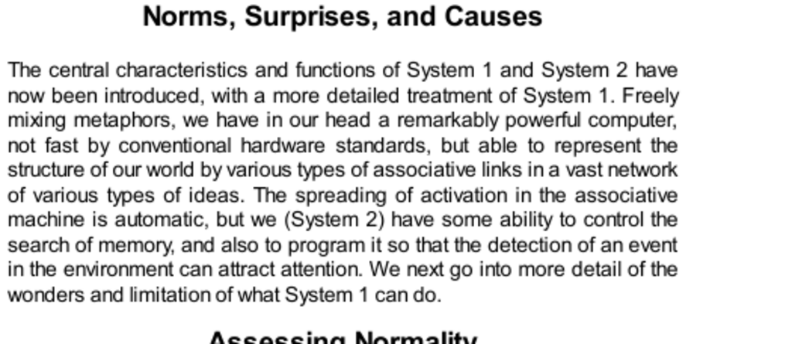

- **Norms, Surprises, and Causes**
  - **Assessing Normality**
    - System 1 maintains and updates a model of the personal world that represents what is normal through associative links of co-occurring events.
    - Surprise functions as a sensitive indicator of how the world is understood and what is expected.
    - There are two types of surprise: active (conscious expectations) and passive (unconscious but unsurprising events).
    - Repeated incidents reduce surprise by adjusting the internal model of normality.
    - [Thinking, Fast and Slow](https://en.wikipedia.org/wiki/Thinking,_Fast_and_Slow) by Daniel Kahneman provides further insights on System 1 and System 2.
  - **Seeing Causes and Intentions**
    - System 1 automatically constructs coherent causal stories based on associative links and immediate interpretation.
    - Physical and intentional causality are perceived directly rather than inferred from repeated observation.
    - Experiments show infants have innate perceptions of causality and intentionality.
    - Dual concepts of causality (physical and intentional) contribute to the universality of religious beliefs.
    - Statistical reasoning differs from causal intuition and relies on System 2's deliberate processes.
    - [The Black Swan](https://en.wikipedia.org/wiki/The_Black_Swan_(book)) by Nassim Taleb illustrates causal interpretation errors.
  - **Speaking of Norms and Causes**
    - Repetition quickly normalizes new experiences through minimal exposure.
    - Understanding reactions requires considering the entire range of normal variability, not just averages.
    - People tend to create causal narratives to explain unlucky or unexpected outcomes, often attributing intentional sabotage.
    - Recognition of the need for causal stories affects how individuals perceive and respond to events.
    - [Norm Theory](https://en.wikipedia.org/wiki/Norm_theory) provides theoretical background on how people judge normality and abnormality.
