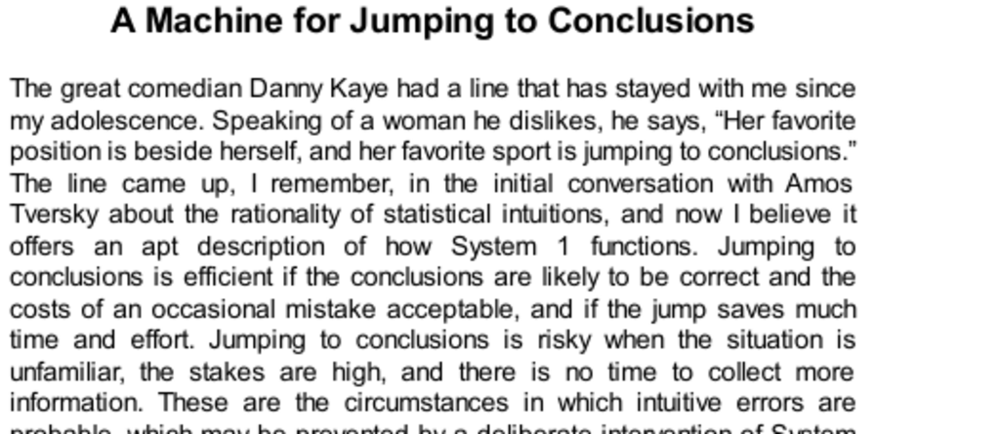

- **A Machine for Jumping to Conclusions**
  - **Efficiency and Risk of Jumping to Conclusions**
    - Jumping to conclusions is efficient when likely correct and cost of mistakes is low.
    - Risks increase in unfamiliar situations with high stakes and insufficient information.
    - System 2 can intervene deliberately to prevent intuitive errors.
    - See [Thinking, Fast and Slow](https://en.wikipedia.org/wiki/Thinking,_Fast_and_Slow) by Daniel Kahneman for more on dual-system thinking.

- **Neglect of Ambiguity and Suppression of Doubt**
  - **Context-driven Interpretation**
    - Ambiguous stimuli are interpreted based on context, resolving ambiguity without awareness.
    - System 1 makes a definite choice without tracking alternatives or recognizing ambiguity.
    - Doubt and uncertainty require System 2’s mental effort to maintain incompatible interpretations.
  - **Example of Ambiguity in Reading**
    - Identical shapes read differently as letters or numbers depending on surrounding context.
    - The brain generates a plausible context automatically.
  - **Example of Ambiguity in Language**
    - The word "bank" is interpreted based on recent mental context, evidencing System 1’s role.
  - For further understanding, consult [Ambiguity and the Brain](https://www.ncbi.nlm.nih.gov/pmc/articles/PMC4183502/).

- **A Bias to Believe and Confirm**
  - **Automatic Belief and System 1**
    - Initial understanding requires automatic belief in statements from System 1.
    - Even nonsensical statements initially evoke belief through associative memory.
  - **Unbelieving as System 2 Operation**
    - Doubting or rejecting false information depends on System 2 engagement.
    - Disruption of System 2 impairs unbelieving, increasing false beliefs.
  - **Confirmation Bias**
    - People seek confirming evidence for their beliefs, applying positive test strategies.
    - Confirmation bias applies to both System 1 and System 2.
  - Confirmation bias leads to overestimation of rare or extreme events.
  - For more, see Daniel Gilbert’s work on belief formation [How Mental Systems Believe](https://www.ncbi.nlm.nih.gov/pmc/articles/PMC3180883/).

- **Exaggerated Emotional Coherence (Halo Effect)**
  - **Definition and Impact**
    - The halo effect leads to liking or disliking all attributes of a person based on limited cues.
    - Emotional responses fill evidence gaps and simplify judgments.
  - **Influence of Trait Order**
    - Initial traits presented influence the interpretation of subsequent traits.
    - Early information disproportionately shapes overall impression.
  - **Mitigating Halo Effect**
    - Separating evaluations of different traits decreases bias and increases grading accuracy.
    - Independent judgments reduce correlated errors and improve group decisions.
  - **Applications**
    - Good police procedure requires independent witness testimonies to avoid correlated errors.
    - Committee decisions benefit from independent initial positions before group discussion.
  - Refer to [The Halo Effect](https://www.psychologytoday.com/us/basics/halo-effect) for additional insights.

- **What You See is All There is (WYSIATI)**
  - **Principle Explanation**
    - System 1 constructs stories solely from information currently available.
    - System 1 ignores missing or unactivated information.
  - **Consequences of WYSIATI**
    - Leads to jumping to conclusions based on limited data.
    - Causes overconfidence because confidence depends on story coherence, not evidence quantity or quality.
    - Enables framing effects where different presentations change emotional reactions.
    - Results in base-rate neglect where salient information overshadows statistical facts.
  - **Empirical Support**
    - Study with legal scenarios showed one-sided evidence increased confidence and biased judgments.
  - WYSIATI underlies many cognitive biases explained in Kahneman’s work [Thinking, Fast and Slow](https://en.wikipedia.org/wiki/Thinking,_Fast_and_Slow).

- **Speaking of Jumping to Conclusions**
  - **Practical Examples**
    - Halo effect can cause judgments based on incomplete or misleading information.
    - Independent error decorrelation improves decision-making accuracy.
    - Decisions based on limited information reflect WYSIATI and risk overlooking missing data.
    - Resistance to new information may reflect preference for coherent but incomplete stories.
  - Emphasizes importance of cautious interpretation and seeking diverse evidence to mitigate biases.
