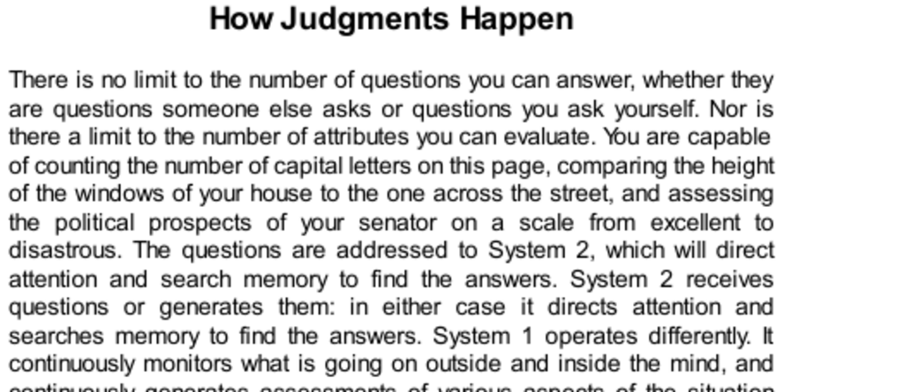

- **How Judgments Happen**
  - System 2 answers explicit questions by directing attention and searching memory.
  - System 1 continuously and effortlessly generates intuitive assessments without specific intention.
  - Heuristics and biases arise from substituting difficult questions with simpler System 1 assessments.
  - System 1 can translate values across dimensions and triggers multiple computations beyond specific intentions.
  - For further reading, see [Thinking, Fast and Slow](https://en.wikipedia.org/wiki/Thinking,_Fast_and_Slow).

- **Basic Assessments**
  - System 1 evolved to assess threats, opportunities, and normality continuously for survival.
  - Assessments include judgments of approach or avoidance with mood and cognitive ease signaling safety.
  - These automatic evaluations shape intuitive judgments and influence decision-making.
  - Refer to [The Adaptive Unconscious](https://journals.sagepub.com/doi/10.1111/j.1467-8721.1996.tb00365.x) for related concepts.

- **Discriminating Friend from Foe**
  - Humans rapidly assess dominance and trustworthiness from facial features and expressions.
  - Dominance cues include facial structure such as a square chin; trustworthiness depends on expressions like smiling.
  - These judgments, though imperfect, provide survival advantages and affect social and political evaluations.
  - Alex Todorov’s research demonstrates these effects on voting outcomes worldwide.
  - See [Alex Todorov’s Research](https://alex-todorov.com) for further detail.

- **Face Reading and Voting**
  - Voters tend to choose candidates whose faces rate higher in perceived competence.
  - Competence combines facial strength and a confident smile but does not predict actual performance.
  - Ratings of facial competence predict election results in multiple countries better than likability ratings.
  - Emotionally driven evaluations reveal biological predispositions to reject less competent faces.
  - Consult [Journal of Experimental Psychology](https://psycnet.apa.org/record/2005-01114-008) on political face perception.

- **Influence of Information and Media on Voting**
  - Automatic System 1 preferences are stronger among uninformed, television-heavy voters.
  - Informed voters rely less on facial competence cues, showing individual differences in System 1 influence.
  - Media exposure amplifies intuitive, automatic judgment in political decisions.
  - For media effects on cognition, see [Media Effects Studies](https://doi.org/10.1111/j.1460-2466.2004.tb02636.x).

- **System 1 and Language Understanding**
  - System 1 performs basic assessments during event perception and message comprehension.
  - These include similarity, representativeness, causality attribution, and availability evaluations.
  - Such automatic assessments function even without specific task demands but support task performance when needed.
  - Explorations of System 1 language understanding can be found in [Psycholinguistics Research](https://www.cambridge.org/core/books/psycholinguistics).

- **Sets and Prototypes**
  - System 1 forms rapid impressions of averages and norms in visual arrays without effort.
  - Judgments about sums or totals require deliberate System 2 computation.
  - System 1 represents categories by prototypes or typical exemplars, ignoring quantity in sum-like variables.
  - Neglect of quantity affects economic decisions, demonstrated by willingness-to-pay experiments after the Exxon Valdez spill.
  - For cognitive prototype theory, see [Categorization and Prototypicality](https://psycnet.apa.org/record/1999-03059-004).

- **Intensity Matching**
  - System 1 matches intensities across different dimensions using underlying scales.
  - People naturally align abstract qualities such as happiness, popularity, or severity across contexts.
  - Matching occurs automatically and is culturally consistent but can be statistically inaccurate.
  - This mechanism explains intuitive predictions that equate unrelated scales.
  - Additional reading: [Psychophysics and Intensity Matching](https://doi.org/10.1146/annurev.psych.56.091103.070237).

- **The Mental Shotgun**
  - System 1 processes many computations simultaneously, often beyond the intended scope of System 2 tasks.
  - Unintended automatic computations can interfere with task performance, as shown in phonetic and semantic experiments.
  - The mental shotgun metaphor illustrates the difficulty of limiting cognitive activation to a single target.
  - This effect explains many intuitive judgments triggered by overlapping automatic processes.
  - For experimental examples, see [Cognitive Interference Studies](https://doi.org/10.1037/0096-1523.10.5.664).

- **Speaking of Judgment**
  - Automatic assessments like attractiveness and dominance evaluation influence behaviors unknowingly.
  - Face shape and expression contribute to perceived leadership suitability.
  - Perceived justice requires punishment intensity to match crime severity, reflecting cross-modal intensity matching.
  - The mental shotgun exemplifies how unrelated automatic feelings can contaminate deliberate judgments.
  - For applied judgment heuristics, consult [Heuristics and Biases](https://mitpress.mit.edu/books/heuristics-and-biases).
